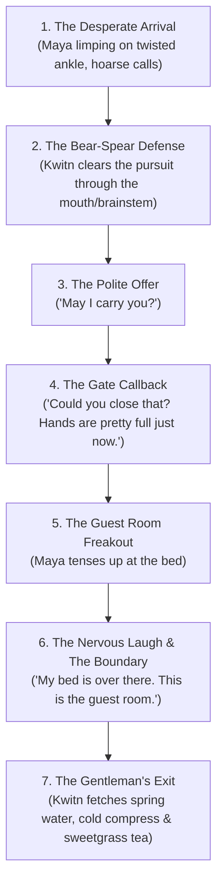

# Scene Blueprint: The Encounter (Chapter 6)
**Setting:** The Perimeter Fence & Creek Camp, Petkotkweyak  
**Characters:** Kwitn Simon, Maya Lin, Nipn  
**Tone:** Intense Survival Action ──▶ Polite Gentleness ──▶ Dry Humor ──▶ Deep Emotional Relief  

---

## The Beat-by-Beat Sequence

---

### Beat 1: The Desperate Emergence
* **Kwitn's Activity:** Kwitn is outside the perimeter fence, adjusting the wattle weave along the creek spur with his rock-maple mallet.
* **The Noise:** Nipn gives a sudden, rigid point. The hazel brush parts thirty yards away.
* **Maya's Condition:** 
  * She has been on the run for a solid month, living out of her 65L Osprey backpack.
  * She breaks through the ferns—trying to bolt, but hobbling painfully on a severely swollen, bruised, twisted ankle.
  * In her hand is her taped galvanized pipe; her clothes are caked in trail mud, pine sap, and dried sweat.
  * She tries to shout for help, but she is so dehydrated, exhausted, and winded that only a raspy, strained whisper comes out: *"Help... please..."*

---

### Beat 2: The Pursuing Pack & The Bear-Spear Showcase
* **The Threat:** Four or five infected break out of the brush right behind her, jaws hanging wide open, drawn by her limping rhythm.
* **Kwitn's Action:**
  * Zero panic. Zero shouting.
  * He steps between Maya and the tree line, drops his heel over an ancient exposed spruce root, and levels his 6-foot ash bear-spear at face height.
  * One by one, the infected charge mouth-first onto the high-carbon leaf blade.
  * *Pop. Crack. Drop. Push. Reset.*
  * In under thirty seconds, all five corpses are pinned and folded into the silt, dispatched through the soft palate into the brainstem without Kwitn taking a single step backward.

---

### Beat 3: The Polite Rescue & Functional Strength
* Kwitn wipes the steel blade clean on a handful of marsh grass, sets the spear upright against a post, and walks over to where Maya has collapsed against a mossy stump, clutching her ankle, chest heaving.
* He crouches down, keeping his hands open, low, and completely visible.
* He looks her in the eye and asks, softly and very politely:
  > *"May I carry you?"*
* Maya, completely spent and unable to put weight on the swollen joint, gives a small, exhausted nod.
* **Quiet, Functional Power:** Kwitn scoops her up smoothly—her, her heavy boots, and her loaded 65-liter Osprey pack—cradling her against his chest in a single, effortless lift. 
  * He is a timber carpenter who spends his life hauling green cedar logs, felling 40-foot trees, and portaging canoes. 
  * He doesn't huff, tremble, or strain; his stride is completely steady, balanced, and unshakeable on the uneven forest floor.

---

### Beat 4: The Gate Callback ("Hands are pretty full just now")
* As they reach the heavy cedar perimeter gate, Kwitn stops just past the threshold, holding her securely without an ounce of struggle.
* He glances back at the open door, then looks down at Maya in his arms with a slight, dry, self-deprecating smirk:
  > *"Could you reach out and give that cedar post a little push? My hands are pretty full just now."*
* Maya reaches out with one tired arm and gives the wooden frame a light shove.
* She watches in amazement as the offset trunnion hinge swings the heavy seven-foot gate shut in **absolute, greased silence**, and the counter-weighted maple drop-latch falls into the notch with a solid, satisfying *clack*.
* She realizes two things at once: this camp is built to perfection, and this man possesses effortless, quiet, protective strength.

---

### Beat 5 & 6: The Guest Room Panic, The Nervous Laugh & The Boundary
* Kwitn carries her up the porch steps into the cool, cedar-scented cabin and turns down the short east hallway into the spare bedroom.
* He approaches the pine bed frame with its clean wool blanket and fresh spruce-bough mattress.
* **The Panic Moment:** Having spent thirty days running from monsters and desperate, predatory people along the highway, Maya suddenly stiffens in his arms. Her eyes go wide with acute survival panic as she realizes she's being carried toward a bed in an isolated cabin.
* **The De-escalation:**
  * Kwitn catches the terror in her eyes.
  * He lets out a small, nervous, self-deprecating chuckle—breaking the tension completely.
  * He gently sets her down on the edge of the mattress, immediately steps two paces back toward the open doorway, and raises both hands with an apologetic grin:
    > *"Hey, hey—easy. Look. My bed is all the way on the other side of the cabin by the workbench. This is the guest room. Nobody is bothering you."*

---

### Beat 7: The Gentleman's Exit
* Seeing her shoulders drop as the reality of safety sinks in, Kwitn nods toward the washstand.
* *"I’ll be right back with some cold spring water for that ankle, a clean cloth, and a hot mug of sweetgrass tea. Take your boots off if you can."*
* He turns, walks out into the kitchen, and leaves the door wide open so she has full line-of-sight to the main hall.
