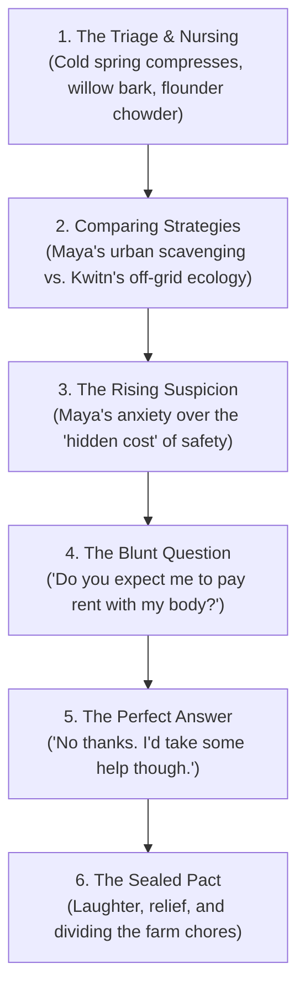

# Scene Blueprint: The Currency of Firewood (Chapter 7)
**Setting:** The East Guest Room & Kitchen Porch, Creek Camp  
**Characters:** Kwitn Simon, Maya Lin, Nipn  
**Timeline:** Days 46 to 52 (Maya's Recovery & The First True Dialogue)  
**Core Arc:** Physical Triage ──▶ Strategic Comparison ──▶ Rising Psychological Tension ──▶ The Blunt Confrontation ──▶ Absolute Relief & Partnership  

---

## The Beat-by-Beat Narrative Arc

---

### Beat 1: The Two-Week Recovery & The Outhouse Incident (Days 46–59)
* **The Medical Reality:** It takes **two full weeks** before Maya can put weight on the damaged joint and walk again on her own.
* **The Daily Care:**
  * Kwitn brings her fresh meals three times a day: hot flounder and striped bass broths, steamed cattail shoots, wild leeks, and mountain spring water.
  * He changes her cold willow-bark compresses twice daily and carves her a pair of custom, padded ash crutches with leather arm rests.
* **The Outhouse Incident (The Ultimate Awkward Vulnerability):**
  * Because she cannot put weight on her foot, getting to the cedar outhouse fifty yards down the path requires immense effort and Kwitn's support.
  * Kwitn stands twenty paces away with his back turned, staring fixedly at the hemlock tops, whistling an unhurried tune to give her auditory privacy.
  * **The Fall:** Maya finishes cleaning herself up inside the latrine, attempts to hitch her pants and stand on her bad leg, her ankle gives out with a sharp stab of pain, and she immediately **tumbles out the wooden doorway onto the moss—pants tangled around her knees, bare-bottomed, bruised, and blushing furiously in absolute mortification.**
  * **Kwitn's Reaction:** Hearing the loud wooden crash and the gasp, he freezes. He doesn't turn around to gawk, he doesn't laugh, and he doesn't act like a creep. Keeping his face strictly pointed toward the spruce branches, ears bright red, he calls out with gentle, deadpan politeness:
    > *"Can I come help without making you mad?"*
  * Maya, buried in her own embarrassment on the moss, lets out a strangled, half-laughing, half-sobbing: *"Yes... please."*
  * He walks backward toward her, hands extended blindly until she grabs his forearms, helps her hoist her pants without looking once, and gently lifts her into his arms to carry her back to the cabin.
  * That single moment of pure, awkward, fiercely guarded respect shatters any lingering doubts she has about his integrity.

---

### Beat 2: Sizing Up Strategies (Through the Open Door)
* As she recovers her strength over those fourteen days, they talk through the open bedroom doorway.
* **Maya’s Strategy (Brilliant, but Crushed by Town):**
  * She was trying to do surgical, high-value scavenging runs in town (hospital pharmacies, clinics, warehouses).
  * *Why it failed:* The town was an unpredictable death trap of rotting supermarkets, trapped hordes, and violent, predatory men who tried to corner her at every turn. She burned thousands of calories running for her life.
* **Kwitn’s Strategy (Off-Grid Ecology & Standoff):**
  * Never enter a supermarket; stay off the asphalt; let the 30-foot Fundy tide catch live fish in shallow stone pits; let winter do the heavy killing.
  * Maya realizes: *He didn't just survive the game; he walked off the board entirely.*

---

### Beat 3: The True Reason for the Armor (The Highway Predators)
* Maya’s terror and suspicion are not irrational paranoia—they are **hard-earned survival reflexes**.
* During her thirty days on the run between the hospital and the river, she didn't just fight the dead; **she had to fight off living men who repeatedly tried to corner, trap, and force themselves on her**:
  * Scavengers along the Trans-Canada who offered "protection" in exchange for complete submission.
  * A group at a gas station that tried to barricade her inside a storage room, forcing her to crack a man's collarbone with her taped iron pipe to break free into the night.
* She is an attractive, athletic woman who has learned that in the ruins of civilization, most men look at her not as a fellow human being, but as prey to be claimed.
* Lying injured on a bed in an isolated cabin, unable to run on her swollen ankle, being fed and sheltered by a powerful timber carpenter who has an arsenal of hand-made weapons, her nervous system is in full red-alert panic: *This is where it happens. This is where he makes his move.*

---

### Beat 4 & 5: The Blunt Confrontation & The Perfect Punchline
* On the evening of Day 50, Kwitn brings in an evening bowl of smoked bass broth and sets it on the bedside stand.
* Maya sits up straight against the pine headboard, sets her jaw with clinical intensity, and looks him dead in the eye. Her knuckles are white on the edge of the blanket:
  > *"Let's stop dancing around it, Simon. You're feeding me, you're treating my ankle, and you gave me a bed. I've met enough men on the highway to know how this goes. Are you expecting me to pay rent with my body?"*
* **Kwitn's Reaction:**
  * He doesn't get angry, offended, or predatory. He recognizes the raw, defensive scar tissue behind the question.
  * He stops with one hand on the doorframe, blinks twice in mild, gentle confusion, and lets out a quiet, dry, slightly bemused chuckle:
  > *"No thanks. I'd take some help with the weeding and the firewood, though."*

---

### Beat 6: The Shattered Tension & The New Reality
* Maya stares at him for five long seconds. The sheer, unpretentious simplicity of the answer catches her completely off guard.
* The defensive armor she has worn for thirty days cracks; she lets out a startled, breathless laugh, burying her face in her hands as the immense psychological weight of fear and suspicion finally rolls off her shoulders.
* Kwitn gives her a friendly, respectful nod from the doorway:
  > *"I've got an acre of Three Sisters that needs hoeing, two hundred pounds of flounder that need salt-rubbing, and Chris is bringing his welding scrap up the trail next week. If you can use a hoe and a crooked knife, you’re paid up for the next five years."*
* He steps out and closes the latch softly behind him, leaving her in safety and peace.
