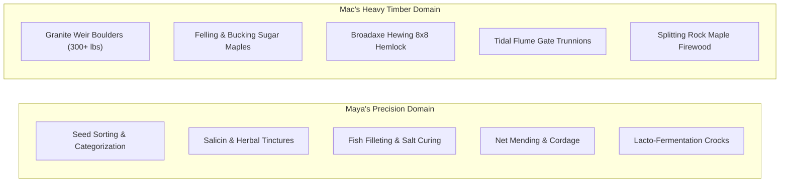

# Chapter 7: The Physics of Balance

### I. The Shavehorse & The Ash Billet

The morning began with a catastrophic breach of orthopedic discipline.

At seven o’clock on her third morning at the Creek Camp, Maya had decided that lying cooped up in the lower guest bunk of the Stone Light was an intolerable insult to her autonomy. Determined to reach the fresh air and sunlight of the yard, she had swung her legs out of the blankets, braced her palms against the whitewashed cedar wall, and attempted a dignified, one-legged hop toward the open outer doorway.

*Hop.*

The impact vibrated uncomfortably through her bruised hip.

*Hop... wobble.*

Her right foot instinctively touched the floor to arrest her balance, sending a sharp, white-hot spike of agony shooting from her swollen lateral malleolus straight up into her calf.

Before she could take a third hop—or pitch sideways into the stone masonry—a massive pair of sun-bronzed hands caught her firmly by the elbow and waist, arresting her wobble.

Kwitn, who had been passing the threshold with an armload of dry birch splits, had dumped the wood into the indoor hearth box in one fluid motion and crossed the floor in two long strides.

He looked down at her with that unhurried, stoic calm, holding her steady on her one good foot.

"Need a carry out to the porch?" Kwitn asked.

Maya drew herself up, lifting her chin with stubborn pride.

"No, I don't," she stated. "I'm a grown woman and I can walk on one leg. Let go."

Kwitn nodded once. "All right."

He let go and took half a step back.

Gravity took over immediately.

Without his hands holding her up, Maya’s center of gravity tilted, her left foot slipped on the smooth boards, and she dropped six inches in a sudden, undignified plunge toward the floor.

"Wait, no, catch me—!" Maya gasped.

Kwitn’s arms moved in a blur. His right arm swept behind her back, his left hooked beneath her knees, and he scooped her clean out of the air, pulling her up against his chest before her bad ankle could touch the floor.

Maya’s hands instinctively grabbed his shirt collar, her eyes wide as she found herself cradled in his arms.

Kwitn didn't smirk, but the quiet amusement in his dark eyes was unmistakable.

"Changed your mind?" he asked in a low rumble.

Maya swallowed, holding onto his shirt with as much dignity as she could manage.

"Shut up and carry me to the porch," she muttered.

"Understood," Kwitn said, turning toward the open doorway.

He carried her effortlessly through the door into the warm July morning, heading over to the covered workshop pavilion where a cool breeze drifted off the river. He set her down gently onto the wide cedar bench in the shade, slid a cushioned pine block under her swollen right foot, and handed her a hot tin mug of steeped mint and labrador tea.

"Sit," Kwitn said. "Keep the foot up. Drink the tea."

Maya looked up at him over the rim of the mug, the fresh air and the warm tea taking the edge off her frustration.

"I'm a nurse, Simon, not a glass figurine," she said, taking a sip.

"You're a nurse with a wrecked foot trying to hop around like a drunken flamingo," Kwitn replied, heading over to the shavehorse ten feet away in the shade of the sugar maples. "Sit still and watch how real wood works."

Once settled, Maya set her mug on the bench and began her morning orthopedic self-assessment. Her thumbs, nimble and practiced, palpated the anterior talofibular ligament, pressing firmly into the soft depression just anterior to the lateral bone tip, then traced the line of the calcaneofibular ligament down toward the heel.

"Grade two sprain," she muttered aloud, testing the passive inversion of her foot with a sharp, controlled intake of breath. "Significant interstitial edema. Partial tearing of the anterior talofibular fibers, calcaneofibular intact but stretched. No crepitus along the fifth metatarsal. Bony architecture intact. No avulsion fracture."

She looked down at her swollen ankle with profound clinical irritation, as if her own joint had committed a breach of professional conduct.

Ten feet away, in the cool morning shade cast by a towering stand of sugar maples, Kwitn was seated astride his traditional **shavehorse**—the foot-treadle clamping bench that served as the heart of his green-wood carpentry shop.

He wore a faded gray henley with the sleeves chopped off at the shoulders, exposing arms that looked as though they had been hewn from the same seasoned rock maple as his workbenches. His skin was deep copper, glistening faintly with a sheen of honest sweat in the July humidity. As he pulled the curved, two-handled **drawknife** toward his chest, the thick cords of muscle across his upper back and deltoids flexed with a slow, hypnotic rhythm, peeling off ribbons of white ash that curled and dropped to the sawdust-strewn dirt like parchment shavings.

Maya watched him over the rim of her tin mug, a sudden, sharp knot of tension tightening in her chest.

In the old world—and especially during the bloody, desperate weeks following the collapse—she had learned that every offer of male kindness was a calculated transaction. In the city, every meal had an unspoken price, every "safe room" was an ambush waiting to happen, and every man with a weapon looked at an unattached woman like scavenged property. She had spent two months sleeping with a surgical scalpel palmed in her fingers, ready to sever a femoral artery the second the inevitable demand arrived.

Sitting here, helpless on a wooden bench while this massive man calmly shaved timber for her, the sheer, unnatural quiet of his decency finally broke her patience. The cognitive dissonance was too loud. She couldn't take the suspense anymore.

She set her tin mug down on the cedar bench with a sharp, metallic *clack*.

"Why haven't you tried to leverage food or shelter to get into my pants, Simon?"

The words cut through the morning air like a thrown knife—raw, blunt, and deliberately offensive, stripped of all clinical politeness.

The rhythmic *shhhhk-shhhhk* of the drawknife stopped instantly.

A single curled ribbon of white ash drifted down to the sawdust. Beside the shavehorse, Nipn’s ears snapped forward, the wolf lifting his silver head, sensing the sudden spike of sharp adrenaline in the yard.

Kwitn didn't flinch. He didn't drop the drawknife, and he didn't raise his voice. He simply released the foot treadle, stood the tool carefully on the bench peg, and turned slowly on the horse to look at her.

His dark eyes were completely steady, meeting her harsh, defensive glare without a flicker of anger or guilt. He looked at the tightness in her jaw, the defensive hunch of her shoulders, and the white-knuckled grip she had on the edge of the cedar bench. He saw right through the insult to the raw, exhausted survival terror beneath it.

"Because that’s city garbage," Kwitn said. His voice was a low, quiet rumble that carried the heavy, unshakeable weight of granite bedrock. "If a man has to use a bowl of fish, a dry roof, and a torn ankle to corner a woman into bed, he isn’t a man. He’s just a coward with a roof."

Maya blinked, the air catching hard in her throat.

Kwitn picked up a clean rag and wiped a fleck of wood sap from the back of his thumb.

"My people have lived along this river for three thousand years," Kwitn continued, his voice calm, level, and entirely matter-of-fact. "We have a law called *Netukulimk*—straight dealing with the land, and straight dealing with people. You don't take more than you need, and you don't use another human being's misfortune to feed your own ego. You came down my trail bleeding, being hunted by five dead things. I opened the gate because you're a human being who needed a roof, not because I was looking to barter for what's between your legs."

He looked directly into her eyes, his expression unhurried and clear as deep river water.

"You're a very pretty woman, Maya. I'm not blind, and I'm not made of stone. But being pretty doesn't give a man an excuse to act like a scavenger, and having bad luck on a trail doesn't make you property. When two people decide to share a bed, it should be because they both choose to, in the light of day, with their boots off and their minds clear. Not because one of them is starving and can't walk."

He paused, holding her gaze until the tension in her jaw completely dissolved.

"You're safe here, Maya. Under this roof, nobody touches you unless you ask for it, and nobody charges you rent for breathing. Now stop looking for a fight that isn't coming, and drink your tea before it gets cold."

Maya sat frozen for three long heartbeats. The harsh, defensive words she had prepared died in her throat, dissolving into the clean morning air.

The silence that followed was not uncomfortable; it was vast, quiet, and cleansing. The brutal, suspicious armor she had worn like an iron corset since the day the hospital generators died shattered into dust, leaving only an overwhelming wave of relief that made her breath shudder in her chest.

She set her tin cup on her knee, looking across the ten feet of sawdust at the man on the shavehorse. Her posture shifted—no longer the cornered stray waiting for the blow, but a woman meeting an equal on level ground.

"My grandfather raised me with a strict code of our own," Maya said, her voice dropping into a clear, resonant cadence that held its own quiet authority. "In our family, we have an ancient rule about reciprocity: when someone gives you clean water, a fire, and a roof without demanding a pound of your flesh in return, you do not take it lightly. A life-debt is paid with straight labor, fierce loyalty, and mutual honor. Not back-alley bargains in the dark."

She looked down at her hands, exhaling a long, slow breath that released the last knot of tension from her shoulders.

"I spent eight weeks in the ruins of Saint John being looked at like I was a prize to be cornered, or a piece of meat to be traded for a can of soup and a dry room. Having someone look me in the eye, treat me like an actual human being, and tell me straight that my safety isn't up for barter... it’s a relief, Simon. A profound one."

She lifted her chin, meeting his dark eyes again. A tiny, self-aware, distinctly dangerous glint of humor sparked in her dark eyes.

"And for the record, carpenter... when the time eventually comes that two people decide to share a bed 'in the light of day, with their boots off and their minds clear'—you're not exactly hard on the eyes yourself."

Kwitn’s hand on the drawknife paused for half a second. A slow, genuinely amused grin broke across his broad face, crinkling the corners of his eyes.

"Noted for future reference, Nurse Lin," Kwitn rumbled, clamping the foot treadle tight. "Now let me finish building your crutches before you decide to test that hypothesis on one foot."

"Fair enough," Maya said, a soft, radiant smile playing on her lips as she leaned back against the cedar siding and took a long, hot sip of her mint tea.

Kwitn drew the steel blade smoothly toward his chest. *Shhhhk.*

"Good," Kwitn rumbled, watching the pale ash curl away under the edge. "Life's a whole lot simpler when all the cards are laid flat on the table."

He paused, looking up with that dry glint in his eye. "Now, what did you actually do to that foot?"

"Tore the main ligament on the outside," Maya said, resting her hands on her knee. "The strap that keeps your foot from rolling inward. Stepped in a washout on the rail line while five dead guys were trying to grab my pack. It's swollen and throbbing, but the bone's in one piece."

"You're lucky you didn't snap it in half," Kwitn remarked, checking the grain line of the ash limb with his thumb.

"Fear is a great painkiller," Maya replied. "What are you making?"

"Crutches," Kwitn said. He lifted the ash billet, sighting down its length. "You're too stubborn to sit on that bench for three weeks, and if you keep trying to hop around the yard, you're going to bust your other side."

Maya opened her mouth to argue, then looked down at her purple foot and sighed. "I can hop pretty well."

"You look like a three-legged deer in a swamp," Kwitn said, heading over to the outdoor hearth where a large copper kettle was boiling over birch embers.

He slid the split upper fork of the ash into a long birchbark steam tube connected to the kettle spout.

"Steam bending," Kwitn explained, watching the steam hiss from the vent. "Twenty minutes of wet steam softens the wood fibers. You bend it out, peg the crossbars while it's hot, and when it cools, it sets hard as iron with no stress in the wood."

He grabbed his folding wooden ruler and walked over to her bench, kneeling down in the dirt in front of her.

He held the ruler, looked up into her face, and paused politely.

"Mind if I measure you?" Kwitn asked.

Maya looked down at him, an amused, fond smile softening her face. She shook her head with a quiet chuckle.

"Simon," Maya said, her voice gentle and teasing. "You have my permission to touch me to take measurements, patch up my injuries, catch me when I trip, or pull me out of the mud. You don't have to ask every single time your hand gets near me."

Kwitn let out a low chuckle, his dark eyes meeting hers with quiet warmth.

"Good," Kwitn said. "Less talking."

"Sit up straight," he instructed, setting the ruler against the dirt beside her hip.

He measured quickly and carefully, his large, rough fingers surprisingly gentle as they checked the height along her ribs and palm.

"Floor to armpit: forty-four inches," Kwitn muttered. "Grip height: twenty-eight. We'll drop the pad two inches below your armpit so it doesn't pinch your nerves and make your hands go numb."

"Good call," Maya said, nodding. "Most cheap crutches pinch your armpits raw."

"My uncle had wooden crutches for twenty years," Kwitn said, standing up and folding the ruler. "You carry the weight on your palms, not your ribs."

He walked back to the steaming birchbark chamber, pulled on a pair of thick moose-hide work mitts, and withdrew the hot, steaming ash fork. The wood was supple, glistening with condensed steam, bending effortlessly in his hands like a piece of heavy rubber.

With swift, practiced motions, Kwitn clamped the base in his bench vise, eased the two split prongs apart around a pre-shaped cedar form, and slipped two hand-carved cross-struts—one for the underarm cradle and one for the handgrip—into pre-mortised sockets along the fork. He drove tapered ash pegs through the joints, trimming them flush with a single stroke of his Japanese flush-cut saw.

While the ash cooled and locked into its new shape, Kwitn picked up two strips of **brain-tanned sheepskin**—thick, creamy-white wool sheared to a three-quarter-inch pile—and wrapped them around the upper curved armrest and the hand-peg, binding the edges tight with waxed linen thread and whip-stitches of supple latigo leather.

Within forty-five minutes from the moment he selected the raw log, Kwitn walked back to the porch holding a matched pair of custom-built, steam-bent ash crutches.

They were works of art: the ash was sanded silky smooth, glowing pale gold under a light coat of beeswax and boiled walnut oil; the sheepskin padding was plush and seamless; and the bottom tips had been fitted with heavy, treaded rubber ferrules cut from the sidewall of a salvaged Michelin tire and secured with recessed brass screws.

He set the crutches against the cedar post, but he didn't hand them to her yet.

"Before you stand up," Kwitn said, "we put out the fire in the joint."

He reached into the shade beside the bench, picking up a small, warm stoneware crock and a roll of clean, boiled linen strips. Inside the crock was a thick, dark green paste that smelled intoxicatingly of crushed wintergreen, bruised sweet fern, fresh spruce needles, and the rich, balsamic tang of tamarack pitch, bound together with a spoonful of warm, rendered bear tallow.

He pulled the low milking stool over, seated himself between her knees, and scooped a generous portion of the warm green salve into his broad, calloused palms.

"This is going to feel strange for a second," he said softly.

He didn't just slap the paste onto her skin. From a small leather drawstring pouch at his belt, Kwitn withdrew a smooth, polished palm-sized stone—a raw, tumbled nodule of **Fundy smoky quartz**, translucent as river ice with deep amber inclusions.

He placed the cool quartz crystal against the base of her heel, resting his broad left palm over the top of the herbal wrap and his right hand over the stone. He took a slow, deep, centering breath, closed his eyes, and lowered his chin.

Maya was prepared for the sharp, stinging shock of topical camphor or the icy bite of menthol.

What happened instead made her breath freeze in her throat.

The moment Kwitn’s hands settled into place, a deep, resonant, penetrating warmth pulsed outward from his palms. But alongside the warmth came something stranger: a distinct, physical pull—like a magnetic siphon—drawing the dull, throbbing, sickening ache out of her torn ligaments. She could feel the sharp, fiery pain flowing upward through her ankle, traveling along the line of his thumb, and pouring straight into the quartz crystal.

The gemstone grew faintly warm beneath his fingers, the clear crystalline facets clouding with a deep, smoky shadow.

Within five heartbeats, the throbbing, blinding torment that had kept her awake for three days vanished completely.

For seventy-two hours, Maya had been enduring white-knuckled, nausea-inducing agony from the shredded ligament fibers and bone bruising—forcing herself through it with the hardened, iron-plated professional armor she had perfected in the trauma wards. She had clenched her teeth, refused to limp in front of him, and masked the blinding fire in her joint with sharp wit and haughty clinical defiance, determined never to show weakness or look like helpless baggage to anyone.

Now, as the magnetic pull of the quartz siphoned the last embers of inflammation out of her foot, the sudden, total absence of pain hit her with the force of a tidal wave.

Her shoulders slumped. The rigid, defensive tension in her spine uncoiled, and her entire face softened—the sharp, guarded edges melting away into a look of sheer, breathless vulnerability.

Kwitn looked up from the stool, his dark eyes reading the shift in her posture with quiet, knowing compassion.

"You've been chewing on broken glass for three days and pretending it was mints, Maya," Kwitn said softly, his voice gentle as river mist. "You don't have to play the tough lady under this roof. The gate is barred, the tea is hot, and you don't have to fight the whole world on a torn ankle."

A sudden, sharp sting hit Maya’s eyes. She swallowed hard, looking down at the man who had seen straight through her armor, taken her suffering into his own hands, and offered her peace without asking for a single thing in return.

"It hurt, Simon," she admitted in a tiny, raw whisper—the first time she had admitted vulnerability to another human being since the sirens stopped in Saint John. "It hurt like hell."

"I know," Kwitn said gently. "That's why we're taking a full set of stones for this ankle over the next three weeks. By the time your ligaments knit, we'll have twenty charged crystals packed with pure, uncut orthopedic trauma. We'll mount the whole set across the crossbars of the main trunnion gate."

A soft, genuine smile—warm, unguarded, and completely fond—bloomed across Maya’s face, her dark eyes shining as she looked down at him.

"You're going to line the front gate with my shredded ankle pain?"

"Every last volt of it," Kwitn affirmed, slipping the wrapped stone into his pocket. "Fundy bluffs are full of good quartz and jasper. When your ankle finishes healing and the monthly cycle hits, we'll do the same for the moon cramps. Whenever your body aches, we find a stone and take the weight off."

He paused, glancing toward the outer cedar fence. "Plus, once you're healed up, they make a hell of a booby trap."

Maya, who had been staring down at her miraculously painless ankle and flexing her toes in wonder, caught only half the sentence.

Her head snapped up, her eyes narrowing. "Wait, what? What about my boobs?"

Kwitn looked at her, his face a picture of deadpan calm.

"Booby trap, Maya. B-O-O-B-Y. Perimeter defense. Not your chest."

A sudden flush of heat hit Maya’s cheeks. She let out a helpless laugh, burying her face in her hands for a second.

"I haven't slept in three days, Simon," she muttered through her fingers. "Explain the trap before I embarrass myself more."

Kwitn chuckled quietly.

"We take the charged stones and mount them along the top rail of the cedar fence and the gate latch," Kwitn explained. "A thief tries to climb over barehanded, grabs the raw stone, and gets your three-day sprain blasted straight into his hands in one second. He screams his head off, drops to his knees, and gives away his position without us firing a shot."

Maya considered that, tilting her head. "Wait. Won't all that screaming draw every dead thing in the woods right to our front door and get the guy eaten?"

Kwitn paused, scratching his jaw thoughtfully.

"Actually... yeah," Kwitn murmured. "Self-cleaning pest control. He screams, the dead show up, have their... Manwich... and wander off once the noise dies down. In the morning, we just spear the fresh corpse through the gate slats. Saves on bullets."

Maya stared at him, caught between laughing and groaning. "Did you seriously just call getting eaten a *Manwich*, Simon?"

"Practical culinary term," Kwitn replied without cracking a smile.

"Does it have to be pretty gemstones?" Maya asked, looking at the wrapped stone in his pocket. "Wouldn't any old river gravel work?"

"Any rock with quartz in it works," Kwitn said with a faint grin. "The pretty agates and amethysts are a two-part strategy. First: you deserve a nice stone by your tea instead of a lump of roadside mud. Second: on the fence, it's thief bait. Nobody stops to steal an ordinary gray pebble in the dark. But put a shiny purple amethyst on the gate latch? A greedy looter tries to pocket it, and his own greed triggers the trap."

Maya shook her head in disbelief, a huge smile breaking across her face. "So every month my cycle makes five jewel-encrusted landmines for our fence?"

"Standard logistics," Kwitn said. Then his voice softened, looking at her seriously. "Only if you're okay with it, though. It's your pain. If you'd rather I throw the stones in the deep river current to wash away, that's what I'll do. We only put them on the fence if you say so."

Maya looked at him, feeling that deep, steady warmth in her chest.

"Simon," Maya said softly, "if someone tries to break in here and hurt either of us, hit 'em with every cramp and sprain I've got. Plant the gems."

Kwitn nodded with quiet satisfaction. "Defense authorized. Now. Stand up and try your crutches."

---

### II. First Steps & The Chore Strike

Maya did not hesitate. She took the smooth ash handgrips in her palms, adjusted the sheepskin rests against her ribs—noting with deep clinical satisfaction that the pads cleared her axillary folds by exactly two finger-widths—and pushed herself up from the pine bench.

She stood on her left foot, the right ankle suspended three inches above the dirt.

She took her first step forward.

*Tump-swing-tump.*

The crutches flexed slightly under her weight, absorbing the shock with the natural, spring-like elasticity of green ash, while the rubber-treaded tips gripped the loose gravel of the camp path with absolute, non-slip traction.

"Oh," Maya whispered, taking three rapid, swinging strides toward the center of the camp yard. "Oh, that is glorious."

"Keep your weight on your hands, not your ribs," Kwitn called out, leaning against the workshop post with his arms crossed over his chest.

Maya swung around in a tight circle, testing the lateral stability. Her face lit up with that fierce, brilliant energy of someone who had just been handed back her mobility after days of forced confinement.

"Zero axillary compression," she reported, executing a crisp pivot on her left heel. "The center of mass is perfectly aligned with the grip axis. Kwitn, this is better than the aluminum hospital models with the foam pads. Those things rattle like tin cans and make your palms sweat. This feels like an extension of the skeletal system."

"White ash has the highest shock-absorption rating of any native hardwood in the Maritimes," Kwitn said mildly. "Old Mi'kmaw snowshoe frames were made from the same stuff for the same reason. It bends before it breaks, and it doesn't transmit ground shock into your joints."

Nipn trotted up beside her, his silver tail wagging once in a low, dignified sweep. He matched his pace to her swinging stride, walking shoulder-to-shoulder with her left side like an escort vessel accompanying a frigate into port.

Maya looked over at the outdoor stone hearth, where the large iron Dutch oven was sitting cold, and then toward the garden plots where the Three Sisters were burgeoning with green vitality.

"Right," she said, squaring her shoulders. "What’s on the chore list?"

Kwitn’s eyebrows knit together in a look of profound skepticism. "The chore list for you today is sitting in the shade, keeping that foot elevated above your heart, and drinking labrador tea."

Maya leveled a flat, unyielding glare at him from beneath her dark bangs.

"Simon," she said, her voice dropping into the calm, terrifying tone that ER charge nurses reserve for unruly surgeons and stubborn patients who try to pull out their own IV lines. "I spent the last five years working sixteen-hour trauma shifts on concrete floors without a bathroom break. If you think I am going to sit on a wooden bench like an ornamental lawn gnome while you do eighteen hours of manual labor, you are suffering from severe cognitive impairment."

Kwitn didn't blink. "You have a torn ligament."

"I have *one* torn ligament," Maya corrected, planting her crutches firmly in the gravel. "My upper body is fully functional. My hands are fully functional. My cognitive faculties are vastly superior to yours when it comes to plant chemistry, fermentation, and food preservation. Give me work, or I will start organizing your workshop tool racks by color and tensile strength."

Kwitn stared at her for five long seconds. The corner of his mouth twitched, fighting against a grin that threatened to break across his stoic features.

He looked down at Nipn, who looked back up at him with an expression that clearly said: *She's got you, Mac.*

"Fine," Kwitn sighed, throwing his hands up in mock defeat. "You want work? Come here."

---

### III. The Division of Scale

What followed over the next ten days was a fascinating study in the division of human labor—a living masterclass in the contrast between **meticulous, small-scale dexterity** and **raw, massive structural power**.

Because her mobility was restricted to the cleared, flat paths around the central camp and the ground floor of the Stone Light, Maya claimed absolute dominion over every task that required precision, fine motor control, and biochemical attention:

Seated comfortably on a wide, padded bench by the outdoor preparation table, Maya took over the harvest processing.

With a small, razor-sharp Swedish carving knife Kwitn had honed on his Arkansas oilstones, Maya cleaned and filleted sixty pounds of fresh-caught **striped bass** and **gaspereau** brought up from the weir. Her surgical training translated seamlessly to the cutting board: while an ordinary camp cook might hack at the flesh, Maya’s cuts were anatomical poetry. With three swift, fluid strokes, she removed the dorsal fin, opened the belly cavity without puncturing the bitter bile duct, lifted the pristine, translucent fillets cleanly off the ribcage with zero wasted meat, and set the livers aside in clean brine for vitamin oil extraction.

Beside her, four large earthenware fermentation crocks were lined up in the shade. Using clean spring water, coarse Tantramar sea salt, and wild dill gathered from the river flats, she packed crocks of crisp wild greens, sliced cattail shoots, and wild ginger roots, setting the water seals with meticulous care to encourage the growth of beneficial *Lactobacillus* while locking out airborne mold spores.

And between tasks, she sat with her wooden mortar and pestle, stripping the bright green inner cambium layer from fresh willow boughs Kwitn brought down from the ridge, macerating the bark into a fine pulp for her high-potency salicin tinctures.

And through it all, she watched Kwitn work.

While Maya worked on the scale of millimeters and grams, Kwitn worked on the scale of **tons and cords**.

Forty yards away, at the mouth of the creek where the tidal flume entered the river bend, Kwitn was reinforcing the stone wing-walls of the weir to withstand the ferocious August spring tides.

He worked stripped to his canvas trousers, his broad, sun-bronzed back gleaming with sweat. Maya would pause her filleting knife, her eyes drawn irresistibly to the sheer, effortless power of his movements.

A jagged, three-hundred-pound slab of red granite lay half-buried in the mud near the high-water line. Instead of trying to pry it with a crowbar, Kwitn set his feet wide in the heavy silt, dropped his hips into a deep, biomechanically perfect squat, wrapped his thick forearms around the stone's center of gravity, and engaged the massive power of his legs and back.

*Hnnnh.*

With a single, controlled expulsion of breath, the massive granite boulder broke free of the suction of the mud with a wet, sucking *shhh-clop*. Kwitn hoisted the three-hundred-pound rock to his thighs, reset his grip, walked four steady, balanced strides through the knee-deep water, and set the stone squarely onto the foundation wall of the weir with a dull, echoing *CRACK* that shook the riverbank.

He didn't stumble. He didn't gasp for air. He wiped his brow with the back of a muddy forearm, checked the alignment with his eye, and went back for another.

Later that afternoon, Maya watched him at the timber skidway.

A freshly felled eight-foot log of green eastern hemlock—ten inches in diameter and weighing easily two hundred and fifty pounds—needed to be moved to the workshop for hewing. Kwitn didn't wait to rig a block and tackle. He levered the log up onto a stump, bent his knees, hoisted the entire massive timber onto his right shoulder, balanced it with one hand, and walked it thirty paces up the slope to the sawing trestles, his stride measured and unhurried.

Maya’s throat went dry as she watched the heavy cords of his neck and the massive swell of his trapezius muscles carry the load.

Beside her cutting table, Nipn gave a low, questioning chuff, turning his head to look at her.

Maya quickly looked down at her fish fillet, feeling a sudden, intense warmth rising into her cheeks that had nothing to do with the midday sun.

"Shut up, Nipn," she whispered, slicing through a bass skin with unnecessary vigor. "I am observing his kinetic biomechanics. It's an anthropological study in manual load distribution."

Nipn blinked once, laid his head back on his paws, and let out a soft, wolfish snort of utter disbelief.

---

### IV. The Slick Slate Slip

The first fall happened on a Thursday afternoon.

A brief, violent summer thunderstorm had swept over the Petkotkweyak valley at two o’clock, dumping half an inch of warm rain before moving out over the bay, leaving the red mud slick as axle grease and the wet river slate glistening like polished glass.

Maya was heading down the stone-lined path toward the fish flume, carrying a light cedar basket containing four jars of pickled wild leeks she wanted to store in the cold water of the weir cistern.

She was moving well on her ash crutches—too well, perhaps. Her confidence had grown with every passing day, and she had developed a rhythmic, swinging gate that allowed her to cover ground almost as fast as a walking man.

As she reached the final step above the flume platform—a wide, flat slab of grey shale that sat at a slight five-degree downward angle—the right rubber ferrule of her crutch landed directly on a thin film of washed river silt.

The rubber lost all friction instantly.

*Skrrrrt!*

The crutch kicked outward to the right with violent speed.

Maya’s center of gravity collapsed instantly. Her good left foot slid on the wet stone, her arms flailed to maintain balance, the cedar basket flew from her grip, and she was pitched headlong into a three-foot fall toward the jagged, broken rocks lining the edge of the rushing flume.

"Ah—!"

She didn't even have time to tuck her shoulder.

Thirty feet away, Kwitn had been carrying a six-foot oak lever toward the weir gate.

He didn't drop the tool—he hurled it aside with an explosive, violent reflex, covering the distance across the slick mud not with a frantic run, but with three massive, explosive lunges of his long legs.

He arrived just as Maya’s shoulder was inches from the jagged slate rim.

Kwitn dropped to one knee on the wet rock, his long right arm shooting out like an iron piston, catching Maya securely around the ribcage just beneath her breasts, while his left hand hooked hard beneath her thighs, arresting her downward momentum with a sharp, controlled jolt.

*Whump.*

The force of the catch brought her entire body slamming flush against his broad, bare chest.

For three seconds, neither of them moved.

The only sounds were the rush of the creek water through the flume below, the heavy, ragged sound of Maya’s gasping breath against his neck, and the thunderous, rapid-fire pounding of Kwitn’s heart vibrating against her ribs.

Kwitn was breathing hard through his nose, his arm wrapped around her back like an iron band, holding her suspended four inches above the rocks.

Maya clutched his shoulders with both hands, her fingers digging fiercely into the thick muscles of his upper back, her face buried in the crook of his neck. She was trembling from the raw, sudden shock of the near-disaster.

"You have me?" she whispered, her voice shaking slightly.

"I have you," Kwitn rumbled, his voice rough, low, and laced with an intensity she had never heard from him before. "I've got you, Maya. You're clear."

Slowly, carefully, Kwitn rose from his knee, lifting her entire weight off the ground in his arms as effortlessly as if she were a child. He turned away from the slick edge, stepped onto the solid, dry gravel of the main path, and stood there, holding her pressed against his chest.

Maya let out a long, shuddering breath, her forehead resting against his jawline. She could smell the rain on his skin, the sharp scent of cedar pitch, and the clean, overwhelming warmth of his body.

"The jars," she whispered, her voice muffled against his skin. "Did the leek jars break?"

Kwitn looked over at the basket, which had landed right-side up in a patch of soft clover, all four glass jars intact.

A slow, incredulous breath left his chest, and he looked down at the woman in his arms.

"You almost split your skull on three feet of river slate," Kwitn said, his dark eyes blazing with a mixture of profound relief and exasperation, "and you're asking about the pickled leeks?"

Maya looked up at him, her dark eyes wide, vulnerable, and remarkably close to his. A small, shaky, breathless laugh parted her lips.

"They took four hours to forage and pack, Simon. Scurvy prevention is a serious public health priority."

Kwitn stared down at her face. For a long, silent moment, the world shrank down to the circle of his arms, the heat of her body pressed against his, and the undeniable, electric current running between them.

His arms tightened around her, holding her just a fraction closer against his chest before he finally spoke.

"Next time," Kwitn said softly, his voice dropping into that gentle, protective rumble, "you tell me when you want the jars moved. I have two good legs and a thick skull. Let me carry the heavy glass."

"Understood," Maya murmured, her hand lingering on his broad shoulder, not pulling away even as he carefully carried her back up the path and set her gently onto the porch bench.

---

### V. The Vestibular Anomaly

By the second week of her recovery, the swelling had receded significantly, and the bruised purple along her ankle had faded to a mild greenish-yellow. Maya could now bear partial weight on her heel, though she still relied on the ash crutches for stability on uneven ground.

And with that returning confidence came something new: **mischief**.

It began on a warm Tuesday evening while Kwitn was working at the long indoor pine workbench in the lower level of the Stone Light, repairing a set of iron strap hinges for the root cellar door.

Maya had been standing near the drying racks by the south window, hanging bunches of dried sweetgrass and mountain mint from the ceiling hooks.

She turned to walk toward the center table where Kwitn was working. She planted her crutches, swung forward two strides with perfect, graceful balance, and then—just as she passed within two feet of Kwitn’s left side—her right crutch suddenly "slipped" on the clean, dry spruce floorboards.

"Whoa—!"

She didn't fall toward the floor. She leaned directly, deliberately, and with complete precision straight into Kwitn’s side.

Kwitn didn't even have to look. His left arm shot out from the bench, his broad palm catching her squarely around the waist and hauling her in against his hip, steadying her effortlessly while his right hand set down the ball-peen hammer.

Maya ended up draped comfortably against his side, her right arm resting over his shoulder, her face inches from his cheek.

She didn't look terrified. She looked completely relaxed, a faint, teasing smirk dancing on her lips as she blinked innocently up at him.

Kwitn didn't let go of her waist. He turned his head slowly, looking at her with one dark eyebrow raised in supreme, unhurried judgment.

"Dry spruce floor," Kwitn noted in a flat, deadpan rumble. "Perfect level. You just walked across forty feet of rough gravel outside without a wobble, but you suddenly fall over the exact second you're next to me."

Maya rested her chin lightly on his shoulder, completely unbothered by being caught in the act.

"I got dizzy, Simon. Sudden loss of balance. You're wide, solid, and you don't move. You're basically furniture."

Kwitn’s eyebrows rose. "I'm furniture now?"

"Load-bearing furniture," Maya whispered, her dark eyes sparkling with amusement. "Very reliable. Good structural integrity."

Kwitn let out a low, rich chuckle that vibrated right through her ribs. His arm tightened around her waist, pulling her just a fraction closer against his side.

"I’m a carpenter, Maya," he murmured, his voice dropping into that quiet, intimate tone. "I know the difference between a bad floor and an intentional lean."

"You complaining?"

Kwitn looked down into her dark, luminous eyes, seeing the playful challenge and the open, unguarded warmth looking back at him.

"Not even a little bit," Kwitn said softly, his thumb resting warm against her hip before he gently eased her back onto her crutches. "Lean on me whenever you want."

"Good," Maya said, giving him a brilliant, victorious smile as she adjusted her grip on the ash handles. "Consider it regular maintenance."

---

### VI. Sunset on the Bluff

That evening, as the sun began its slow, majestic descent over the western ridges of the Petitcodiac valley, Kwitn and Maya sat together on the high granite ledge behind the Stone Light.

The river below was a winding ribbon of molten copper and gold, catching the final, fiery rays of the July twilight. The air was cooling, carrying the sweet, clean scent of wild roses, balsam fir, and the fresh salt tide pushing up into the estuary.

Maya sat with her legs stretched out before her on a thick wool blanket, her right ankle wrapped in a clean linen bandage soaked in her fresh salicin-and-spruce extract. Her ash crutches lay resting peacefully in the heather beside her.

Between them, Nipn lay with his great silver head resting comfortably across Maya’s knees. Her fingers were buried deep in the wolf’s thick ruff, scratching behind his ears with slow, rhythmic strokes that elicited a deep, vibrating rumble of pure wolfish satisfaction.

Kwitn sat beside her, his long legs hanging over the edge of the rock ledge, a steaming tin pot of sweet fern tea resting on the stone between them.

He poured two mugs, handing one to Maya.

"How does the joint feel tonight?" he asked quietly.

Maya took the warm tin cup in both hands, taking a slow sip. "Swelling is down fifty percent. Range of motion is almost seventy degrees. In another week, I’ll be off the ash sticks and back in boots."

"Good," Kwitn said, looking out over the glowing river. "Though I might miss catching you mid-air."

Maya turned her head, looking at the strong, calm profile of his face against the sunset.

"You know," she said softly, "when I ran out of Saint John on that first morning, I thought the whole world had turned into wolves. I thought every human being left alive was going to be a scavenger, fighting over scraps in the dirt until there was nothing left."

She looked down at her hands, then at the wolf resting across her lap, and finally at the man sitting beside her.

"Then I found this camp. I found a man who builds crutches out of steam and ash, who calculates firewood by heat units instead of panic, and who treats a stranger like she’s worth protecting."

Kwitn turned his head, his dark eyes meeting hers in the fading golden light. There was no awkwardness between them now—only that deep, quiet certainty that had been forged through labor, humor, and shared survival.

"You weren't a stranger, Maya," Kwitn said softly. "The river brought you here. Around here, when someone comes down the trail with good hands and an open heart, you don't build a higher fence. You build a longer table."

Maya smiled—a soft, radiant smile that held all the warmth of the summer sun.

She reached out, her fingers closing gently over Kwitn’s large, scarred hand on the granite rock between them.

Kwitn didn't pull away. His thick fingers turned, lacing through hers, his grip warm, solid, and unbreakable as the granite beneath their feet.

They sat together in the gathering twilight, listening to the rushing of the tidal river, the soft breathing of the wolf, and the quiet, steady beating of two hearts that had found their balance in a reclaimed world.

---

### [End of Chapter 7: *The Physics of Balance*]
