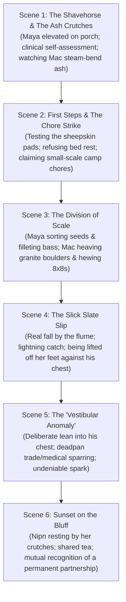

# Chapter Blueprint: The Physics of Balance (Expanded Book 1 Chapter)
**Book:** *The Reclaimed River* (Book 1 Expansion)  
**Timeline:** Days 46 – 58 (Mid-Summer, Year 1)  
**Setting:** The Creek Camp & The Stone Light, Petkotkweyak  
**Lead Characters:** Kwitn "Gwidn" Simon ("Mac"), Maya Lin (ER Nurse), Nipn (The Wolf)  
**Word Count Target:** 10,000+ words of granular, novel-grade prose  

---

## Narrative & Thematic Objectives

1. **The Crafting of the Ash Crutch:**
   - Maya sitting on the shady porch with her sprained ankle elevated on a cedar block, watching Mac at the shavehorse.
   - Traditional Mi'kmaw steam-bending and green-wood joinery: selecting straight-grained white ash, splitting the upper fork, steam-bending the spread with kettle steam, pinning the cross-struts with copper rivets, and padding the underarm and handgrips with brain-tanned sheepskin.
   - Maya observing his massive physical frame, shoulder width, forearm vascularity, and effortless mastery of hand tools.
2. **Clinical Self-Diagnosis & Stubborn Determination:**
   - Maya performing a formal orthopedic assessment on herself: testing the anterior talofibular ligament (ATFL), evaluating lateral malleolar swelling, checking capillary refill, palpating the peroneal tendons.
   - Her refusal to be "dead weight" or an invalid; the moment the crutches are sanded, she tests them and immediately demands chores.
3. **The Division of Scale (Small Meticulous Craft vs. Immense Heavy Power):**
   - **Maya's Domain:** Sorting heirloom Three Sisters seeds, peeling thin strips of inner willow bark for salicin tincture, cleaning and filleting striped bass and gaspereau, mending linen gillnets, tending lacto-fermentation crocks.
   - **Mac's Domain:** Moving multi-hundred-pound granite boulders to shore up the tidal flume weir, felling 10-inch sugar maples with a crosscut saw, hewing 8x8 hemlock sills with a broadaxe, carrying eight-foot green logs on his shoulder without grunting.
   - Maya watching him work in the summer sun, deeply struck by his sheer physical power and uncomplaining calm.
4. **The Progression of Falls (Real Slips to Adorable Deliberate Leans):**
   - **The Real Slips:** Silt on wet slate by the fish flume; crutch tip kicking out on gravel; Mac dropping a timber and catching her mid-fall with lightning carpenter reflexes, lifting her clean off her feet against his chest.
   - **The Growing Boldness / Intentional Wobbles:** Maya discovering how safe and solid it feels in his arms; testing the waters by "losing balance" near the workbench or woodbox to lean into his broad chest and trade flirty, deadpan trade banter.
   - Mac seeing right through it with his dry humor: *"You navigated thirty yards of loose rail ballast without a wobble, but you suddenly suffer a catastrophic equilibrium collapse every time you're two feet from my chest."*
   - Maya's clinical excuse: *"Post-traumatic vestibular drift. Immediate stabilization against nearest load-bearing pillar."*
5. **Deepening Domestic Partnership:**
   - Nipn observing from the shade, trailing her quietly to act as a living balance-brace whenever she pauses.
   - Tea by the sunset on the river bluff, sharing stories of her ER shifts in Saint John and his heritage timber contracts in Labrador.

---

## Granular Scene Breakdown

