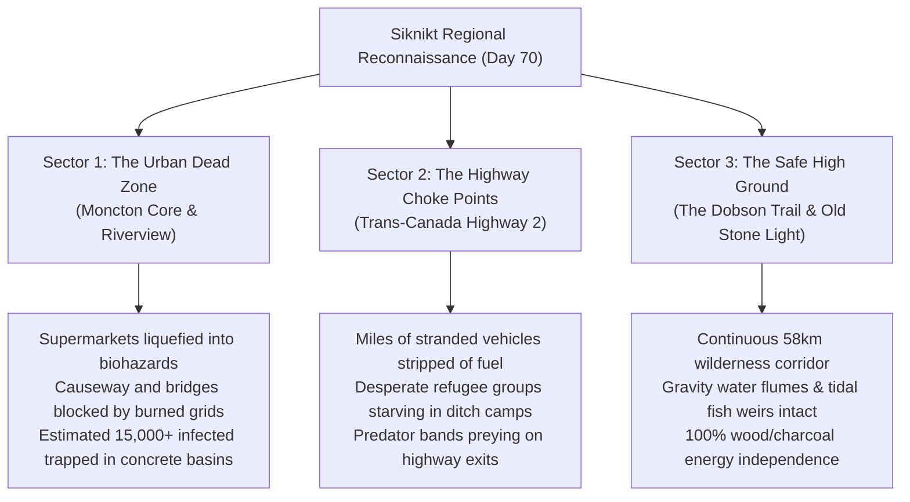
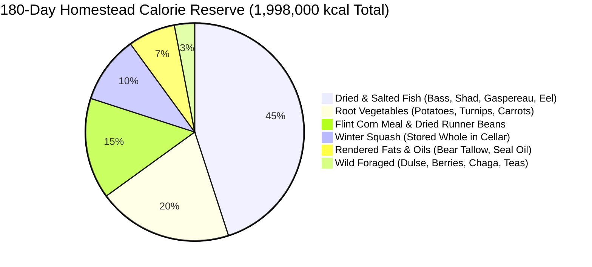

# Chapter 8: The Family on the Rails

### Days 60–72 (Early August, Year 1)
**Location:** The Creek Camp & The Old Stone Light, Petkotkweyak (*Siknikt*)  
**Protagonist:** Kwitn "Gwidn" Simon  
**Companions:** Maya Lin, Cousin Chris, Auntie Elizabeth, Nipn  

---

### I. The Rhythm of the Silt (Day 60)

The morning broke across the Petitcodiac not with a sudden blaze of gold, but with the slow, cool lifting of river-smoke. It was the first week of August, and the maritime summer had settled into that brief, precious pocket of heavy green abundance where the humidity smelled of wild rose, marsh grass, and the rich, iron-heavy silt exposed by sixteen vertical feet of receding Fundy tide.

Kwitn stood barefoot on the damp cedar planks of the lower terrace, sharpening an eight-inch carbon-steel fillet knife against a wet Arkansas oilstone. The rhythm was steady, meditative, and quiet: three strokes on the bevel, a turn of the wrist, three strokes on the reverse, the light slurry of water and stone dust foaming into a dark gray paste beneath his thumb.

Across the garden plot, twenty paces away within the double line of spruce-pole palisades, Maya was kneeling in the dark loam of the Three Sisters mounds.

She was not limping.

Kwitn watched her out of the corner of his eye as he worked the blade. Her right ankle, which two weeks earlier had been swollen to the circumference of a spruce burr and mottled in shades of bruised eggplant, was wrapped in a simple strip of dry linen, snugged firmly inside a laced work boot. She moved with the fluid, deliberate economy of someone whose joints had remembered their purpose. She was weeding around the base of the northern flint corn stalks—stout, deep-green pillars now standing five feet high, their broad leaves rustling in the morning draft from the bay. Around each stalk, the climbing runner beans had coiled themselves in tight counter-clockwise spirals, their pale violet blossoms already dropping to reveal the slender green fingers of young pods. Below them, sprawling across the mounds in a dense, prickly carpet that completely shaded out the soil and choked the weed roots, the broad, ribbed leaves of the crookneck squash drank the morning dew.

"You’re staring at the corn, Simon," Maya said without looking up from her weeding. Her voice had the crisp, rested cadence that had returned to her over the last four days of steady walking.

"I’m staring at the shade under the squash," Kwitn replied evenly, drawing the knife edge across the leather strop hanging from the porch post with a soft *shhk-shhk*. "The weeds don't stand a chance. The old people knew what they were doing. If you leave bare dirt in New Brunswick, the lamb’s quarters and thistle will eat you alive before August is out. But squash leaves are like umbrellas. They keep the moisture in the ground and starve the nettles of sunlight."

Maya sat back on her heels, wiping a smudge of dark silt from her cheek with the back of a canvas-gloved hand. A stray lock of black hair had escaped from her bandana, catching the pale morning light. She looked over at the knife in his hand, then out toward the tidal creek where the mudbanks sloped down like vast, glistening shoulders of chocolate fudge.

"Low tide in twenty minutes?" she asked.

"Eighteen," Kwitn corrected, glancing at the line of driftwood stakes he had driven into the bank below the flume. The top six inches of the third marker were dry in the sun. "The tide doesn't wait for conversation. If we don't clear the wicker baskets before the turn, the striped bass will work themselves raw against the spruce laths, and the mud-eels will wriggle through the bottom weave."

Maya stood up in a single, smooth motion, testing her weight squarely on both feet. She smiled—a quick, wry flash of white against sun-browned skin that had lost every trace of the gaunt, gray exhaustion she had brought out of the woods on Day 45.

"Lead on, River Man," she said, picking up two five-gallon wooden firkins by their rope handles. "Let’s see what the bay sent us for breakfast."

---

### II. The Harvest of the Weirs

The walk down the timber-stepped path to the creek mouth was cool beneath the canopy of red spruce and mountain ash. Kwitn had laid split-log treads along the steepest grade, trenching each one into the hillside and pinning it with dried ash trunnels so that even in a driving November sleet, a person carrying sixty pounds of wet fish wouldn't lose their footing and break an ankle on the shale.

At the bottom, where the fresh spring-fed brook met the brackish backwater of the Petitcodiac, the tidal weir sat like an ancient, half-submerged wooden lung.

It was constructed entirely of woven willow withies, peeled alder poles, and split-spruce stakes driven three feet deep into the heavy clay bed. At high tide, the massive twelve-foot surge of chocolate-colored water rushed up the channel, completely submerging the weir wings and allowing migrating fish to swim freely into the wide creek mouth to feed on sand shrimp and marsh bugs. But when the tide turned—ebbing with the fierce, silent speed of a draining lake—the water was funneled along the V-shaped willow wing-walls directly into three submerged holding corrals.

Kwitn stepped out onto the weir walkway—two parallel hemlock logs peeled clean of bark and notched with cross-cleats for traction. Maya followed half a pace behind, her balance steady, setting the empty wooden firkins on the staging platform.

The water inside the central holding pen was swirling.

"Look at that boil," Maya whispered, leaning over the wicker rail.

Kwitn peered into the murky, tea-brown pool. The surface broke in a sudden, violent swirl of silver and dark green scales. A broad, broad back—marked with distinct, dark horizontal stripes running from gill to tail—sliced through the water, followed by a frantic flurry of smaller, deeper-bodied fish.

"Striped bass," Kwitn said, his voice dropping into the quiet, respectful tone he used whenever the river delivered food. "Big one, too. Thirty inches at least. And a whole school of American shad and gaspereau that got turned around in the eddy."

He took the long-handled dip net—woven from salvaged nylon seine twine and lashed to a twelve-foot peeled ash pole—and dipped the hoop smoothly into the downstream corner of the pen. With a practiced twist of his shoulders, he scooped upward through the boil.

The net came out heavy, dripping with thick river spray. Inside, thrashing with tremendous, muscular vigor, was a thirty-two-inch striped bass, its silver belly flashing like clean pewter, and three fat, deep-bellied American shad whose scales scattered iridescent blue and green sparks in the sunlight.

"Hold the firkin steady," Kwitn said.

Maya stepped forward, tilting the wooden tub. Kwitn swung the net over and released the tension, letting the four heavy fish slide smoothly into the water-filled firkin. Before the bass could thrash against the staves, Kwitn reached into his belt, produced a six-inch maple priest—a small, weighted hardwood club—and struck the fish once, cleanly and decisively, directly behind the eyes atop the cranial ridge.

The bass stiffened, shuddered once, and went perfectly still.

"No lactic acid," Maya observed quietly, watching the precision of the strike. "If they thrash themselves to death in the bucket, the meat turns sour and soft. That’s standard clinical physiology: glycogen depletion and lactic acidosis degrade protein fibers."

Kwitn looked up, his lips twitching with a quiet smile. "In Siknikt, we just say an angry fish tastes like mud, and a calm fish tastes like sweet water. But I expect your medical books and my grandfather were talking about the exact same thing."

He dipped the net three more times.

By the time the tide reached dead low—the vast chocolate mudflats stretching out into the Petitcodiac channel like gleaming sheets of wet leather—they had harvested two magnificent striped bass, eleven fat American shad, fourteen smaller gaspereau (alewives), and three thick, muscular American eels (*kat*) that had coiled themselves into the shaded floor of the third basket. The remaining smaller fish—mostly juvenile tomcod and river herring—Kwitn scooped out and transferred into the upstream live-holding box, a deep, submerged crib anchored in the constant flow of the cold freshwater brook where they could swim safely until needed.

"We don't take more than we can salt, smoke, or eat in three days," Kwitn said, washing the slime from his hands in the cold spring brook. "That’s *Netukulimk*. If you kill twenty bass today and let five rot on the bench because you were too tired to clean them, the river remembers. Next spring, when the ice breaks and you’re starving, the weir will be empty."

"It’s good arithmetic," Maya said simply, lifting the first firkin with an easy shrug of her shoulders. "And good hygiene. Rot attracts flies, flies bring maggots, and maggots bring sickness. Clean living isn't a luxury out here; it’s preventative medicine."

Together, moving with synchronized, unhurried paces, they carried the harvest up the timber steps to the outdoor cleaning bench beside the flume.

---

### III. Hardwood, Smoke, and Pratchett (Day 61)

The flume ran with relentless, icy clarity. Water diverted from the upper mountain spring rushed through the U-shaped split-cedar troughs, spilling over the granite wash-basin with a soothing, hollow gurgle.

Maya worked on the left side of the bench, her slender hands moving with surgical speed and confidence. She scaled the shad with the back of an oyster knife, using short, rhythmic scrapes that sent the silver scales flying like mica flakes into the waste trough. With a swift incision from vent to throat, she cleared the entrails in a single pull, dropping the clean guts into the garden compost bucket and rinsing the cavity under the cold flume spout until the white flesh was spotless.

Kwitn was splitting the larger striped bass along the backbone, opening the thick, firm fillets so they could be laid flat on the cedar smoking racks. Beside him, a small smoke-pot—made from a five-gallon steel paint drum punched with draft holes—was smoldering softly with dampened green birch punk and sugar maple shavings. The smoke was sweet, dense, and pale blue, curling up through the drying tiers where strips of salted fish were already drying into tough, golden planks.

"You have twenty-four books on that shelf by the fireplace," Maya remarked, wiping her fillet blade on an oiled rag.

Kwitn paused, his crook knife halfway through a cedar peg. "Twenty-seven, actually. If you count the 1974 edition of the *Canadian Wood-Frame House Construction* manual and the pocket flora of Atlantic Canada."

"And eight of them are Terry Pratchett," she said, looking over at him with that keen, evaluating tilt of her head. "I was reading *Men at Arms* last night by the tallow candle while you were checking the perimeter tripwires."

"A fine piece of work," Kwitn said without hesitation. "Sam Vimes understands infrastructure better than most city engineers. And his Boots Theory of Socioeconomic Unfairness is the truest piece of economics ever printed."

"The idea that a rich man buys a fifty-dollar pair of boots that lasts ten years with dry feet, while a poor man spends ten dollars every winter on cheap cardboard boots that leak, so after ten years the poor man has spent a hundred dollars and still has wet feet?" Maya recited, her dark eyes flashing with amusement.

"That’s the one," Kwitn said, pointing the tip of his crook knife at his own thick-soled, oil-tanned leather boots drying near the hearth. "It’s why I spent three months of wages on these Red Wings four years before the radios died, and why I spent two weeks hand-fitting the white oak hinges on that trunnion gate instead of using cheap hardware store zinc brackets. Zinc rusts out in eighteen months in the salt fog of the Bay of Fundy. White oak greased with bear tallow lasts fifty years. Cheap solutions kill you in the woods. They just take their time doing it."

Maya leaned against the cedar post, looking out through the open gate toward the high ridge where the Old Stone Light stood sentinel against the sky.

"And what about Granny Weatherwax?" she asked softly. "You have three of the Witches books. What’s the survival application of Headology?"

Kwitn chuckled—a low, dry sound in his chest. "Headology is knowing that ninety percent of the trouble in the world happens because people are reacting to what they *think* is happening rather than what’s actually in front of their noses. It’s knowing that if you panic, you’ve already been eaten. When those five stumble-bums chased you out of the woods on Day 45, they weren't tactical masterminds. They were rotting meat driven by basic spinal reflexes. If I had run around screaming with a machete, I would have slipped in the mud, broken my elbow, and gotten bit. But if you set an ash pole in the dirt at a forty-five-degree angle and let their own forward momentum drive the point through their roof-of-the-mouth, you don't even have to break a sweat."

Maya was silent for a moment. Her gaze drifted to her own hands—the neat, clean fingernails, the faint scar across her left knuckle from an old kitchen burn in Halifax.

"I panicked," she admitted in a quiet, measured voice. "In town. At the hospital first, then on the road. When the power went out, everyone was running. We had protocols for mass casualties, but we didn't have protocols for the patients getting up off the stretchers and biting the triage nurses. People were driving their cars onto the sidewalks, smashing into lamp posts, shooting at shadows in the dark. It was like the whole city lost its mind in forty-eight hours."

"That wasn't panic, Maya," Kwitn said gently, setting the fish fillet onto the salt board. "That was just observing a catastrophe before you had the right tools to deal with it. You walked sixty kilometers on a sprained ankle through spruce bogs without getting bitten. You kept your medical kit dry. You found the river trail. That’s not panic. That’s good sense taking its time to find high ground."

She looked at him, and for the first time since she had collapsed at his gate, there was no shadow of the old terror in her eyes. There was only the calm, steady clarity of two people who had measured each other against the wilderness and found no cracks in the timber.

"Dandelion tea?" she offered, turning toward the iron kettle steaming on the hearth stones.

"Boil it dark," Kwitn said. "We have four more cords of maple to split before the heat of the afternoon."

---

### IV. The Iron Rhythm on the Ballast (Day 63)

Two days later, the quiet routine of the camp was broken not by a sound of violence, but by a rhythmic, metallic vibration that traveled through the bedrock before it reached the air.

It was mid-morning. Kwitn was thirty feet up on the lower gallery of the Old Stone Light, replacing a cracked cedar shake on the southern eaves of the lightkeeper’s quarters. Maya was below on the terrace, winnowing dried sweetgrass on a birchbark tray.

Suddenly, Kwitn stopped his hammer mid-swing.

He laid his left palm flat against the massive, dressed-granite blocks of the tower wall.

*Clack-clack... clack-clack... clack-clack.*

It was faint, rhythmic, and perfectly spaced. A heavy, rolling metallic clatter coming from the northeast, along the grade of the abandoned Canadian National railway spur that wound through the spruce ridges three hundred yards behind the light.

Kwitn descended the ladder with smooth, swift precision, his boots making no sound on the rungs. When he reached the terrace, Maya already had her light cedar shortbow unslung, an ash shaft nocked on the hemp string, held low across her thighs in the ready position.

"You hear that?" she asked, her eyes scanning the dense wall of black spruce along the northern perimeter.

"Iron on steel," Kwitn said, slipping his heavy ash bear-spear from its wall bracket. "Not walkers. Walkers don't roll. And they don't keep time."

"Scavengers?"

"Could be. But scavengers usually walk the gravel with noisy boots or try to drive trucks until they run out of gas in the ditches." Kwitn motioned with his chin toward the tree line. "We take the high ditch trail. Keep behind the alders. If it’s trouble, we let them pass toward the washout. If it’s not..."

He didn't finish the sentence. He didn't need to.

They moved like twin shadows through the perimeter abatis, slipping through the concealed gate and ducking into the narrow, moss-carpeted trench that ran parallel to the old railbed. The rail line had been decommissioned fifteen years before the collapse; the heavy steel tracks were still intact, though red with surface rust, running straight through a deep cut in the sandstone ridge. Alders and young birch saplings had grown up along the ditches, creating a natural green tunnel that muffled sound and obscured vision.

Kwitn knelt behind a thick clump of serviceberry bushes, thirty yards from the grade. Maya knelt four paces behind his left shoulder, her arrow half-drawn, her breathing slow and completely silent.

Twenty yards up the tracks, a rustle stirred the spruce branches.

A shape emerged from the shadows.

It was not a human.

It was a large, broad-chested dog—a Canadian Inuit sled dog crossed with a German shepherd, with a thick, silver-gray double coat, black markings across the muzzle, and erect, wolf-like ears. The dog was moving in a low, effortless trot along the center of the rail ties. He carried no pack, wore no jingling collar, and made not a single sound.

Three paces onto the gravel ballast, the dog stopped dead.

His black nose twitched once toward the south. His left ear rotated backward toward the tracks, then forward toward the serviceberry clump. He did not growl. He did not bark. He simply stood with his tail curled loosely over his spine, lowered his head by two inches, and fixed his pale amber eyes directly on the exact spot in the brush where Kwitn was concealed.

A slow, wide grin broke across Kwitn’s face. He lowered the bear-spear.

"Nipn," Kwitn whispered softly.

The dog gave a single, tight wag of his tail—an acknowledgment of presence—and took two steps toward the brush, his tail held high in calm greeting.

Behind the dog, emerging from the rock cut at a steady four miles per hour, came the source of the iron rhythm.

It was a heavy, hand-pumped rail trolley—a classic four-wheeled track draisine, heavily modified with welded steel reinforcement bars, timber outrigger cargo decks, and dual hand-crank walking beams.

Pushing the wooden levers with rhythmic, tireless power was a broad-shouldered man in grease-stained denim overalls, a faded flannel shirt with the sleeves cut off, and a worn leather welding cap pulled low over a thick mop of dark hair. He had a thick jaw, forearms like cured oak logs, and a half-smoked cigarette stub clamped unlit between his back teeth.

Sitting upright on the wooden cargo deck between two massive canvas-tarped bundles was an older Mi'kmaw woman. She wore a heavy wool Hudson's Bay coat over a calico dress, her silver-streaked hair tied back in a neat, traditional braid. In her lap, she held a woven black ash basket covered with a clean cotton tea towel. Her sharp, dark eyes scanned the treetops and the ridge line with the quiet, unhurried scrutiny of a hawk circling a meadow.

"Chris," Kwitn muttered, standing up from behind the serviceberries and stepping out onto the gravel ballast. "You’re three weeks late. I was about ready to give your room in the lighthouse to the squirrels."

---

### V. The Reunion on the Ballast

The man on the handcar slammed his boots down onto the timber brake lever. The iron shoes bit into the steel rails with a dry, squealing crunch, bringing the laden trolley to a halt five paces in front of Kwitn.

Cousin Chris wiped a streak of charcoal grease from his brow with the back of a hairy forearm, spat his unlit cigarette stub into the gravel, and looked Kwitn up and down with an expression of deeply feigned exhaustion.

"Three weeks late?" Chris drawled, his voice a gravelly, resonant baritone that sounded like two grinding stones in a mill. "Simon, do you have any idea how many rotten transmission casings and abandoned Hyundai sedans are parked across the level crossings between here and Salisbury? I had to winch twelve dead Subarus off the tracks with a come-along just to get this iron bastard past the highway overpass. And half the ties on the marsh bridge were so rotten I had to lay split logs across the stringers while the dead guys were groaning down in the bulrushes."

He stepped off the trolley, his heavy steel-toed boots crunching on the stone, and grabbed Kwitn in a fierce, one-armed bear hug that rattled Kwitn’s ribs.

"Good to see you, cousin," Chris murmured, the sarcastic edge vanishing for an instant into pure, honest relief. "Heard the radio towers drop out from the shop in Moncton. Looked like the end of the world down on Main Street."

"It was," Kwitn said quietly, returning the grip. "How did you get Auntie out?"

From the cargo deck, the older woman raised a single, commanding hand. "He didn't *get* me out, Kwitn Simon. I got *him* out. The boy was trying to load three hundred pounds of broken engine blocks into the back of a half-ton truck with two flat tires. I had to hit him over the head with my walking stick and tell him to grease the rail trolley."

Kwitn stepped to the side of the car, lowering his head with deep, instinctive respect. "Auntie Elizabeth. *Kwe’*."

" *Kwe’*, little maker," Auntie Elizabeth said, her stern face breaking into a web of warm, sun-deepened wrinkles as she reached down and cupped Kwitn’s cheek with a warm, dry palm that smelled of sweetgrass and woodsmoke. "You look skinny. But you built a good roof. I could smell your spruce smoke three miles up the grade."

She turned her gaze toward the ditch.

Maya was standing at the edge of the alders, her bow relaxed in her hand, watching the three of them with quiet, polite reserve. Her posture was straight, her chin up, but her eyes were assessing every detail of the newcomers—the tools on the car, the posture of the elder, the dog sitting calmly at her side.

Auntie Elizabeth’s eyes settled on Maya. She looked at the young woman’s clean, functional clothing, the firm way her boots were planted on the shale, the alert intelligence in her face, and the linen wrap neatly bound around her right ankle.

"Well," Auntie Elizabeth said, nodding slowly. "Who is your friend, Kwitn? And why is she letting you do all the talking while she stands there holding an arrow like she’s ready to shoot a deer?"

Maya stepped forward onto the ballast, un-nocking her arrow and slipping it smoothly into her back quiver. She bowed her head slightly—a crisp, respectful gesture of acknowledgment.

"Maya Lin," she said clearly. "I’m... staying at the camp. Recovering from an injury."

Auntie Elizabeth smiled—a wide, knowing, grandmotherly beam that instantly dissolved every ounce of tension in the air.

"Good," the elder said, extending her hand to Maya. "A nurse. I can tell by the way you wrapped that ankle. Clean turns, no bunches over the malleolus. My nephew would have tied a cedar branch to your leg with rope and called it a splint. Help me off this iron cart, child. My knees are older than this railway, and Chris has been driving like he’s trying to catch a train that stopped running in 1982."

Maya stepped up to the handcar, taking Auntie Elizabeth’s arm with gentle, confident firmness, easing the elder down onto the firm footing of the rail ties.

Chris stood with his hands on his hips, looking at Maya with a raised eyebrow, then turned to Kwitn with a deadpan smirk.

"Well, look at that," Chris muttered. "You’ve only been out here two months, Simon, and you’ve already found someone who actually knows how to work. God knows you needed the help."

---

### VI. The Cargo of the Draisine

Unloading the rail trolley was a three-hour operation of pure, unadulterated engineering bliss.

For two months, Kwitn had been working with wood, stone, bone, and whatever small hand tools he had managed to haul in his canoe. But Chris was a machinist and a welder—a man who measured the world in Rockwell hardness, thousandths of an inch, and the tensile strength of cold-rolled steel.

The cargo lashed to the trolley was a masterclass in salvage:

1. **The Smithy Core:**
   - A 120-pound forged-steel Peter Wright anvil, its horn polished bright and its face flat and true, rescued from a retired blacksmith shop in Salisbury.
   - A heavy cast-iron blacksmith’s leg vise with six-inch jaws.
   - A hand-crank Champion centrifugal blower with intact bronze gears and an oil-bath housing.
   - Four burlap sacks of high-grade bituminous smithing coal—pea-sized, low sulfur, stolen from an old coal bunker behind the heritage railway yard.
   - Sixty pounds of assorted carbon steel stock: discarded truck leaf springs (5160 spring steel), old circular sawmill blades (L6 tool steel), and thick square-bar iron.

2. **The Domestic & Survival Stores:**
   - Auntie Elizabeth’s woven ash seed baskets, containing glass jars of heirloom white Mi'kmaw flint corn, black runner beans, Crookneck squash, northern tobacco, and sweetgrass rootstocks wrapped in damp moss.
   - A thirty-pound iron Dutch oven with a flanged lid for holding hot coals, two heavy copper tea kettles, and three cast-iron skillets.
   - Bundles of dried traditional medicines: wild ginger (*Pekwit*), sweet fern, goldenrod root, dried chaga mushroom chunks the size of fists, and bundles of dried sweetgrass braided tightly into three-foot strands.
   - Five heavy 100% wool Hudson’s Bay point blankets (four-point, thick and un-moth-eaten), three oilskin canvas tarps, and two pairs of winter caribou-and-moosehide moccasins sewn with sinew.

3. **The Mechanical & Defense Salvage:**
   - A heavy manual tire-lever set, two come-along cable winches (two-ton capacity) with thirty feet of aircraft-grade steel cable.
   - Four brand-new, un-opened boxes of Nicholson bastard files, three drawknives, two splitting froes, and a complete set of antique timber-framing corner chisels.
   - A heavy crate containing two hundred feet of 3/8-inch galvanized chain and eight heavy steel snatch blocks.
   - Strapped securely beneath the undercarriage of the rail car, out of the summer dust: a traditional six-foot ash-and-hickory *komatik* (dog sled) with UHMW poly runners, greased with seal oil and stowed away specifically for when the three-foot snowdrifts arrived in December. For the summer trails, Nipn wore a pair of fitted canvas saddle-panniers to carry thirty pounds of camp gear and dry-land scouting kits.

"Where did you find the coal, Chris?" Kwitn asked, hauling a sixty-pound sack onto his shoulder with an appreciative grunt.

"Salisbury rail heritage shed," Chris said, unbolting the leg vise from the deck timbers. "The museum folks had half a ton of it stored in a dry bunker for their tourist steam locomotive that never ran. Left a note on the door saying 'Thanks for the fuel, the King is dead, long live the clacks.' Figured nobody was going to audit the inventory."

"And the anvil?"

"Stole it off my uncle’s front lawn in Petitcodiac. He was using it as a doorstop for his tractor shed. Sacrilege, Simon. Absolute sacrilege. An anvil like this has another two hundred years of work in it, and he had a plastic flower pot sitting on the horn."

Maya was carefully carrying Auntie Elizabeth’s seed baskets up the terrace steps, walking beside the elder. Auntie Elizabeth was pointing out the native flora along the path with her peeled ash cane.

"See that there, Maya?" the elder said, pointing to a patch of dark green leaves with serrated edges growing near the flume overflow. "That’s wild mint. Good for the stomach when the winter fish gets heavy. And over there, by the spruce stump—that’s goldthread. The roots look like yellow wire. You chew on a little piece of that when you have a toothache or a canker sore, and the pain is gone in ten minutes. My grandmother used it when the doctors in Moncton wouldn't see our people. Better than aspirin."

"We use benzocaine and chlorhexidine in the hospital," Maya replied, her voice full of genuine fascination as she bent down to inspect the tiny, bright-yellow root hairs exposed in the moist moss. "But the mechanism is the same: antimicrobial alkaloids and local vasoconstriction. It numbs the mucous membranes."

"I don't know about alka-whatevers," Auntie Elizabeth chuckled softly, "but it stops a crying baby from keeping the whole house awake, and that’s science enough for me."

---

### VII. Setting the Anvil (Days 64–66)

By the following morning, the quiet camp had transformed into a thriving hive of purposeful industry.

The installation of the blacksmith shop took precedence over everything else. Without forged iron, they could not build heavy hinges for the lighthouse storm shutters, could not make iron wedges to split the winter firewood, and could not forge socketed bear-spears to replace the fire-hardened ash poles.

Chris chose the site with the eye of an experienced tradesman: a flat gravel bench twenty paces downstream from the kitchen terrace, shaded by three towering white pines and protected from the prevailing Bay of Fundy winds by a natural sandstone outcrop.

"The anvil needs a proper stump, Simon," Chris declared, standing with hands on hips over a newly felled white oak log. "Not birch. Not spruce. Birch splits under the hammer, and spruce is too soft—absorbs the blow like a sponge. An anvil needs a solid oak heart. The anvil doesn't just hold the metal; the stump pushes back. Every ounce of energy you put into the hammer has to bounce back into the steel, or you’ll wear your shoulder out before you finish three drawknives."

Together, using a six-foot two-man crosscut saw they had salvaged from the trolley, Kwitn and Chris cut a three-foot section of the three-foot-thick white oak trunk. The saw sang back and forth—*shhh-wack, shhh-wack*—the large raker teeth spitting out thick curls of sweet-smelling, butter-colored oak shavings.

They trenched the stump eighteen inches deep into the gravel bed, packing crushed sandstone and wet river clay around its base until it was as immovable as the continent itself.

On top of the flat-faced stump, Chris laid a bed of wet lead sheet and thick pine pitch to deaden the ring. Together, grunting with synchronized effort, they hoisted the 120-pound Peter Wright anvil into place, seating it squarely in the center of the wood. Chris drove four heavy, hand-forged steel staples—bent from rebar—over the feet of the anvil, pinning it permanently to the oak.

He tapped the anvil face with his 2.5-pound cross-peen hammer.

*CLIIIIIIING.*

The note was high, pure, and sustained—a clear, bell-like ring that echoed off the granite walls of the lighthouse and rolled down through the spruce valleys.

Nipn, lying in the shade of the palisade gate, raised his head, gave a single appreciative snort, and rested his chin back upon his paws.

"Now *that*," Chris grinned, running a thumb over the hardened face, "is the sound of civilization coming back to Siknikt."

---

### VIII. The Fire and the Iron (Days 67–68)

For two full days, the creek bank echoed with the roar of the forge and the rhythmic music of the hammer.

Chris connected the hand-crank Champion blower to Kwitn’s sunken charcoal pit using a three-foot length of salvaged three-inch cast-iron pipe as a tuyere. When Maya turned the wooden crank handle—her movement smooth and steady—the air roared into the heart of the pit. The bed of bituminous coal and lump spruce charcoal erupted into a brilliant, incandescent white-yellow glow that reached over 2,200 degrees Fahrenheit.

Kwitn was the striker. Chris was the smith.

Chris would reach into the fire with heavy iron tongs, drawing out a six-inch section of truck leaf spring glowing cherry-red. He laid it across the anvil face.

"Strike!" Chris commanded.

Kwitn swung an eight-pound sledgehammer in a smooth, overhead arc, bringing the flat face down with crushing momentum: *THWACK!*

The glowing steel yielded beneath the blow, flattening and spreading.

"Again!" *THWACK!*

"Turn!" Chris flipped the steel ninety degrees with the tongs. "Strike!" *THWACK!*

Between every heavy blow from Kwitn’s sledge, Chris’s smaller cross-peen hammer tapped the anvil face in a rapid, guiding rhythm—*ting-ting, THWACK, ting-ting, THWACK*—directing the flow of the metal with effortless non-verbal communication.

Under their combined labor, the scrap metal from the old world was reborn into the essential tools of the new:

1. **Four Heavy Splitting Froes & Six Steel Wedges:**
   - Forged from thick leaf-spring carbon steel, hardened in spring water and tempered in hot oil to a tough, springy straw-yellow hardness. These would allow them to rive straight cedar shakes and split cordwood without dulling their primary felling axes.
2. **Twelve Heavy Strap Hinges & Pintles:**
   - Massive, three-eighths-inch-thick iron strap hinges with half-inch pivot pins, designed to hang the heavy, insulated storm shutters across the lower windows of the Stone Light before the November gales arrived.
3. **Six Socketed Bear-Spear Heads:**
   - Beautiful, lethal weapons. Each spearhead was nine inches of double-edged leaf-shaped 5160 carbon steel, with a hollow, tapered conical socket that seated over a peeled ash pole. Behind the socket, Chris welded a heavy, five-inch crossguard bar—the classic medieval boar-spear lug—preventing an impaled infected from sliding down the shaft toward the user.

Maya inspected the finished spearheads as they cooled in a wooden trough of used motor oil. The steel was a deep, iridescent blue-black, smooth to the touch, with edges ground razor-sharp on the water wheel.

"These are brilliant," Maya said, testing the weight and balance of one spearhead against her palm. "With the crossguard, the mechanical stop is absolute. In trauma medicine, you see puncture wounds where the impaling object passes entirely through soft tissue because there’s no flange to arrest forward kinetic energy. With this, the corpse’s own weight locks it six feet away from you while the brainstem is severed."

Chris looked at her, then looked at Kwitn, shaking his head with a broad grin.

"Simon," Chris said, wiping sweat from his neck with his oily cap, "I don't know where you found this girl, but if you let her leave this camp, I’m going to throw you in the Petitcodiac at high tide."

---

### IX. Auntie’s Snug and the Apothecary (Day 69)

While the smithy roared by the creek, the interior of the Old Stone Light was undergoing a transformation of comfort and order.

The ground-floor living quarters of the lighthouse—a sixteen-foot circular room enclosed by four-foot-thick cut-granite walls—had been a drafty, echoing space when Kwitn first took shelter there. But with Auntie Elizabeth in residence, the room became a home.

In the southern arc of the tower, where the low autumn sun would shine through the deep-set window embrasures, Kwitn and Chris framed a private sleeping "snug" for the elder. They used two-by-four spruce studs planed smooth with drawknives, sheathing the interior walls with tight-fitting tongue-and-groove cedar boards that smelled of warm pine and resin.

Between the granite wall and the cedar sheathing, they packed a four-inch insulation layer of dried sphagnum moss and clean sheep’s wool salvaged from an abandoned farmstead in Hillsborough. The bed was a stout cedar platform raised two feet off the stone floor, topped with a thick mattress ticking stuffed with dried sweet-fern and fresh cedar shavings, layered with two of the heavy four-point wool blankets.

Along the wall above the bed, Auntie Elizabeth hung her treasures:
- Three long, tightly braided strands of sweetgrass, filling the room with the sweet, vanilla-like fragrance of summer meadows.
- A small wooden hoop strung with sinew webbing and a single eagle feather found along the river bluff.
- A framed, yellowed black-and-white photograph of her late husband, smiling from the deck of a wooden lobster boat in Shepody Bay in 1971.

Opposite the bed, Maya and Auntie Elizabeth had organized the camp's central medical apothecary on a set of sturdy white-pine shelves:

"Look at this, Auntie," Maya said, holding up a small glass jar filled with fine green powder. "I dried and ground the yarrow leaves we harvested from the upper meadow. It’s rich in achilleine. If someone takes a deep axe cut or a puncture, you pack this directly into the wound before applying the pressure bandage. It stops capillary bleeding in under sixty seconds."

Auntie Elizabeth unscrewed the lid, smelled the sharp, aromatic powder, and nodded with satisfaction.

"My aunt used to make that in a stone mortar," Elizabeth said softly. "She called it *Wiskwesoq*. When the men worked in the lumber camps in the winter, every one of them carried a little leather pouch of that powder in his shirt pocket. If a double-bitted axe slipped on frozen spruce, you didn't have time to wait for a doctor from Moncton. You packed the green dust into the cut, tied a flannel rag around it, and kept working."

She reached out and patted Maya’s knee.

"You have good hands, Maya Lin. Fast hands, but quiet hands. You don't shake when you touch a cut. That’s a gift. The Creator gave you healing fingers. Don't ever let anyone tell you it’s just book-learning."

Maya lowered her eyes, a faint, rare flush of color rising on her cheeks. "Thank you, Auntie."

"Now," the elder said, standing up and smoothing her apron, "go tell those two noisy boys to wash their faces. It’s time for supper, and if Chris eats another cold biscuit with grease on his fingers, I’m going to make him sleep in the rail ditch with Nipn."

---

### X. The Feast of the Bends (Day 70)

Supper that evening was a feast unlike anything the camp had seen since the collapse.

The four of them sat around the large, oval white-pine table in the center of the lighthouse living room. In the middle of the table, illuminated by the warm, amber glow of three seal-oil lamps made from shallow stone bowls with twisted cotton wicks, was a feast of pure, decolonized maritime abundance:

1. **Cedar-Plank Smoked Striped Bass:** Two massive fillets of twenty-four-inch bass, their flesh flaky, moist, and golden-pink, infused with the sweet smoke of sugar maple and wild apple twigs.
2. **Boiled Fiddleheads & Wild Leeks:** Harvested in early spring from the rich river floodplains, preserved in cold brine crocks, and now sautéed in rendered bear tallow with wild ramps.
3. **Steamed American Shad & Roe:** Plump, tender shad fillets steamed with sweet fern and wild sea-parsley, accompanied by the golden, fried roe sacks—a rich, buttery delicacy prized for generations along the Petitcodiac.
4. **Skillet Cornbread:** Baked in Chris’s heavy Dutch oven over glowing hardwood embers, made from freshly ground Mi'kmaw white flint corn meal, coarse-grained, nutty, and hot from the iron.
5. **Roasted Dandelion & Chicory Root Brew:** Steaming in heavy ceramic mugs, dark as black coffee, bitter and rich, sweetened with a single spoonful of wild blueberry honey Auntie Elizabeth had brought in a mason jar.

Nipn lay curled quietly beneath the table, his heavy head resting contentedly across Maya’s left boot. Every few minutes, Maya would casually slip a piece of crispy fish skin beneath the edge of the tabletop; Nipn would accept it with the delicate, silent precision of a gentleman, never making a sound.

Chris swallowed a massive mouthful of cornbread, washed it down with three gulps of hot dandelion brew, and let out a long, contented sigh that rattled the iron lamp brackets.

"Simon," Chris said, leaning back against the curved stone wall, "I’ll admit I had my doubts when you told me three years ago you were spending your weekends rebuilding this lighthouse instead of buying snowmobiles like a normal human being. But sitting here right now, with two feet of granite between me and the rest of the province, eating fresh bass... I think you might be the only sane man left in Siknikt."

"I told you," Kwitn smiled, carving a second portion of fish with his knife. "A snowmobile needs gasoline, spark plugs, and two-stroke oil. A canoe needs a paddle and a river. Gasoline goes sour in six months. The river has been flowing for ten thousand years."

"Speaking of the rest of the province," Maya said, her tone shifting into that focused, analytical register that brought immediate attention to the table, "what did you see coming down the rail line, Chris? What’s the situation between Salisbury and Moncton?"

---

### XI. The Reconnaissance of the Lower Line

Chris’s smile faded. He set his mug down on the table, folded his thick hands together, and leaned forward into the lamplight.

"It’s gone, Maya," Chris said, his voice quiet and completely stripped of sarcasm. "All of it. Moncton isn't a city anymore. It’s an open-air crypt."

He unrolled a grease-stained road map of southeastern New Brunswick across the pine boards, pinning the corners with two empty shell casings and a salt cellar.

"I spent four days scouting the perimeter from the ridge above Riverview before I linked up with Auntie," Chris explained, his index finger tracing the red line of Route 112. "The bridges across the Petitcodiac—the Causeway and the Gunningsville Bridge—are completely plugged. Cars burned to the rims, tractor-trailers jackknifed across the lanes. You couldn't get a bicycle across, let alone a truck."

"And the population?" Kwitn asked.

"Most of them died in the first three weeks," Chris said grimly. "When the water plants stopped pumping, people tried drinking out of the retention ponds and storm ditches. Cholera and dysentery hit them before the walkers did. Then the fires started. The downtown district around Main Street burned for five straight days. The smoke was so thick you could see it from Hillsborough."

He looked at Maya.

"The Moncton Hospital was the worst of it. The parking garage is full of them. Hundreds of them, trapped between the concrete barriers, groaning in the dark. The smell alone would knock you off your feet from half a mile away. It’s a biohazard soup. Blowflies, methane gas, and rot."

Maya closed her eyes for a brief second, taking a slow, steady breath through her nose. When she opened them, her expression was calm, hardened by the reality of clinical certainty.

"And the highways?" she asked.

"Highway 2 is a death trap," Chris continued. "Miles of cars abandoned on the asphalt. The people who fled Halifax and Saint John thought they could drive through to Quebec. They ran out of gas around Salisbury and Petitcodiac. Small groups of scavengers are living in the culverts and ditch camps, but they’re starving. They’ve eaten all the canned soup, the dogs, the raccoons, everything. Now they’re turning on each other. A couple of heavily armed gangs are setting up roadblocks near the exits, trying to shake down anyone moving on foot."

"They won't come up here," Kwitn stated with quiet certainty.

"Why not?" Maya asked.

"Because roads attract people who think like roads," Kwitn answered, tapping the green wilderness corridor on the map that marked the Dobson Trail. "People who grew up in cities think in straight lines and asphalt. They follow Highway 2 because it’s big and flat. They don't know how to navigate twenty miles of unbroken spruce bog, they don't know how to cross a tidal mudbank without sinking to their waists in suction silt, and they have no idea how to find food without a supermarket barcode. By the time November hits, the highway bands will either starve or freeze in their aluminum camper trailers. The land will clean them up for us."

Auntie Elizabeth nodded slowly, sipping her hot dandelion tea. "The forest has always taken care of itself. In the old days, when the smallpox came through with the ships, the people who stayed in the stone forts died. The people who took their canoes up the headwaters of the rivers and lived on spruce bark and trout lived to see their grandchildren. Nothing has changed. Only the shape of the sickness."

---

### XII. The 180-Day Winter Arithmetic (Day 71)

The following morning, Maya took charge of the central table with a ledger book, a pencil, and a set of hand-carved boxwood measuring rulers.

"We have roughly sixty days before the first hard ground-freeze," Maya said, tapping the open page where four neat columns had been drawn in dark graphite. "In clinical logistics, you never plan for the average scenario; you plan for the maximum duration of isolation. In New Brunswick, winter isn't three months. It’s six. November through April. That’s one hundred and eighty days."

Kwitn, Chris, and Auntie Elizabeth gathered around the table, listening with undivided attention.

"Let’s do the calorie math," Maya continued, her voice crisp and precise:

$$\text{Daily Baseline Calories Per Person} = 2,400\text{ kcal}$$

$$\text{Four Adults} \times 2,400\text{ kcal/day} = 9,600\text{ kcal/day}$$

$$\text{Nipn (Working Dog)} = 1,500\text{ kcal/day}$$

$$\text{Total Daily Homestead Requirement} = 11,100\text{ kcal/day}$$

$$\text{180-Day Winter Total} = 11,100 \times 180 = 1,998,000\text{ kcal}$$

"Two million calories," Chris whistled, crossing his arms over his chest. "That’s a hell of a lot of fish."

"Let’s break down where those two million calories come from," Maya said, turning the ledger so everyone could see the asset allocation breakdown:

"Here is our current inventory and harvest projection," Maya detailed, tapping each line:

1. **Dried and Salted River Fish:**
   - **Requirement:** 450 pounds of dried/salted fillets (Striped Bass, American Shad, Gaspereau, and American Eel).
   - **Current State:** 180 pounds currently curing in salt crocks and smoke racks.
   - **Action:** Operate the 3 tidal weirs at maximum efficiency through August and September. We need to process twenty fish per day for the next thirty days.
2. **Root Vegetables & Tubers:**
   - **Requirement:** 350 pounds of stored roots (potatoes, rutabagas, turnips, carrots).
   - **Current State:** The upper garden plot and Auntie’s seed mounds will yield roughly 400 pounds by late October.
   - **Storage:** Packed in dry sand inside the deep granite root cellar below the lighthouse living room, maintained at a stable 38°F.
3. **Mi'kmaw Flint Corn & Dried Runner Beans:**
   - **Requirement:** 120 pounds of dried flint corn kernels (to be stone-ground into meal) and 60 pounds of dried black runner beans.
   - **Current State:** The Three Sisters mounds are fully pollinated and ripening on schedule.
4. **Rendered Animal Fats & Marine Oils:**
   - **Requirement:** 80 pounds of rendered bear tallow, seal oil, and fish oil.
   - **Purpose:** Pure caloric density (4,000 kcal per pound), essential for maintaining body heat and brain function during sub-zero operations, plus fuel for the stone lamps.

"And what about fuel?" Chris asked, pointing his thumb toward the hearth. "You can have all the dried fish in the world, but if the house drops to minus twenty, you’ll burn through your body fat in three weeks just shivering."

Kwitn stepped forward, tapping the firewood tally notched into the fireplace mantelpiece.

"Eight cords," Kwitn stated. "We have four cords of seasoned rock maple, yellow birch, and white ash split and stacked under the dry timber lean-to behind the tower. We have another three cords felled and bucked on the upper ridge that just need splitting. Chris and I will have the full eight cords stacked, covered with birchbark rolls, and seasoned before the first frost in late September."

"Eight cords of rock maple generates roughly one hundred and sixty million BTUs," Maya noted, nodding in agreement. "Combined with the four-foot granite walls, the moss-wool insulation in the snug, and the ceiling damper, the Stone Light will maintain an ambient temperature of sixty-five degrees Fahrenheit with a single small fire burning in the hearth."

Auntie Elizabeth reached out, resting her hand over Maya’s ledger with a gentle, approving smile.

"You see that, Kwitn?" the elder murmured. "When a nurse and a carpenter sit down at the same table, nobody starves, and nobody freezes. This house is ready for the frost."

---

### XIII. The Silent Watchers of Siknikt (Day 72)

By the evening of Day 72, the compound had settled into a quiet, impregnable equilibrium.

The new forged-iron hinges had been mounted on the lighthouse storm shutters, swinging with silent, oiled precision on their heavy pintles. The creek smithy was cold for the night, its anvil covered with an oiled canvas shroud. In the garden, the tall flint corn stalks swayed gently in the evening breeze, their long leaves whispering against the split-cedar fence.

Up on the gallery catwalk of the Old Stone Light, forty feet above the river bluff, Kwitn and Maya stood side by side, leaning against the cold iron railing.

To the south and west, the vast, unbroken wilderness of the Caledonian Highlands stretched away in rolling waves of deep emerald spruce, fading into purple mist beneath the setting sun. Below them, the Petitcodiac curled through its ancient mudbanks like a sleeping serpent of dark copper, the incoming tide rushing up the channel with a soft, steady hiss that sounded like the breath of the earth.

To the north, thirty miles away across the ridges, a faint, dirty brown smudge hung on the horizon—the lingering particulate haze of the dead, burned city of Moncton.

Nipn stood between them, his forepaws resting lightly on the lower iron rail, his nose testing the evening draft from the bay. His ears twitched once toward the north, then settled back in calm indifference.

"They won't make it through the winter, will they?" Maya asked softly, looking at the distant smudge. "The people on the highway."

"No," Kwitn said quietly. "Most of them won't. They built a world out of plastic, electricity, and twelve-lane highways, and they forgot that the winter doesn't care about supply chains. When the snow piles four feet deep on the asphalt, the cold will take them in their sleep."

He turned to look at her.

"And the ones who survive?" she asked.

"The ones who survive will be the ones who know how to build a weir, split an ash log, and listen to the elders," Kwitn replied. "At the council table tonight, Auntie Elizabeth and Chris made the decision together with us. Their home and their clan responsibilities are down at the coastal settlement in Amlamgog. They brought the anvil, the coal, and the seeds to get us fully set up. Tomorrow at dawn, they take the rail trolley back south to manage the bay fishery and the elders at Fort Folly."

"And this place?" Maya asked, looking around the sturdy granite courtyard.

"This is our house," Kwitn said with a quiet, warm smile. "Just you, me, and Nipn holding the northern river fortress. And with the Clacks up on the lantern deck, we're linked directly to Auntie and Chris across the bay. Two independent homesteads, one united family."

Maya looked down at the courtyard below. Through the open door of the lighthouse living room, Auntie Elizabeth was packing her seed baskets with a peaceful smile, while Chris gave Kwitn’s hand-built trunnion gate a final appreciative shake before loading his travel kit onto the draisine.

Maya smiled—a deep, serene, unshakeable smile—and slipped her hand into Kwitn’s calloused palm.

"Just you and me, Mac," she said softly.

"Two builders and the best sentry dog in New Brunswick," Kwitn said, squeezing her fingers gently in the cool evening air. "And eight full cords of rock maple. We're ready for whatever the winter brings."

---

### XIV. Homestead Inventory & Asset Summary (End of Chapter 8)

| Category | Item Description | Quantity / Status | Operational Notes |
| :--- | :--- | :--- | :--- |
| **Personnel** | Mac's Homestead Crew | 2 Adults + 1 Sentry Dog | Kwitn/Mac (Lead/Maker), Maya (Partner/Medic), Nipn (Silent Sentry). Chris & Elizabeth stationed at Fort Folly trade hub. |
| **Structures** | The Old Stone Light | Fully Fortified & Insulated | 4-ft granite walls, ceiling crown damper, insulated cedar snug, heavy iron storm shutters. |
| **Smithy Core** | Creek Bank Blacksmith Shop | 100% Operational | 120-lb Peter Wright anvil on white oak stump, Champion hand-crank blower, 4 sacks smithing coal, leaf-spring steel stock. |
| **Weapons** | Hand-Forged Bear-Spears | 6 Complete Units | 9-inch 5160 carbon steel double-edged heads, welded 5-inch crossguard lugs, 6-ft peeled ash shafts. |
| **Food Reserves** | Salted & Smoked River Fish | 240 lbs Cured / In Crocks | Native Petitcodiac species: Striped Bass (*Morone saxatilis*), American Shad, Gaspereau, and American Eel (*kat*). |
| **Garden Crops** | Three Sisters Harvest | In Maturation (Oct Harvest) | Northern Flint Corn (120 lbs meal est.), Black Runner Beans (60 lbs est.), Crookneck Squash (400 lbs est.). |
| **Fuel Reserve** | Hardwood Cordwood | 8 Cords Split & Stacked | Rock Maple, Yellow Birch, White Ash; sheltered under bark-sheathed lean-to (160,000,000 BTUs). |
| **Apothecary** | Medical & Herbal Stores | Full 180-Day Supply | Sphagnum moss dressings, silk sutures, yarrow styptic powder (*Wiskwesoq*), willow bark salicin, goldthread root. |
