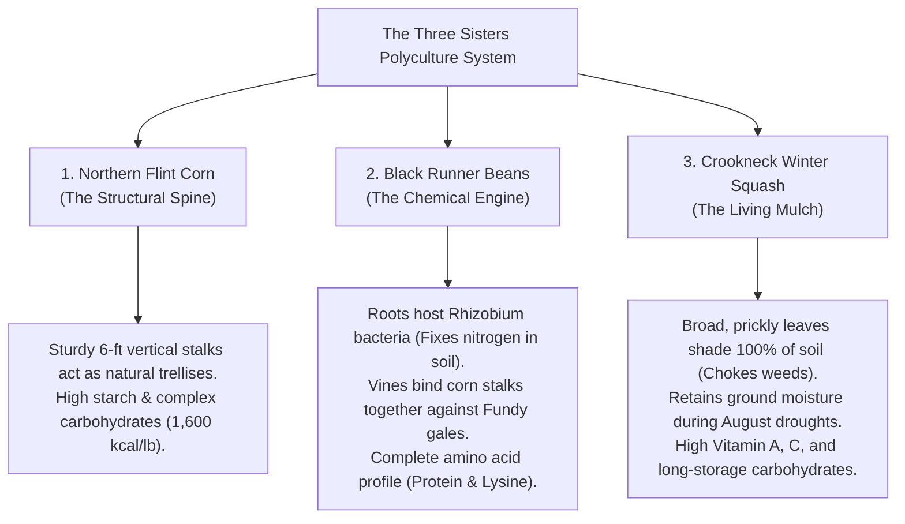
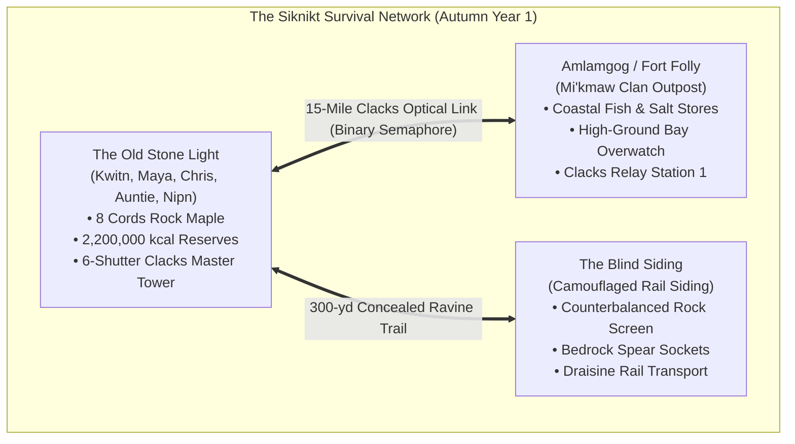

# Chapter 9: The First Frost and the Clacks Signal

### Days 73–95 (Late September to Mid-October, Year 1)
**Location:** The Creek Camp, The Blind Siding, & The Old Stone Light, Petkotkweyak (*Siknikt*)  
**Protagonist:** Kwitn "Gwidn" Simon  
**Companions:** Maya Lin, Cousin Chris, Auntie Elizabeth, Nipn  

---

### I. The Turning of the Leaves (Day 73)

By the final week of September, the geography of Siknikt had set itself on fire with the silent, magnificent chemical transformation of autumn.

The rolling spruce ridges of the Caledonian Highlands—which all summer had been a monotonous, dense wall of deep charcoal-green—were now pierced by explosive ribbons of sugar maple, red oak, and yellow birch. Along the high sandstone bluffs overlooking the Petitcodiac, the hardwoods burned in incandescent shades of copper, saffron, and crimson. In the early mornings, when the temperature plunged to four degrees Celsius above freezing, the massive tidal river did not merely exhale smoke; it breathed vast, ghostly banks of white fog that rolled across the mudflats like combed fleece, snagging in the tops of the eighty-foot hemlocks until the midday sun burned the moisture back into the cold blue sky.

Kwitn stood in the soft loam of the western spruce clearing, a peeled ash digging stick in his right hand and a wooden pack basket slung over his left shoulder.

Ten paces to his right, kneeling among the thick carpet of damp red cedar needles, Maya was working with her sleeves rolled up to her elbows.

Her skin had taken on a deep, radiant bronze from eight weeks of sun, salt wind, and physical labor. The linen wrap was long gone from her ankle; she wore her oil-tanned leather work boots laced tight to the calf, her movements characterized by that sharp, athletic economy that comes from complete physical confidence.

She held an eight-inch crooked knife—the *Mokotaugan* Kwitn had carved for her from an old circular sawmill blade and a curved birch burl handle—and was staring down at an exposed, wrist-thick surface root of a mature red spruce tree.

"I don't get the split, Mac," she said, looking up at him with a slight, concentrated furrow between her dark eyebrows. "In modern carpentry, if you split a root against the annular rings, you create run-out and fracture the grain. But if I try to shave it with the drawknife, the fibers bunch up like wet cardboard."

Kwitn walked over, stepping softly on the moss so as not to crush the delicate cranberry runners creeping along the forest floor. He crouched beside her, placing one knee on a flat sandstone slab.

"You’re thinking like a board, Maya," Kwitn said with his quiet, dry smile. "A board is cut across the log at a sawmill with a spinning steel blade. It doesn't have a choice where it breaks. But *Watap*—spruce root—isn't a board. It’s a living cable. It evolved over four hundred years to flex in sixty-mile-an-hour Fundy gales without tearing."

He reached out, his calloused thumb resting gently over the back of her knuckles as he guided the tip of her crooked knife to the exact center of the peeled root's end-grain.

His hand was warm, rough with dried pine resin and cedar dust, his pulse calm and unhurried. Maya didn't pull away. She leaned in closer, the scent of woodsmoke, wild mint, and clean sweat rising between them in the cool autumn air.

"See that pale central pith?" Kwitn pointed with the pencil-thin tip of a cedar splinter. "That’s the core. You don't cut it with force. You make an incision half an inch deep right down the center line, parallel to the radial fibers. Then you put the knife away."

Maya blinked. "Put the knife away? How do you split three feet of root without a blade?"

"With your fingers and your teeth," Kwitn said. "Watch."

He took the two split halves of the root in his left and right hands. He pulled them apart with steady, continuous tension. The wood didn't tear; it gave way with a soft, rhythmic *zip-zip-zip*, the long, resinous fibers parting cleanly down the exact geometric center of the root, producing two six-foot, ribbon-like strands of flexible, quarter-inch white wood as supple as rawhide lacing.

"The fiber wants to split evenly," Kwitn explained, handing the two strands to her. "If the split starts wandering to the left side and making the left strand too thin, you increase the pulling angle on the right strand. The resistance forces the crack back to the center. It’s self-correcting physics."

Maya took the two halves, feeling the incredible tensile strength of the wet root ribbon between her fingers. She tried to snap it with a sharp, two-handed jerk; the wood barely stretched.

"Tensile strength equal to thirty-pound braided nylon," she muttered, her eyes lighting up with that clinical, analytical satisfaction. "And when it dries?"

"When it dries, the resin hardens," Kwitn said. "It shrinks by roughly three percent, which means whatever you lash with it—whether it’s the gunwale of a birchbark canoe or the wicker frame of a fish weir—gets pulled into an iron grip that never loosens, even if you leave it in salt water for five years."

Maya picked up her crooked knife, positioned the blade over the next spruce root, made the clean half-inch central nick, set the knife down, and pulled.

*Zip-zip-zip-zip.*

The root parted down its six-foot length in a single, flawless, mirror-straight split, dropping two perfect ribbons of lashing into her lap.

She looked up at him, a wide, triumphant grin breaking across her face, her dark eyes flashing in the dappled sunlight.

"Not bad for a town girl, right, Mac?"

"Not bad at all," Kwitn said, letting his eyes linger on her smile for half a second longer than was strictly necessary before picking up his pack basket. "If you keep splitting like that, Auntie Elizabeth is going to have you lashing sixty storage baskets before supper."

---

### I-B. The Medicine Walk on the Ravine (Day 74)

The headache hit Maya on the following morning, right as the sun cleared the eastern hemlocks.

It was not a minor ache. It was a vicious, blinding vascular tension headache—the kind brought on by three straight days of heavy wood-splitting in the biting maritime wind, compounded by the glare of the morning sun off the river mud. 

Kwitn found her sitting on the timber bench beside the kitchen flume, her eyes squeezed tightly shut, her thumbs digging hard into the hollows of her temples. Her complexion was pale, her breathing shallow, and beside her on the wood was an empty plastic blister foil that had once held twenty-four tablets of extra-strength ibuprofen.

"Temporal pulse pounding?" Kwitn asked quietly, setting down a bundle of dry cedar kindling.

Maya let out a ragged breath, not opening her eyes. "Feels like someone drove an eight-penny framing nail through my sphenoid bone. In the hospital, I’d take eight hundred milligrams of Motrin and a liter of normal saline. Out here... I’m staring at an empty foil pack."

Kwitn set his kindling axe down, wiping his hands on his apron. 

"Get your boots on, Maya," Kwitn said gently. "Take the canvas pouch and your crooked knife. It’s time for your first **Medicine Walk**."

Maya opened one squinting eye, looking up at him. "A medicine walk?"

"Before Auntie Elizabeth and Chris took the rail trolley south to Fort Folly, Auntie reminded me to make sure you walked the stream ravine," Kwitn said with a quiet smile. "In Siknikt, you don't run to a tree only when you’re screaming in pain. You walk the land so you know where every healer lives before the sickness comes. Come on. Listen with your ears, not with your hospital machines."

---

They walked slowly up the sunken stream ravine, where the cold mountain brook tumbled over mossy sandstone ledges beneath the red spruce canopy. 

For Kwitn, a Medicine Walk was not an errand; it was a living atlas. As they walked, he introduced her to the forest floor:

1. **Goldthread (*Wisawkesk*):** Tucked in the deep, moist sphagnum moss beneath the yellow birches. Kwitn pulled back the green moss to reveal the bright, canary-yellow, wire-like roots. *"The yellow is berberine,"* Maya recognized immediately. *"A broad-spectrum alkaloid. We use it in clinical trials for mucosal infections and stomatitis."*
2. **Chaga (*K'aqawejoq*):** The black, charcoal-like fungal conks growing on mature yellow birches, rich in betulinic acid for immune support and winter lung protection.
3. **Sweet Fern (*Kjipapaqm*):** The fragrant, fern-like shrubs growing on the sunny gravel benches, used for antiseptic washes and poison ivy relief.

At the sunny gravel bend where the brook widened into a shallow pool, Kwitn stopped before a grove of slender willows and crimson-stemmed bushes.

"Here’s where we fix your head," Kwitn said, pulling his crooked knife from his belt.

He pointed first to the crimson bushes along the ditch.

"People call that 'Red Willow'—the red osier dogwood. The old people use that red bark for smoking blends and chest colds. But for a pounding head and swollen joints, you want the true river willow growing right in the water. We call it *Nipnoqsi*. That green skin under the gray bark is what takes the hammer out of your skull."

"Rule number one of *Netukulimk*," Kwitn said, guiding her hand to a healthy four-inch-thick willow trunk. "Never take the first plant you see, and never girdle a tree. If you cut a circle of bark all the way around the trunk, you choke the wood, the roots starve, and the tree dies. You take only a vertical strip—two fingers wide, eighteen inches long—from the southern side where the sun hits it. The tree scars over and keeps living."

Maya watched with keen, clinical intensity as Kwitn scored the outer gray cork with two parallel vertical slices. With a deft, upward flick of the crooked knife, he peeled back the rough bark to reveal the vibrant, lime-green, moist layer beneath: the inner green skin.

"That’s the medicine," Kwitn explained, slicing the thin green ribbon cleanly from the white heartwood without cutting a millimeter into the sapwood.

He wiped the blade on his leather apron, flipped the knife around in his grip, and offered the curved birch burl handle to Maya.

"Your turn," Kwitn said with a quiet, dry grin. "Take an eighteen-inch strip off that second sapling by the rock... that is, if you’ve got the patience."

Maya took the crooked knife. She gave him a sharp, amused look that said *patience is my job description.*

"Mac, I’ve sutured severed radial arteries in a screaming trauma room with three police sirens going off in the bay," she said calmly, stepping up to the four-inch willow trunk. "I think I can handle a tree."

She aligned her thumb along the flat back of the blade. 

She didn't rush. She rested the carbon-steel bevel against the rough gray bark, feeling the natural resistance of the wood. With two slow, perfectly parallel vertical incisions—exactly eighteen inches long and two inches apart—she scored the outer layer.

Then, sliding the curved hook of the blade under the top edge, she pulled down toward her chest in a smooth, continuous, unhurried draw.

*Shhh-wip.*

The outer bark lifted like a peel. Beneath it, her blade skimmed the exact microscopic plane between the green layer and the white wood, never gouging, never tearing. She lifted an eighteen-inch, unbroken ribbon of vibrant green, translucent cambium into the sunlight—clean as a surgical graft.

She held it up, inspecting the edges with a cool, clinical eye, then looked over at him with a raised eyebrow.

"How was that for patience, Mac?"

Kwitn let out a low, admiring whistle, nodding slowly.

"You cut cleaner than my grandfather," he admitted. "And he’d been doing it for seventy years. Put half of that strip in the pot and chew the other half."

Maya put the pale green ribbon between her teeth and bit down. 

A sharp, intensely bitter, astringent taste flooded her tongue, followed immediately by a cool, clean numbness across her gums.

"Salicin and tannins," she murmured, her nurse's brain instantly translating the bitter chemistry. "Extremely bitter, but there’s an immediate local vasoconstriction."

Kwitn pulled three dried chaga mushroom chunks and a sprig of wild spearmint from his pocket, dropping them into a small, blackened copper kettle filled with four cups of fresh spring water. He chopped the green willow bark into half-inch squares and tossed them in.

He set the kettle directly over a bed of glowing hardwood coals beside the flume, letting it heat slowly.

"You don't boil it hard," Kwitn instructed. "If you boil it at a rolling bubble, you scorch the medicine and make the tea taste like boiled leather. You bring it to a gentle, quiet simmer for twelve minutes until the water turns the color of pale amber beer."

When the steam rose—smelling of wild mint, earthy birch, and bitter bark—Kwitn poured the brew into Maya’s enameled tin mug, stirring in a single spoonful of wild blueberry honey.

"Drink it hot," he said. "Take slow sips."

Maya took the mug in both hands, blew on the surface, and drank.

The tea was hot, pleasantly bitter, sweetened by the honey, with the crisp mint cutting through the heavy astringency of the willow. She drank the entire mug in five minutes, sitting on the sun-warmed cedar log, letting the steam warm her face.

Fifteen minutes passed.

Kwitn was quietly splitting cedar kindling ten paces away, his axe making soft, rhythmic *thunk-thunk* sounds in the quiet morning air.

Maya slowly lifted her head.

Her eyes opened.

The agonizing, throbbing vise that had been crushing her temples had vanished. The sharp, photophobic ache behind her eyes had softened into a warm, relaxed lightness across her forehead, and her neck muscles had uncoiled completely.

She stared at the empty tin mug in her hands, then looked up at Kwitn with an expression of stunned, professional disbelief.

"The nail is gone," she whispered.

Kwitn looked over with a small, crooked smile. "How's the stomach?"

"Completely fine," Maya said, her voice rising with amazement. "When you take synthetic aspirin or NSAIDs on an empty stomach, the acetyl group irritates the gastric mucosa and can trigger stomach bleeding. But natural salicin passes through the stomach inert and only converts to salicylic acid once it hits the lower intestinal tract and the liver. It’s... it’s literally superior pharmacokinetics."

She looked at the willow tree leaning over the sparkling brook, then looked back at Kwitn.

"You literally harvested Advil from a tree branch, Mac."

"The tree was doing chemistry three million years before Bayer opened a factory in Germany," Kwitn replied with a quiet laugh, setting down his kindling axe. "That’s what a Medicine Walk is for. Now you know where your pharmacy lives."

He paused, looking up the sunlit slope toward the edge of the southern clearing where the wild brambles met the open meadow.

He looked back at Maya, his tone shifting into that calm, matter-of-fact, completely unbothered cadence he used for discussing tides or timber grain.

"Do you want to know about the women's cycle plants now," Kwitn asked respectfully, "or do you want to wait until you need them?"

Maya blinked, caught completely off guard by the blunt, unblushing normalcy of the question. 

In the old world, even male doctors sometimes treated menstrual cramps with patronizing shrugs, and men on the road avoided the topic like it was radioactive. But Kwitn stood there with his hands resting easily on his tool belt, treating female reproductive biology with the exact same serious, practical engineering respect he gave to a load-bearing beam.

"You know the cycle plants?" Maya asked, her voice quiet with genuine curiosity.

"I grew up with Auntie Elizabeth and three older sisters in Siknikt," Kwitn said with a faint, amused smile. "If you live in a house with four L'nu women and you don't know which leaves to harvest for uterine cramps, you’re not paying attention to life."

He walked her thirty paces up the slope to a sunny clearing thick with wild brambles and dried, feathery flower heads.

"Two main ones before the ground freezes," Kwitn pointed out with his ash stick. "First is **Wild Raspberry**—we call it *Klumuejiman-aqsi*. You harvest the leaves off the dark second-year canes, dry them in the shade, and steep them in hot water. The old people call it women's tea. It calms the lower belly and stops the hard cramps."

"Fragarine," Maya breathed, her clinical mind immediately confirming the pharmacology. "It’s an active alkaloid that selectively relaxes and tones the smooth muscle of the myometrium. It normalizes uterine contractions without dropping systemic blood pressure. And the leaves are packed with bioavailable iron, which prevents post-cycle fatigue."

"And beside it: **Yarrow**—*Wiskwesoq*," Kwitn continued, pointing to the dry, aromatic white flower clusters. "If the bleeding is running too heavy or getting thrown off by the cold and stress, yarrow balances the blood. Auntie keeps three jars of both dried in her snug, along with clean, sterilized rolls of boiled sphagnum moss for pads. But I wanted you to know where the wild stands are on the ridge so you never have to ask anyone’s permission if you need them."

Maya looked at the raspberry canes, then looked at Kwitn. 

A profound, quiet warmth settled into her chest—the deep, unshakable realization that in this homestead, her health, her dignity, and her biology were completely safe, understood, and provided for.

"I still have half a box of manufactured tampons and a few blister packs of Naproxen in the bottom of my pack," Maya said, her voice dropping into that dark, reflective register. "I guarded them like gold. But manufactured supplies are a countdown timer. When they run out, you either suffer, or you do something suicidal like raiding an abandoned Shoppers Drug Mart in the middle of an infected zone."

She reached out, touching the serrated edge of a wild raspberry leaf with her fingertips.

"I spent a month watching people get killed over five-year-old plastic bottles in town," she whispered. "Knowing that the medicine grows right here on the hillside... knowing that I never have to walk into a rotting city again just to manage my own body... that’s real freedom, Mac."

"That’s *Netukulimk*," Kwitn said gently. "The land doesn't have a supply chain that can collapse. As long as the sun rises on the ridge, the pharmacy is open. Let's harvest two bundles right now so you see how it’s done."

He dropped to one knee beside the brambles. 

He didn't just talk; he **flat-out showed her the work with his hands**:

"Look at the canes," Kwitn demonstrated, holding two stems side by side. "This light green one is first-year growth. Leave it alone—that’s next summer’s fruit. You want this darker, woody, second-year cane. Grip the stem lightly near the base, cup your fingers, and slide upward toward the tip."

He pulled his hand upward in a smooth, gentle motion. A fistful of silver-backed green leaves gathered cleanly in his palm without breaking the tough woody cane.

"Your turn," he said.

Maya knelt beside him in the moss. She selected a mature woody cane, cupped her hand, and stripped the leaves with smooth, natural rhythm. Within three minutes, she had filled her canvas apron with three pounds of clean, dry raspberry leaves.

Next, Kwitn pointed his stick five paces over to an arching thicket of thick, thorny canes with dark purple stems.

"And here’s the heavy hitter: **Wild Blackberry**—*Ajioqmin-aqsi*," Kwitn said. "People think of the berries, but the real power is in the root bark. If someone is bleeding way too heavy from stress, or if someone in camp gets the running belly sickness, you boil this root bark in water. It locks the leak down fast."

He took his crooked knife, knelt in the loose loam, and carefully uncovered a shallow lateral runner root the thickness of a pencil. He made a four-inch incision, peeled the tough outer root bark, and covered the main root back with soil so the bush continued to thrive.

"Tannic astringency," Maya said, smelling the sharp, woody root. "It precipitates surface mucosal proteins, cross-links collagen, and constricts bleeding micro-capillaries within twenty minutes. In clinical practice, we’d use tranexamic acid or IV vasopressin. Out here... this root is an organic hemostatic agent."

"And two more before we hit the moss," Kwitn said, pointing to the rich, damp soil along the brook bank. "That heart-shaped leaf is **Wild Ginger**—*Pekwit*. The root is hot and spicy like real pepper. It warms the pelvis, gets cold blood moving, and eases deep belly ache. And down in the wet bog where we get the pads..."

He led her twenty paces down to the water's edge, where the bright crimson spheres of **Wild Bog Cranberries** (*Kwitmu'man*) lay nestled like rubies in the moss.

"Cranberries," Maya smiled, kneeling down to scoop a handful of the firm, tart berries. "A-type proanthocyanidins. They prevent bacteria from sticking to the bladder wall. When you don't have running showers or antibiotics, drinking wild cranberry tea every week is what keeps women from dying of ascending kidney infections."

"That’s the whole circle," Kwitn said, nodding with deep satisfaction. "Raspberry to calm the cramps, blackberry to stop the heavy bleed, yarrow to balance the flow, ginger to warm the belly, cranberry to keep your water clean, and clean boiled moss for the pads."

---

"Now for the hygiene pads," Kwitn continued, leading her to where a thick, spongy mound of pale-green **sphagnum moss** grew in deep cushions.

He dug his fingers into the cushion, lifting a four-inch-thick mat of living moss from the substrate.

"You take only the top living green layer," Kwitn explained, demonstrating as he squeezed the clump with both hands. Clear water poured out in a steady stream. "This moss acts like a sponge, holding twenty times its weight in liquid. But you don't use it raw from the bog."

"You boil it to sterilize," Maya noted, running her fingers through the soft, springy fibers.

"Exactly," Kwitn said. "You rinse the mud in the running brook, boil the moss in clean water for ten minutes in a dedicated kettle, and lay it out on clean linen in the lighthouse draft. When it dries, it turns into a soft, sterile fleece. It’s naturally sour, which keeps rot and bugs from growing in it. The old people used it for baby diapers, wound bandages, and women’s pads for thousands of years."

Maya pressed a handful of the rinsed moss against the back of her wrist. It was incredibly soft, devoid of grit, and had a clean, fresh, peat fragrance.

"Better than synthetic bleached rayon," Maya said, packing the harvested moss, the blackberry root, the ginger rhizomes, and the cranberries into her canvas shoulder bag with practiced care. "No toxic shock risk, completely biodegradable, and unlimited supply."

She stood up, looking at the full bounty in her pack. 

She looked at Kwitn, her dark eyes clear and steady in the crisp autumn sunlight.

"Now I know," she said quietly. "Every step."

"Now you know," Kwitn smiled. "Let's get back to the tower."

---

### I-C. The Practice and the Apothecary Stockpile (Day 75)

Maya was not the kind of person who waited for an emergency to test a hypothesis.

In the hospital, you never waited for the central crash cart to run empty before ordering replacement epinephrine from the pharmacy; in the woods, waiting until your last manufactured tampon was used or your last pill was swallowed before practicing plant processing was a reckless gamble with your own health.

By noon of the following day, the outdoor cleaning bench beside the flume had been turned into a functioning botanical laboratory.

Under Auntie Elizabeth’s watchful, nodding scrutiny, Maya threw herself into the processing with the relentless focus of a surgical technician:

1. **Processing the Sphagnum Pads:**
   - She rinsed three gallons of fresh bog moss in the cold spring flume until every grain of peat silt was washed away.
   - She boiled the moss in rolling batches for ten minutes in a dedicated cast-iron kettle over hardwood coals, lifting the steaming, sterile fleece with peeled ash tongs onto clean linen drying racks.
   - Using her bone awl and Spectra thread, she stitched six reusable outer wraps from soft, washed cotton flannelette, leaving an open inner envelope designed to hold the replaceable, boiled sphagnum pads.
2. **The Women's Tea Jars:**
   - She laid the harvested second-year raspberry leaves, aromatic yarrow tops, and shredded blackberry root bark across split-cedar drying screens in the warm, dry draft of the lighthouse ground floor.
   - Once the leaves were crumbly and dry, she blended them in calibrated proportions—two parts raspberry leaf, one part yarrow, half a part dried ginger rhizome—storing the blends in three clean, corked glass jars labeled with birchbark tags.
3. **The Trial Brew:**
   - She brewed a test cup on the woodstove, steeping a tablespoon of the dried blend in hot spring water for eight minutes.
   - The tea came out dark amber, aromatic, tasting of sweet wild earth, spice, and warm mint.

Auntie Elizabeth sat in her rocking chair by the hearth, watching Maya inspect the finished jars and linen pads with sharp, critical satisfaction.

"Smart girl," the elder murmured, taking a sip of her own tea. "A fool waits until the roof is pouring water to learn how to split cedar shakes. A wise woman weaves the thatch while the sky is blue."

Maya looked over at Kwitn, who was sharpening a broadaxe by the door.

"That’s twenty full cycles worth of tea and pads stocked in the apothecary," Maya said, a deep sense of relief settling across her shoulders. "My manufactured box can sit in my pack as an emergency backup. The ridge has us covered."

Kwitn nodded with quiet respect. "That’s how a homestead survives, Maya. You don't live off the wreckage of the old world. You build the new one before the old one finishes rusting."

---

### I-D. The Living Pharmacopoeia and Maya’s Pocket Ledger

From that day forward, Maya Lin was an unstoppable engine of medical curiosity.

An ER nurse does not see the world as static scenery; she sees it as a continuum of potential traumas, infections, and pathologies waiting to happen. Whenever they walked the trail lines, inspected the river weirs, or checked the charcoal pits, Maya carried a small, palm-sized notebook she had bound herself from thin sheets of white birchbark stitched with sinew, a sharpened graphite carpenter's pencil tucked behind her ear.

She was constantly asking questions:

"What’s this sap oozing from the balsam fir blister?" she asked, pointing to a raised bubble on a young fir trunk.

"Balsam pitch," Kwitn answered, demonstrating how to pop the resin bubble with the tip of his knife without tearing the bark. "Antiseptic glue. In Siknikt, we mix that melted pitch with clean bear tallow. If Chris burns his forearm on the forge or you get a deep wood-gouge from the drawknife, you spread the warm salve over the cut. It keeps the air and dirt out, kills the rot, and seals the wound like a second skin."

*"Natural liquid bandage and antimicrobial barrier,"* Maya murmured, her pencil scratching rapidly across the birchbark page. *"Rich in alpha-pinene and abietic acid."*

When Auntie Elizabeth sorted dried roots by the hearth in the evenings, Maya was always sitting on the low stool beside her:

"What about this black fungus from the birch trees, Auntie?"

"That’s *K'aqawejoq*—Chaga," the elder replied, passing a fist-sized chunk of the charcoal-like mushroom into Maya’s hands. "You grate that into hot water when the winter sleet comes and the chest gets heavy. It cleans the blood and keeps the lungs clear of the coughing sickness."

"And for a toothache?"

"*Wisawkesk*—goldthread root," Auntie said, tapping the bundle of yellow root wires. "You chew a piece right against the gum where the tooth is bad. It tastes bitter enough to make a moose blink, but the swelling drops by nightfall."

Maya recorded every single entry in her ledger using a strict two-part system:
1. **The Land's Name & Harvest Rule:** (What Kwitn and Auntie called it, where it grew, and how to harvest without harming the stand).
2. **The Mechanism of Action:** (Her clinical translation of why the chemistry worked in the human body).

On the evening of Day Seventy-Six, Maya sat at the edge of the kitchen table, squinting in the dim lamplight as her graphite pencil tip snagged on a rough, raised lenticel on the birchbark page. She blew a flake of brown bark dust from the wood, letting out a soft, frustrated sigh.

Kwitn walked over from the workbench, setting down an oil can and a clean rag. He leaned against the table, looking down at the bumpy, curling bark sheet.

"You know," Kwitn said with a quiet, dry grin, "we can make better paper than that."

Maya looked up, her eyebrow arching in sharp amusement. "Real paper? Out of what, Mac? The office supply stores in Moncton aren't delivering five-hundred-sheet reams of twenty-pound bond anymore."

"Modern office paper is junk anyway," Kwitn said, pulling a low cedar stool over and sitting across from her. "Modern paper is made from bleached wood pulp glued together with acid. It yellows in twenty years and crumbles to dust in fifty. But real paper—the kind the old monks made, and the kind the Chinese invented two thousand years ago—is made from **linen rag and plant bast fibers**."

Maya leaned forward, her interest instantly piqued. "You know how to pull rag paper?"

"It’s basic mechanical physics and chemistry," Kwitn explained, sketching a small diagram on the table corner:

```
[ Worn Linen / Cotton Rags + Stinging Nettle Bast ]
                       │
 (Boiled 4 hrs in Wood-Ash Lye Water to dissolve lignins)
                       │
 [ Pounded with Oak Mallets into Milky Cellulose Slurry ]
                       │
 [ Dipped with Wooden Mould & Fine Brass Mesh Deckle ]
                       │
 [ Pressed between Wool Felts in Screw Clamp & Dried ]
                       │
  ──▶ 100% Acid-Free Rag Paper (Lasts 500+ Years)
```

"We have three boxes of worn-out linen work shirts, scrap cotton sheets, and bundles of stinging nettle stalks down by the weir," Kwitn detailed. "You chop the fabric into one-inch squares, boil it in an iron pot with wood-ash lye water from the fireplace to strip the oils and dissolve the lignins, and then pound the fibers into a milky pulp using heavy oak mallets in a stone trough."

"And to form the sheets?" Maya asked.

"I build a **mould and deckle**—a light cedar frame backed with that fine brass mesh screen Chris salvaged from the Salisbury balloon burners," Kwitn said. "You dip the frame into the vat of water and pulp, give it a gentle shake to interlock the cellulose fibers, and lift it out. You couch the wet sheet onto a flat piece of Mackinaw wool, stack twenty sheets in Chris’s heavy screw vise to squeeze out the water, and hang them on a line in the tower draft."

"And sizing so the ink doesn't feather?"

"A quick dip in thin starch made from boiled cattail roots or gelatin from fish skin," Kwitn smiled. "Smooth as vellum, acid-free, and strong enough to fold ten thousand times without tearing. The Gutenberg Bible was printed on rag paper six hundred years ago, and the pages are still as white as the day they were pulled."

Maya looked down at her rough birchbark notebook, then looked across the table at Kwitn. Her eyes were bright, sparkling with that fierce, shared creative joy of two builders in their element.

"You build the mould and deckle, Mac," Maya said with a broad, brilliant grin, "and I’ll brew the ink from oak galls, iron shavings from Chris’s forge, and vinegar."

"Deal," Kwitn laughed softly, tapping the tabletop. "We'll turn this lighthouse into a publishing house before the winter is out."

---

### II. The Code of the Hearth

As they walked back along the moss-padded timber trail toward the compound, Nipn trotted fifty paces ahead of them, wearing his fitted canvas saddle-panniers loaded with thirty pounds of harvested spruce roots and wild cranberries. The dog moved with silent, fluid grace, stopping at every trail bend to test the wind before giving a low, single tail-wag that signaled all clear.

Kwitn walked with his ash digging stick across his shoulder, his strides long and easy.

Beside him, Maya matched his pace step for step.

She was an exceptionally striking woman—not in the fragile, painted manner of the pre-collapse city billboards, but in the fierce, grounded, vibrant way of someone whose body was completely attuned to the earth beneath her feet. Her shoulders were lean and muscled from weeks of swinging splitting froes and carrying water firkins; her black hair was tied back in a practical braid that reached between her shoulder blades; and her gaze was direct, intelligent, and unclouded by fear.

Kwitn was not blind, and he was certainly not made of granite.

He noticed the line of her throat when she tilted her head back to drink from the flume; he noticed the graceful, effortless power in her hips when she hoisted a thirty-pound sack of flint corn; and he noticed the sharp, dry wit that sparked in her eyes whenever they traded jokes across the chopping block.

In the old world, a man in his position might have thought of a dozen clumsy, performative ways to press an advantage.

In the modern ruin of the highways, where law had collapsed into brute force, men traded food and shelter for bodies like commodities at a salvage auction.

But Kwitn was L'nu.

He had been raised by his grandfather and Auntie Elizabeth in the ancient, unshakeable tradition of the Siknikt people. In L'nu custom, hospitality is not a commercial transaction; it is a sacred trust (*Netukulimk* and *Wskijnuwey*). When a traveler crawls to your fire wounded, bleeding, and pursued by monsters, that traveler is under the absolute protection of your roof. To use that vulnerability—to demand intimacy, to extract sexual favors as 'rent,' or to make a guest feel that their safety depends on physical submission—is the ultimate spiritual and moral bankruptcy. A man who does that is not a hunter or a protector; he is just another scavenger feeding on weakness.

Kwitn kept his distance with absolute, effortless dignity.

He never crowded her space; he never touched her without asking; and he treated every chore they shared as a partnership between two sovereign adults who respected each other’s strength.

And because he demanded nothing, because his decency was as solid and unyielding as the four-foot granite walls of the lighthouse, something far deeper and more powerful than casual transaction had begun to take root in the quiet space between them.

Maya knew it.

She felt it in the comfortable silence that stretched between them while they worked the fish benches; she felt it in the unhurried way he listened whenever she talked about her family in Halifax; and she felt it in the complete, absolute safety she felt every night when she closed her eyes in the guest room, knowing that the man on the other side of the timber wall would die before he let harm touch her.

"What are you thinking about, Mac?" Maya asked softly, brushing a stray spruce needle from her sleeve as they reached the compound palisade.

Kwitn looked out across the river bend, where the incoming tide was beginning to push a thin, chocolate-colored line of foam up the Petitcodiac channel.

"I’m thinking the first hard frost is coming tonight," Kwitn said. "The air has that dry, metallic smell. Like cold iron. We need to clear the Three Sisters before the sun goes behind the ridge."

---

### III. The Harvest of the Three Sisters (Days 79–81)

The harvest of the garden was a three-day celebration of agricultural genius.

For four hundred years before European contact, and for centuries after, the Indigenous nations of the northeast had planted the **Three Sisters**—Flint Corn (*Mandamin*), Climbing Pole Beans (*Maloxit*), and Winter Squash (*Winasquas*). It was not a primitive planting method; it was an advanced polyculture agro-ecosystem that produced twice the caloric and nutritional yield per square yard of any single-crop European field, with zero synthetic fertilizer, zero weeding after mid-summer, and zero soil depletion.



Auntie Elizabeth sat on a low wooden bench in the center of the garden, wrapped in her thick wool Hudson’s Bay coat, directing the harvest with the calm authority of a field marshal.

"Chris!" the elder called out, pointing her peeled cane at the northern rows. "Don't just rip the squash off the vine like you’re tearing up a rusted radiator! Leave two inches of the stem attached. If you break the stem off flush at the crown, the mold will get into the neck in three weeks and rot the whole squash before Christmas."

"Yes, Auntie," Chris groaned, his broad back bent over the prickly vines, carefully slicing the tough, woody stems with a curved pruning knife. "Two inches of stem. Don't drop them on the shale. Treat them like eggs. Got it."

He hauled a fifty-pound wooden crate of pale-orange, ribbed crookneck squashes over to the wheelbarrow, his massive forearms glistening with sweat in the crisp October air.

Kwitn and Maya were working the corn rows.

The northern flint corn stalks stood six feet high, their husks dry, bleached pale buff by the autumn sun, rustling like parchment in the wind. Kwitn would snap each heavy ear downward with a sharp twist of his wrist, peeling back the outer husk to reveal the tightly packed rows of hard, glossy, pearl-white and deep-ruby kernels.

Maya stood beside him, taking the ears and braiding the stripped husks together in long, intricate three-strand ropes of twelve ears each.

"Look at the density on these kernels," Maya said, pressing her thumbnail against a white flint ear. Her nail couldn't make a dent; the outer endosperm was as hard as glass. "This isn't sweet corn from a supermarket. This is pure starch and protein."

"Flint corn," Kwitn explained, passing her another three ears. "It has a hard, vitreous outer shell. You can't eat it off the cob—you’d break your molars. But that hard shell is why we can store it for three years without weevils or mold getting inside. We dry these braids in the draft of the lighthouse tower, and when we need bread or porridge, we grind the kernels in the stone quern."

"And when you combine it with the runner beans?" Maya asked, pulling the husk braid tight.

"A complete protein," Kwitn said. "Corn is high in methionine and low in lysine. Beans are high in lysine and low in methionine. When you eat them together with a little bear fat and dried fish, your body gets every essential amino acid it needs to build muscle. You can live for twenty years on flint corn, beans, and river water without developing a single nutritional deficiency."

By the afternoon of Day Eighty-One, the harvest tallies were complete, recorded in Maya's ledger and safely transferred into the deep storage compartments of the Old Stone Light:

| Crop / Asset | Total Harvest Weight | Storage Location | Operational Function |
| :--- | :--- | :--- | :--- |
| **White Flint Corn** | **145 lbs** (Dried kernels) | Braided & hung in lantern draft | Stone-ground meal for cornbread, porridge, and winter trail cakes. |
| **Black Runner Beans** | **72 lbs** (Shelled dry) | Sealed in glazed ceramic crocks | High-protein stew base (Nitrogen-dense winter fuel). |
| **Crookneck Squash** | **420 lbs** (58 whole squashes) | Packed in dry river sand in cellar | Fresh carbohydrates, vitamins A & C; stable until May. |
| **Wild Cranberries** | **35 lbs** (Fresh picked) | Submerged in cold spring flume | Natural benzoic acid preservative; vitamin C scurvy barrier. |
| **Dried Dulse & Kelp** | **20 lbs** (Pressed sheets) | Sealed birchbark storage boxes | Essential marine iodine, potassium, and trace electrolytes. |

---

### IV. The Frostfish of the Petitcodiac (Days 82–83)

On the night of Day Eighty-Two, the temperature dropped to minus two degrees Celsius.

The frost arrived silently, coating the garden mounds, the cedar boardwalks, and the massive granite blocks of the lighthouse with a shimmering, crystalline armor of diamond-bright ice.

At dawn, Kwitn and Maya walked down the timber steps to the creek mouth, steam pouring from their mouths with every breath. The mudflats of the Petitcodiac were crusted with a thin, brittle skin of frozen silt that crackled like fine glass beneath their boots.

When they reached the tidal weir, the water inside the holding crib was churning with frenzied silver life.

"The frost has turned the river," Kwitn said, pointing down into the clear, tea-colored backwater.

Schooling inside the wicker pens were hundreds of slender, twelve-inch, olive-brown and silver fish, their dark-mottled backs flashing beneath the surface.

"Tomcod," Kwitn said, his voice rich with satisfaction. "In Mi'kma'ki, we call them *Punamu*—the Frostfish. They only run into the tidal creeks when the first ice forms on the mud. In the old days, when the winter came early and the hunting was lean, the tomcod runs saved whole villages from starvation."

Maya knelt on the hemlock walkway, dipping the wicker scoop net into the swirling water.

The fish came up in thick, gleaming masses—ten, fifteen at a time, their flesh cold and firm as marble. Alongside them were dozens of six-inch rainbow smelt, smelling sharply and wonderfully of fresh-cut garden cucumbers.

For two full days, the cleaning bench by the flume ran at full capacity.

Maya, Auntie Elizabeth, and Kwitn split and gutted over four hundred tomcod and smelt. They packed the smaller fish whole into two-gallon wooden firkins layered with coarse Fundy sea salt, while the larger fillets were strung on thin cedar laths and hung in the high racks of the smokehouse over a slow, cold smolder of damp yellow-birch punk.

"That brings our cured fish reserve to four hundred and eighty pounds," Maya said, wiping salt brine from her hands with a dry linen towel. "Combined with the four hundred pounds of squash and the corn meal, our calorie buffer is up to **two million two hundred thousand calories**. That’s enough to carry four adults and Nipn for two hundred and ten days."

She looked at Kwitn, her eyes bright with pride.

"We have a thirty-day safety margin on the winter math, Mac."

"A safety margin is the difference between surviving a winter and enjoying it," Kwitn said, fastening the wooden lid onto the salt crock. "Now let’s go help Chris with the steel. It’s time to seal the rail line."

---

### V. The Fortification of the Blind Siding (Days 84–87)

The abandoned CN railway spur, located three hundred yards northeast of the lighthouse through the sandstone ridge, was their greatest logistical asset—and their most dangerous potential liability.

An open rail line is an elevated, flat highway through the wilderness. While mindless infected lacked the coordination to travel long distances along steel rails without falling into the ditches, smart, predatory survivor bands fleeing the starving cities of the south would naturally follow the tracks, knowing they connected towns, warehouses, and rural farms.

Kwitn and Chris spent four days turning the spur siding into a masterpiece of counter-scouting camouflage and passive defense.

```
 [ Abandoned Main Rail Line (To Salisbury) ] ──▶ (Open Sightline)
                      │
                      ▼
         [ THE BLIND SIDING ENTRANCE ]
  ┌───────────────────────────────────────────────────────────┐
  │ • Counterbalanced "Rockslide" Screen (Sandstone & Spruce) │
  │ • Brushed-out ballast (Zero footprints on gravel)         │
  │ • 45° Bedrock Spear Sockets (With Blood Drip Flanges)     │
  │ • Silent Deer-Hoof Trip-Rattles in concealed oil cans     │
  └───────────────────────────────────────────────────────────┘
                      │
            (300 yds down ravine)
                      │
        [ The Old Stone Light Citadel ]
```

---

#### 1. The Rockslide Screen (The Blind Gate)

The siding branched off the main line inside a deep, narrow cut in the sandstone ridge.

Across the thirty-foot opening where the switch tracks diverged, Chris and Kwitn built a massive, counterbalanced swing gate. The frame was constructed from heavy, squared white-oak timbers joined with mortise-and-tenon joints, pinned with cured ash trunnels.

On the outward-facing side of the frame—the side visible from the main tracks—they bolted weathered slabs of red sandstone, ancient gnarled spruce root-wads, and gray alder branches, using heavy iron strap brackets Chris had forged at the creek smithy.

When the gate was swung shut, the camouflage was absolute.

Anyone walking down the main line from Salisbury or Moncton would look at the rock cut and see only a natural, ancient slope collapse—a rough mound of tumbled sandstone boulders and dead hemlock brush that appeared to have blocked the spur fifty years ago.

The entire 800-pound gate was balanced on a greased white-oak pivot post, counterweighted by a wooden box filled with three hundred pounds of crushed shale. A person could push the entire massive structure open with a single hand, roll the laden draisine through into the rock alcove, and release a trip-peg, allowing the counterweights to swing the screen silently shut behind them.

---

#### 2. The Bedrock Spear Sockets

Inside the narrow sandstone pass leading from the siding down to the camp trail, Kwitn used a two-inch carbon-steel star drill and a four-pound hammer to sink six cylindrical holes, eighteen inches deep, directly into the solid sandstone ledge.

Each hole was bored at an exact **forty-five-degree upward angle**, facing toward the railbed entrance.

Beside the sockets, mounted on dry cedar wall brackets inside a sheltered rock cleft, rested six of the new hand-forged 5160 carbon-steel bear-spears:
- **Nine-Inch Leaf Blades:** Razor-sharp, oil-tempered spring steel.
- **Five-Inch Boar Crossguard Lugs:** Heavy forged steel bars to arrest charging mass.
- **Flared Conical Blood Deflectors:** Four-inch hammered copper skirts riveted behind the crossguard to throw spurting necrotic fluids out into the dirt.
- **Raised Pitch-Dam Capillary Rings:** Braided hemp soaked in spruce-tar epoxy at the two-foot mark to prevent fluid creep.

"If someone or something comes through the cut," Kwitn demonstrated to Maya and Chris, dropping the butt of an ash spear into the first socket with a solid *thunk*, "you don't hold the pole. You drop three spears into the rock holes in four seconds. The bedrock takes all the kinetic recoil. Anything charging down the pass skewers itself on six feet of steel, the blood drips into the gravel, and you’re standing twenty feet away behind the parapet with an arrow on the string."

Chris tapped the copper deflector collar with his knuckle, grinning approvingly.

"Simon, you’re the most paranoid man in the Maritimes," Chris said. "And that’s why we’re going to live to be ninety."

---

#### 3. The Silent Hoof-Rattles (Acoustic Early Warning)

To protect against surprise approach, Kwitn avoided bells, zinc whistles, or trip-flares, which made sharp, unnatural sounds that could echo for miles and attract unwanted attention.

Fifty yards up and down the main track, he strung ultra-fine, forty-pound-test fluorocarbon fishing line three inches above the railroad ties, running the invisible filament through greased brass eyelets hidden beneath the rail flanges.

The line ran into two clean five-gallon steel paint drums concealed deep inside the alder ditch. Inside each drum, suspended from the trigger wire, hung a bundle of eight dried deer hooves (*Pukwe'kkl*).

When a foot snagged the tripwire, the line released a light iron counterweight. The dried hooves dropped two inches and clattered against the inside of the steel drum:

*clack-clack-clack-rattle.*

To anyone walking the tracks, it sounded like a grouse fluttering in the dry leaves or a squirrel dropping a sprucecone. But to the sentry sitting on the timber platform of the Blind Siding, the distinct, hollow percussion was an instant, unmistakable warning: *movement on the northern line.*

---

### VI. The Assembly of the Clacks (Days 88–92)

With the garden harvested, the cellar packed, and the rail siding sealed, Kwitn turned his full attention to the long-range strategic project he had planned since the first week of the collapse:

**The Optical Semaphore Telegraph (The Clacks).**

```
              [ 6-SHUTTER CLACKS ARRAY (LANTERN DECK) ]
                      ┌───┬───┬───┐
                      │ 1 │ 2 │ 3 │   (Top Row: 3 Louvers)
                      ├───┼───┼───┤
                      │ 4 │ 5 │ 6 │   (Bottom Row: 3 Louvers)
                      └───┴───┴───┘
                            │
               (Piano-Wire Lever Console)
                            │
        [ Heliograph Gimbal (Polished Brass Mirror) ]
                            │
        [ 15-Mile Line-of-Sight Across Shepody Bay ]
```

---

The lantern gallery of the Old Stone Light stood fifty feet above the rocky river bluff, giving it an unobstructed, 360-degree panoramic view of the entire Siknikt basin.

To the south, on a clear day, the eye could follow the vast expanse of the Petitcodiac estuary all the way to Shepody Bay, where the red mud cliffs of Hopewell Cape and the high forested bluffs of **Amlamgog (Fort Folly)** met the open waters of the Bay of Fundy fifteen miles away.

To the east, across the shimmering amber sea of the Tantramar salt marshes, the elevated ridge of the Chignecto Isthmus rose like a gray-blue wall against the horizon.

In the high glass lantern room, where the old kerosene Fresnel lens had once turned, Kwitn and Chris installed the **6-Shutter Manual Clacks Array**:

1. **The Louver Box:**
   - A six-foot by four-foot rectangular frame constructed of light, seasoned white cedar, mounted flush against the southern glass embrasure of the lantern room.
   - The frame held six balanced, rectangular wooden shutters arranged in two horizontal rows of three (Numbered 1 to 6).
   - Each shutter was painted matte-white on one side and flat carbon-black on the reverse, pivoting on greased brass pins.
2. **The Mechanical Lever Console:**
   - On the floor of the lantern deck, Kwitn built a compact wooden keyboard console with six piano-key levers.
   - Each lever was connected to its corresponding shutter via high-tensile aircraft cable and return springs salvaged from the Salisbury balloon basket.
   - Pressing a lever flipped the shutter from black (Closed / Dark) to white (Open / Light) in less than a tenth of a second.
3. **The Heliograph Mirror & Lantern Housing:**
   - Behind the shutter box, Chris mounted a twelve-inch concave brass reflector mirror on a fully articulated wooden gimbal with azimuth and elevation fine-adjustment screws.
   - For daytime operation, the mirror caught the brilliant autumn sun and projected a blinding, pencil-thin beam of white light through the open shutters.
   - For night operation, a high-intensity pressurized seal-oil lamp sat in the focal point of the reflector, throwing a sharp beam of yellow light visible for over twenty miles across the dark water.

Maya stood beside the console, holding a freshly bound birchbark notebook filled with neat, black-ink alphanumeric tables.

"A six-bit binary array gives us sixty-four distinct permutation states ($2^6 = 64$)," Maya said, running her finger down the code columns. "That’s more than enough for the full English alphabet, digits zero through nine, and twenty-eight dedicated operational control codes."

```
   [ CLACKS SIX-BIT PERMUTATION CODE SAMPLE ]
   A: [1 0 0 0 0 0]       N: [1 1 1 0 0 0]       0: [0 0 0 0 0 0]
   B: [0 1 0 0 0 0]       O: [0 1 1 1 0 0]       1: [1 0 0 0 0 1]
   C: [1 1 0 0 0 0]       P: [0 0 1 1 1 0]       2: [0 1 0 0 1 0]
   ...                    ...                    ...
   CONTROL CODES:
   [1 1 1 1 1 1] ──▶ ALL OPEN (Attention / Standby)
   [1 0 1 0 1 0] ──▶ TRANSMIT READY (Acknowledge)
   [0 1 0 1 0 1] ──▶ MESSAGE COMPLETE (Over)
```

"Terry Pratchett would be proud," Kwitn smiled, testing the tension on lever number four with a satisfying *clack-snick*. "Fast, silent, uses zero electricity, and you can't intercept the signal unless you’re standing directly in the line of sight between the two towers."

"And if the dead are listening?" Maya asked.

"The dead don't look up," Kwitn said. "And even if they did, they don't read binary."

---

### VII. The Flash from Amlamgog (Days 93–95)

On the evening of Day Ninety-Five—the twelfth of October—the autumn sky was a vast, clear bowl of deep violet and indigo.

The wind had died completely. The Bay of Fundy was at full slack water, the vast expanse of Shepody Bay gleaming like polished slate beneath the rising crescent moon. The temperature on the lantern gallery was hovering at zero degrees Celsius; the cold air was crisp, dry, and clean, carrying the distant, faint smell of salt kelp and spruce resin.

Kwitn and Maya stood together on the southern catwalk, wrapped in their heavy wool coats, steam rising from their breaths. Nipn sat between them, his thick double coat insulating him from the iron deck, his dark eyes watching the distant horizon.

Through a twelve-power brass naval telescope resting on a timber tripod, Kwitn was scanning the southern headland at **Amlamgog (Fort Folly)**, fifteen miles away across the water.

For three nights, they had sent the standard six-pulse beacon signal every hour on the hour:

$$\text{ATTENTION} \longrightarrow \text{STANDBY} \longrightarrow \text{SIKNIKT BASE}$$

Every night, the southern horizon had remained dark, silent, and dead.

"Nothing yet?" Maya asked softly, leaning her shoulder against his arm to share the warmth.

"Nothing," Kwitn murmured, his eye pressed to the brass eyepiece. "Just the spruce ridges and the fog rolling out of Grindstone Island."

He was about to step back from the telescope to let Maya take the watch when Nipn suddenly stood up.

The dog did not growl.

His silver ears pricked forward in sharp, rigid triangles. His tail lifted three inches, perfectly level, and his black nose pointed straight out across the dark water toward the high bluffs of Fort Folly.

Kwitn froze.

He pressed his eye back against the lens.

In the center of the crosshairs, fifteen miles away across the black bay, atop the highest ridge of the ancient Mi'kmaw headland...

**A tiny pinprick of brilliant white light flared in the darkness.**

*Flash.*

A two-second pause.

*Flash-flash.*

A one-second pause.

*Flash.*

Kwitn’s heart slammed against his ribs with the force of a tripping sledgehammer.

"Maya," Kwitn whispered, his voice shaking with a fierce, electric intensity. "Get the ledger."

Maya was at the console in a single step, her pencil poised over the white birchbark page, her eyes locked on the southern horizon.

"I see it!" she gasped, her breath catching in her throat. "Direct south by southwest! Reading pulse now!"

The distant light pulsed through the clear autumn night with steady, deliberate, human rhythm:

```
[ PULSE SEQUENCE RECEIVED: 15 MILES ACROSS SHEPODY BAY ]

  • Pulse 1:  [ - - - • • ]  ──▶  K
  • Pulse 2:  [ • - - ]      ──▶  W
  • Pulse 3:  [ • ]          ──▶  E
  • Pulse 4:  [ • - • - ]    ──▶  '  (Glottal Stop)
```

Maya looked up from her ledger, her dark eyes wide, shining with unshed tears in the dim lantern light.

" *K-W-E-*," Maya whispered, reading the decoded letters aloud. " *Kwe’*."

" *Kwe’*," Kwitn repeated, a massive, breathless grin spreading across his face, lighting up the darkness of the lantern room. "It’s Fort Folly. The band elders made it to the high ground. They’re alive."

"Transmit return!" Maya urged, her hands trembling with excitement. "What do we say?"

Kwitn stepped to the six-lever console.

His hands—the hands of a carpenter, a canoe maker, and a reader—moved across the wooden keys with smooth, confident speed.

He swung the heliograph mirror into the focal beam, opened all six shutters in a blinding burst of white light that cut through the darkness of Siknikt, and tapped out the return message across the water:

$$\text{SIKNIKT BASE 1} \quad \Big| \quad \text{FOUR ADULTS, ONE DOG, ALL WELL} \quad \Big| \quad \text{WE HAVE FIREWOOD AND CORN} \quad \Big| \quad \text{KWE' KJI-WIKUQ}$$

Fifteen miles to the south, the distant white light flashed three rapid acknowledgment pulses:

*Flash-flash-flash.*

And then, as the moon climbed higher into the cold October sky, the distant light held steady for three full seconds—a warm, silent beacon of human solidarity burning across the ruined province—before settling into a slow, rhythmic standby pulse that beat like a living heart across the bay.

They were not alone.

The network was alive.

---

### VIII. The Autumn Hearth (Day 95)

Downstairs, in the warm, circular living room of the Old Stone Light, the cast-iron woodstove was radiating a deep, comforting, sixty-five-degree heat that filled every corner of the granite room.

The air smelled of cedar smoke, sweetgrass, roasted flint corn cakes, and the rich, savory aroma of hot frostfish and wild-leek chowder simmering in the heavy Dutch oven Maya had prepared.

They were alone in the vast tower—just the two of them and Nipn—holding down Mac's homestead while Chris and Auntie Elizabeth manned the trade hub fifteen miles away at Fort Folly. But for the first time since the collapse, the isolation didn't feel like loneliness; it felt like victory.

"They made it," Maya said softly, setting the iron ladle back on the stove plate. "Chris and Auntie got the trade car through to the bay, the clan is organized, and the network is open."

"I told you," Kwitn smiled, hanging his wool coat on the peg. "You can't stop Auntie Elizabeth once she has a basket of seed corn and a plan. And Chris probably has a forge running in the old community hall right now."

Maya walked over to the pine kitchen counter, poured two steaming ceramic mugs of dark roasted dandelion brew, and walked back across the room to where Kwitn stood by the drafting table.

She handed him a mug.

Their fingers brushed against the warm ceramic.

Maya looked up into his face. In the warm, amber glow of the hearth fire, her dark eyes were soft, steady, and completely unguarded.

"Thank you, Mac," she said quietly.

Kwitn smiled, taking a sip of the bitter, rich brew. "For the tea?"

"For everything," she whispered, leaning her shoulder lightly against his chest as they looked together at the big canvas map of Siknikt on the table, where the new line of the Clacks network had just been drawn in fresh black ink between the Old Stone Light and Amlamgog. "For the room. For the corn. For teaching me how to split *Watap*. And for keeping the fire burning."

Kwitn looked down at her, feeling the steady, living warmth of her body against his side, smelling the sweetgrass in her hair.

He reached out his right arm, resting his hand gently across the back of her shoulders, pulling her half an inch closer into the circle of his warmth.

Maya did not pull away.

She let out a soft, contented breath, tilted her head sideways until her temple rested against his collarbone, and closed her eyes.

At their feet, Nipn curled himself into a tight, silver-gray circle, rested his heavy chin across Maya’s boot, and let out a long, happy dog-sigh.

---

### VIII-B. The Physics of Snuggling (Midnight, Day 95)

By midnight, the living room fire had died down to a deep, glowing bed of sugar maple embers, casting long ruby shadows across the curved granite walls.

Outside, the October gale had picked up in earnest. The wind roared off the Bay of Fundy, shrieking through the high glass lantern deck and driving pellets of frozen sleet against the heavy oak storm shutters. The ambient temperature in the east alcove had plunged well below freezing, the cold radiating through the stone embrasures like an icy draft.

Kwitn lay on his cedar platform bunk beside the chimney flue, wrapped in his heavy four-point Mackinaw blanket, his hands behind his head, listening to the solid, unmoving groan of the tower in the storm. Because his bunk was built flush against the massive granite chimney column, the stone behind his head was warm as sun-baked slate.

The door latch of the guest room clicked softly.

Footsteps padded across the cold pine floorboards—soft, quick, in thick wool socks.

A shadow moved through the dim ruby light.

Kwitn turned his head.

Maya was standing beside his bunk, shivering slightly, clutching her heavy Hudson’s Bay blanket around her shoulders like a cape. Her dark hair was loose, tumbling over the collar of her oversized flannel work shirt.

Without asking, and without a single word of hesitation, she lifted the edge of his wool blanket, climbed onto the cedar platform, and slid under the heavy covers.

She curled herself tightly against his left side, pressing her back against his chest, tucking her knees up, her cold heels immediately finding the warm wool of his woolen socks.

She turned her head over her shoulder, looking back at his face in the dim amber glow of the coals. 

Her dark eyes narrowed into a fierce, mock-stern, deeply teasing glower.

"Snuggling is warm," Maya declared in a flat, clinical, no-nonsense whisper. "The warm is all I want right now. Don't let it go to your head, Mac."

Kwitn looked at her fierce, beautiful, shivering face, and a slow, wide, amused grin broke across his mouth in the dark.

He reached down, took the thick edge of both wool blankets, and tucked them securely around her shoulders, sealing the draft with smooth, practiced care.

"Body heat is thermodynamics, Lin," Kwitn whispered back, his voice low and warm with quiet humor. "Thirty-seven degrees Celsius of pure biological radiation. Zero complaints from the heating department."

Maya looked at him for two seconds, her teasing frown wavering, before a tiny, helpless, genuine smile touched the corners of her lips.

"Good," she murmured.

She turned her head back around, settled her cheek into the fir-bough pillow, and backed herself half an inch deeper into the solid, unyielding heat of his chest.

Kwitn rested his left arm naturally across her waist, his hand resting flat against her ribs, feeling the steady, living rhythm of her breath rising and falling in sync with his own.

At the foot of the bed, Nipn hopped up onto the lower cedar bench with a soft *thud*, circled twice, and laid his heavy, warm body directly across both of their feet, pinning the blankets down against the wind.

Outside, the first winter blizzard of the collapse howled across the forests of Siknikt, freezing the rivers, freezing the dead, and locking the world in ice.

Inside, beneath eight inches of wool and cedar, it was seventy degrees.

---

### IX. Comprehensive Homestead Ledger & Network Map (End of Book 1 / Act III)



| Operational Sector | Current Status | Physical Inventory / Asset | Strategic Value |
| :--- | :--- | :--- | :--- |
| **Personnel** | Mac's Homestead Crew | 2 Adults + 1 Sentry Dog (Kwitn, Maya, Nipn). Chris & Elizabeth at Fort Folly hub. | 100% healthy, zero injuries, full clan cohesion. |
| **Caloric Stores** | **2,200,000 kcal** (210 Days) | 480 lbs Salt/Smoked Fish, 420 lbs Squash, 145 lbs Flint Corn, 72 lbs Beans, 80 lbs Fats. | Exceeds 180-day winter baseline by 30-day reserve buffer. |
| **Fuel & Thermal** | 8 Cords Hardwood | Rock Maple, Yellow Birch, White Ash (Stacked dry under bark lean-to). | Generates 160,000,000 BTUs; supports continuous hearth heating. |
| **Defenses** | The Blind Siding & Tower | Counterbalanced rockslide gate, 6 bedrock spear sockets with blood deflectors, hoof tripwires. | Completely camouflaged from rail scouts; zero perimeter breaches. |
| **Communications** | 6-Shutter Optical Clacks | 6-bit binary shutter console + 12-inch heliograph brass reflector. | Confirmed 2-way 15-mile visual link established with Fort Folly. |
| **Next Phase** | **Act IV: The Great Freeze** | Winter Months 5–8 (Nov–March): $-25^\circ\text{C}$ deep freeze & zombie immobilization. | Ready for the deep maritime winter. |
