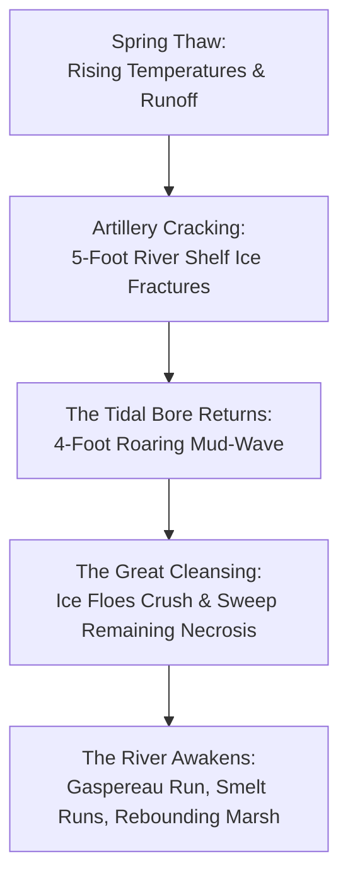

# Chapter 10: The Great Freeze

### I. The Thermal Snug

The frost did not merely settle upon the Petkotkweyak valley that November; it struck like an iron wedge driven into green timber.

By the second week after the first gale, the temperature had tumbled past the forgiving damp of coastal autumn and plunged straight down through zero, down through minus ten, until the spirit bulb in the brass Taylor thermometer mounted outside the lighthouse galley window shrank to a tight, dark red bead at minus twenty-six Celsius. When the wind tore out of the north-northwest, howling down across the frozen flats of the Tantramar and barreling up the river slot from Shepody Bay, the effective chill bit at thirty-eight below. It was a cold that had weight. It had teeth. It searched out every microscopic hairline fracture in mortar, every seam in timber, every uninsulated sliver of glass, turning moisture into feathered white dagger-points of rime that sprouted like fungal colonies across the cold stone corners.

Inside the Old Stone Light, however, the world was dry, golden, and smelling of cedar wood, steeped labrador tea, and hardwood smoke.

Kwitn stood in his woolen socks on the thick braided rag rug, a seasoned stick of split sugar maple resting balanced in his left hand. He pulled open the cast-iron door of the heavy Jotul No. 4 box stove with a gloved right hand. The draft roared instantly—a deep, resonant *thrummm* that vibrated through the welded iron firebox as the column of hot, buoyant gases inside the six-inch stainless chimney drew fresh, oxygen-rich air through the secondary combustion tubes. A bed of orange-white coals, four inches deep and incandescent as smelting slag, breathed in the rush of air. Kwitn slid the split maple log into the glowing belly of the stove, followed by two thick billets of white birch with the papery, oils-rich bark still clinging tight to their backs, then eased the door shut until the iron latch clicked into its home notch.

He backed the primary air damper down to a quarter turn. Within ninety seconds, the bright orange flames calmed, rolling into the lazy, blue-tipped secondary burn across the upper refractory baffle. The cast-iron plates began their steady, relentless ticking as heat soaked outward into the room.

"Internal galley temp," Maya’s voice drifted down from the low loft bench behind the woodbox. She was leaning against the sanded cedar railing, a thick gray wool blanket draped over her shoulders like a shepherd’s cloak, a tin mug cupped between her palms. "Galley floor is eighteen. Loft midpoint is twenty-one. Deckle drying rack near the flue is twenty-four. We have achieved what the heating and cooling trade technically refers to as 'not dying like idiots.'"

Kwitn gave a dry, quiet snort, replacing the stove poker in its wrought-iron stand. "The Montgolfier damper is doing seventy percent of the work. If we hadn’t sealed off the lantern room crown with that counterweighted wool trap, this whole tower would be sucking thirty cords of rock maple straight up into the stratosphere like a seventy-foot blowtorch."

"I know," Maya said, her dark eyes glinting with amusement over the rim of her mug. "You explained the chimney effect to me while hanging by your knees from a safety harness in October. Twice. The second time was because I made the tactical mistake of asking whether stone breathes."

"Granite doesn't breathe," Kwitn said evenly, picking up a clean rag to wipe soot dust from his thumbnail. "Granite sits there and steals your calories until you out-think it. That’s why we insulated the living snug with three inches of dry sheep’s wool and tongue-and-groove cedar planking. You heat the air inside the box, not the mountain outside."

At the base of the woodbox, curled into an enormous, silver-gray circle of dense fur with his black muzzle tucked beneath the plumed brush of his tail, Nipn opened one bright, amber eye. The wolf didn't lift his head. He merely watched Kwitn's boots shift across the floor, gave a soft, shuddering sigh of pure, furnace-warmed contentment, and let the heavy eyelid sink shut again.

Nipn had spent the first two years of his life in the remote crown timber lands north of the Miramichi before Kwitn brought him home as a scrawny, orphaned pup from an abandoned den. In the woods, a wolf survived forty below by digging into the snow pack beneath the drooping boughs of a deadfall balsam, curling his tail over his nose to create a micro-climate of recycled breath. Here, three feet from two hundred pounds of radiant Scandinavian cast iron, Nipn had decided that human technology, while aesthetically questionable and excessively noisy, possessed certain undeniable thermal merits.

Maya came down the short ash ladder from the loft, her wool-socked feet making no sound on the wide spruce boards. She wore a pair of Kwitn’s heavy flannel work shirts over a thermal henley, the sleeves rolled twice at the wrists, and her hair was gathered back with a polished caribou-bone pin Chris had forged from an old antler find. She looked rested, healthy, and entirely at home. The limp from the sprained ankle that had brought her through the gate five months earlier was entirely gone; she moved with the lithe, balanced economy of someone whose muscles had adapted to hauling water, split wood, and fish traps across uneven ground.

She set her mug on the scrubbed pine worktable, alongside three heavy volumes from Kwitn’s shelf—*Guards! Guards!*, a 1974 edition of *The Merck Manual of Diagnosis and Therapy*, and a bound ledger of blank birchbark leaves.

"The thermometer on the rail siding dropped two degrees since dawn," she noted, glancing toward the narrow, triple-glazed casement window. Outside, through the thick, wavy glass, the world was rendered in monochrome: a brutal, blinding expanse of white snow, gunmetal-gray ice ridges choking the river bends, and the dark, jagged wall of black spruce standing rigid against the steel sky. "The tidal mud is frozen four feet down. You can hear the shelf ice groaning when the ebb pulls out."

"It's the spring tide cycle," Kwitn said, pouring himself a measure of hot water over a pinch of dried sweet fern and wintergreen leaves. "Fundy water never stops moving, but when the surface slush freezes into pancakes, they raft up against the mudbanks on the turn. Pack ice three fathoms deep in the narrows. Nothing moves out there."

"Except the wandering ones," Maya said softly, her tone shifting from playful domesticity to the cool, clinical precision of an ER triage nurse reviewing a chart.

Kwitn nodded, sipping his tea. "Except them."

"How many did Nipn scent on the west ridge at dusk?"

"Two," Kwitn answered. "One came out of the old gravel pit cut above the culvert. The other was staggering down the Canadian National rail bed from the Salisbury direction. Neither of them had coats. Just shredded summer shirts."

Maya looked toward the window, her brow furrowing slightly in thought. "They don't have metabolic thermogenesis. No shivering reflex. No vascular vasoconstriction. At minus twenty-six, how long before cellular vitrification occurs?"

"About forty minutes if they're moving into the wind," Kwitn replied, stepping to the wall rack where his snowshoes hung alongside his short ash pole-axe and the leather-sheathed broad hatchet. "Their extremities freeze solid first. Fingers snap off like dry pine twigs if they hit a fence post. Then the quadriceps and hamstrings turn into frozen beef. They don't fall over because they die—they fall over because the knee joints lock into solid ice blocks and their tendons shear off the bone."

Maya picked up her heavy beaver-fur mitts from the drying rack above the stove. "Which means today is collection and clearance day."

"Today," Kwitn agreed, taking down the broad hatchet and checking the razor-honed bevel of its high-carbon edge against the light, "is clearance day. Put on your double wool duffels. We'll check the Blind Siding, clear the rail cut, and check the ice-hole basket traps before the midday light fades."

---

### II. The Statues of Glass

Stepping through the outer airlock door of the Stone Light into the teeth of a Maritime winter gale was like being hit in the face with an iron shovel full of dry salt.

The cold hit the mucous membranes of the nostrils instantly, flash-freezing the moisture into brittle needles that prickled with every inhalation. Kwitn pulled his wool-and-fleece neck gaiter up over the bridge of his nose, adjusting his fur-lined canvas trapper’s cap so that only a narrow slit of skin around his dark eyes was exposed to the biting air. He bent and strapped the raw-hide bindings of his traditional bear-paw snowshoes over his insulated moose-hide winter moccasins—thick, oil-tanned leather lined with two layers of hand-felted sheep’s wool duffels. Bear-paws were wider and shorter than long-tailed Huron shoes, designed specifically for maneuvering through the tight, tangled deadfall of coastal spruce and the jagged, broken ice rubble of the river shore.

Beside him, Maya stepped into her own matched pair of ash-framed shoes, tightening the lamp-wick hitches with quick, practiced pulls of her gloved fingers. She carried her five-foot ash walking staff in her left hand and a light, sharp-beveled carpentry hatchet tucked into the belt loop of her heavy canvas anorak.

Nipn exploded out of the snow drift beside the outer porch, his massive silver-gray body shaking a plume of dry powder from his thick winter coat. The wolf’s fur was nearly three inches deep, dense with an under-wool so thick that falling snow did not melt on his back. He gave no bark—wolves were creatures of absolute, predatory economy—but his black lips curled in a brief, playful grin as he dropped his chest into the drift, front paws extended, before bounding effortlessly on top of the crust toward the perimeter fence. His wide paws acted like natural snowshoes, distributing his eighty-pound frame across the hard-packed wind-slab without breaking through.

"He's showing off," Maya’s voice came through her woolen scarf, slightly muffled but unmistakably amused.

"He's eighty pounds of insulation and four-wheel drive," Kwitn remarked. "He thinks humans are hopelessly over-engineered bipeds who spend too much time worrying about draft stoppers."

They moved out past the heavy cedar trunnion gate, which swung smooth and silent on its grease-soaked pivot pins. Kwitn had spent two days in late October packing the hinge barrels with a blend of bear tallow and graphite dust; cold weather that would freeze automotive wheel grease into hard paste had no effect on the animal fat mixture.

The world outside the perimeter was an absolute wilderness of white silence. The soundscape was entirely different from the lush, whispering rustle of summer. In winter, the forest had no soft edges. The spruce needles were frozen stiff as wire; when the wind gusted through the canopy, the trees didn't sigh—they clattered like racks of dry bone. Every step of their snowshoes produced a rhythmic, dry *crunch-crunch-crunch* that carried two hundred yards across the frozen river basin.

They climbed the short rise toward the Canadian National rail bed, following Nipn’s trail. The wolf had already crested the rail embankment, his ears pricked forward toward the rock cut of the Blind Siding three hundred yards to the west.

Kwitn held up a mittened hand. Maya stopped instantly, dropping her weight into a balanced crouch, her eyes sweeping the perimeter with the calm, methodical scan they had drilled throughout the autumn.

"Two o'clock," Maya whispered, pointing with the tip of her ash staff. "Against the signal box."

Kwitn adjusted his snowshoes and stepped up onto the crown of the rail ballast, where the wind had scoured the snow down to a three-inch crust over the iron rails.

There, standing twenty yards ahead beside the rusted steel cabinet of an old railway relay switch, was a human figure.

It did not turn. It did not lurch forward. It did not groan.

It stood frozen mid-step, its right foot lifted four inches off the ties, its left knee slightly bent. It was a man, or had been one—dressed in the tattered remains of a blue synthetic winter parka that had lost half its polyester fill to brambles and snagged wire. His hands were bare; the flesh of his fingers was not pale or purple, but a deep, translucent, waxy black-white, frozen so thoroughly that ice crystals had burst through the skin along the knuckles like sugar frosting.

His face was turned slightly toward the gray sky. The jaw hung slack, the tongue inside the mouth a solid, grayish-pink wedge of ice. The unblinking eyes were milky spheres of opaque slush, frosted over by the wind.

"Complete somatic vitrification," Maya said, stepping up alongside Kwitn. Her breath billowed in a long, white plume that dissolved instantly in the dry air. She leaned forward, inspecting the corpse from three feet away without touching it. "Look at the tissue along the zygomatic arch. The interstitial fluids froze, expanded, and ruptured the cell membranes. The whole neural circuit is inert. It’s not in a state of suspended animation—it’s structurally wrecked at the cellular level."

"In summer, they're a biohazard," Kwitn said, stepping around to the figure's rear. "In winter, they're just bad statues."

He did not use the heavy bear-spear. In this cold, thrusting a long pole into frozen bone risked shattering the ash shaft or chipping the carbon-steel point on ice-hardened tissue.

Instead, Kwitn reached to his belt, drew the short-handled carpentry hatchet, and stepped in close. He positioned the flat, hardened poll of the hatchet precisely against the base of the skull, just above the first cervical vertebra—the C1/C2 junction they had dissected over tea back in August.

He did not deliver a wild, sweeping chop. He gave the back of the neck a firm, sharp, four-inch tap, exactly as if he were driving a two-inch casing nail into a dry pine stud.

*Tock.*

The sound was shockingly brittle, like a hammer striking a block of cold parsnip or a chunk of river ice.

There was no spray of black septic blood. There was no splatter. The frozen brainstem and medulla oblongata simply shattered into granular, crystalline shards inside the frozen cranial vault. The mechanical tension holding the frozen tendons in place gave way with a faint, structural *crack*.

The figure did not fall like a fainting person; it tipped over like a wooden post, hitting the snow-crusted rail ties with a dull, hollow *thud*.

"Clean," Maya remarked, stepping back as Nipn sniffed the frozen hem of the parka with mild, disdainful curiosity before turning his nose toward the tree line. "Zero aerosol. Zero fluid contamination. If the old-world prepper manuals had spent less time obsessing over high-capacity assault rifles and more time studying simple thermodynamics, half the cities might have survived the first January."

"Cities don't have enough firewood to survive a January even without the dead," Kwitn replied, sliding the hatchet back into its leather loop. "You put five hundred thousand people in high-rise apartments when the natural gas lines depressurize at thirty below, and they'll burn their furniture in four days, burn the floorboards in six, and freeze to death in their beds by day ten. The cold doesn't care about geopolitics."

They dragged the frozen body by its parka hood off the rail bed, rolling it down the embankment into a deep drift behind a stand of dense alder scrub. In spring, when the snow melted, the river scavengers—the ravens, the coyotes, and the spring bears coming out of their dens—would clean the bones long before the ground thawed enough to support bacteria.

Two hundred yards further west, at the mouth of the rock siding, they found the second one.

This one had fallen during the initial blizzard, caught in the deep drift between two fallen spruce trunks. It was buried up to its chest in hard-packed powder, its arms outstretched like frozen branches. The wind had sculpted an aerodynamic snow-tail behind its shoulders, carving it into the landscape as if it were a permanent feature of the Canadian Shield.

Maya stepped forward on her snowshoes, tapped the base of its skull with her own hatchet—*tock*—and watched the head drop an inch into the snow collar.

"That's twenty-two since November," she said, pulling a small wooden pencil and a square of stiff, hand-pulled rag paper from her inner chest pocket. She made a precise tally mark beside a small hand-drawn map of the railway siding. "The density is dropping off drastically. The ones that didn't find shelter in the towns were either caught in the open during the first freeze or drifted into the tidal marshes and got swept into the bay by the ice floes."

"The herd mechanics break down when the weather turns," Kwitn said, adjusting the strap of his shoulder bag. "They don't have the sense to build a fire, they don't have the sense to put on a coat, and they don't have the sense to follow a deer trail into the thick cedar swamps where the wind can't reach. Nature doesn't negotiate with things that don't know how to adapt."

He looked at the small, square sheet of paper in Maya’s mitten. Even in the sub-zero chill, the paper was supple, thick, and distinctly textured, bearing a faint, creamy oatmeal tone and a clean, deckled edge.

"How is the ink holding up in the cold?" he asked.

Maya smiled beneath her scarf, tucking the pencil and paper back into the warm interior pocket of her anorak. "The paper is holding up better than the ink. The iron gall ink turns sluggish below zero, but the sheet itself doesn't crack or fray like that cheap wood-pulp loose-leaf we found in the rail office. It feels like real parchment."

"That's because it *is* real parchment," Kwitn said, turning his snowshoes back toward the river trail. "Or as close as you get without skinning a calf. Once we check the ice traps, we're boiling another batch of rag pulp. Auntie Elizabeth sent two bags of worn linen and cotton work pants on the last draisine before the tracks iced over, and we've got three cords of clean maple ashes waiting in the leach barrel."

"Good," Maya said, her eyes shining with quiet, practical delight. "Because my medical ledger is at forty pages, and I’m just getting to the winter pulmonary remedies."

---

### III. The Art of the Rag Mill

The transition from modern industrialized wood-pulp paper to archival rag paper was not a matter of rustic romanticism; it was a matter of ruthless, practical longevity.

Modern paper, Kwitn had explained to Maya during their long discussions over the workshop bench in late autumn, was manufactured using mechanical and acid-chemical processes that left short, brittle cellulose fibers laden with residual lignins and acids. Within five to ten years in a damp coastal climate, acid-pulp paper turned yellow, grew brittle as dried onion skin, and literally digested itself from the inside out.

Rag paper, by contrast—the stuff of Gutenberg Bibles, medieval botanical codices, and eighteenth-century ship's logs—was made from long-chain cellulose fibers derived from worn linen, hemp rope, and pure cotton rags. When boiled in a mild alkaline lye made from clean hardwood ash, the fibers were stripped of oils, dirt, and gums without breaking the molecular chains. A sheet of hand-pulled rag paper could be soaked in seawater, dried over a stove, folded ten thousand times, and still hold its ink three hundred years later.

In the lower workshop level of the Stone Light, where the heat from the big masonry chimney warmed the stone walls to a steady ten degrees Celsius, Kwitn and Maya had constructed a complete, self-contained miniature paper mill.

The process had taken three weeks of trial, error, and meticulous carpentry:


"The key," Kwitn said, standing over the large, copper-lined wooden vat filled with lukewarm, clean water from the upper cistern, "is fiber dispersion. If the pulp is too coarse, you get lumps that catch the pen nib. If you beat it to death, you destroy the fiber length and the paper loses its tear strength."

Maya stood beside the heavy ash-log mortar. In her hands, she held a four-pound sugar maple stamper—a heavy wooden mallet with a faceted, iron-banded head that Kwitn had turned on his foot-treadle lathe.

Inside the mortar was a thick, oatmeal-like paste of boiled linen fibers. Three days earlier, they had cut two worn pairs of cotton-duck work pants and an old linen tablecloth into one-inch squares, boiled them for eight hours in a weak solution of maple-ash lye in the big cast-iron cauldron, and rinsed the resulting softened mass in cold creek water until the rinse ran clear as crystal.

Maya brought the mallet down into the mortar with a rhythmic, measured cadence: *thump... thump... thump... thump.*

With every blow, the long, interlocking fibers of the linen were teased apart, frayed, and fibrillated, turning into a creamy, cottony mash without cutting the fibers into dust.

"This is remarkably good therapy," Maya observed between strokes, her breathing steady and rhythmic. "If modern hospital administrators had been required to spend two hours a day beating linen rags with a four-pound maple club, the healthcare system might never have collapsed."

"It keeps the blood moving in the forearms," Kwitn replied with a faint smile. He took a handful of the beaten pulp from the mortar, dropped it into a glass jar of clean water, and gave it a sharp shake.

He held the jar up to the lantern light. The tiny, snow-white fibers floated in the water like tiny suspended clouds, neither clumping into knots nor sinking instantly to the bottom.

"That's it," he said. "The freeness is right. Dump the charge into the vat."

Maya scraped the beaten pulp into the copper vat, and Kwitn took a broad cedar paddle, stirring the mixture with long, figure-eight strokes until the entire vat became a uniform, milky suspension of water and suspended cellulose.

From the drying shelf, he picked up the **mold and deckle**.

The tool was a masterpiece of Kwitn’s winter joinery: a pair of matching rectangular frames made from fine-grained, quarter-sawn white ash, joined at the corners with pegged bridle joints that would not warp or twist when repeatedly submerged in water. The lower frame—the *mold*—was covered with a tightly stretched sheet of fine brass wire mesh, eighty wires to the inch, supported from beneath by a ribbed grid of narrow cedar splines. The upper frame—the *deckle*—was a simple open rim that fit perfectly over the mold, acting as a temporary fence to retain the pulp slurry on the screen.

"Watch the wrist angle," Kwitn said, handing the assembled frame to Maya. "It's all in the wave."

Maya took the frame by the short ends, her fingers resting lightly on the ash rim. She leaned over the vat, dipped the far edge of the mold into the slurry at a forty-five-degree angle, submerged it entirely, and brought it up level through the water in one smooth, continuous sweep.

As the frame cleared the surface, gallons of water rushed downward through the brass wire screen, leaving a thin, perfectly uniform sheet of white fibers caught on the wire.

Before the last water drained through, Maya gave the frame a quick, delicate shake—first forward and back, then side to side. The motion interlocked the floating fibers in both directions, eliminating the grain weakness inherent in machine-made paper.

"Look at that," Kwitn murmured, genuinely impressed. "Most people hesitate on the lift and get a thick ridge at the bottom edge. That's as even as machine bond."

"I spent six years threading sixteen-gauge intravenous catheters into collapsed veins in the back of moving ambulances," Maya said, lifting off the deckle frame with steady hands. "A steady hand on a wire screen is a pleasant change of pace."

On the wire mold, exposed to the air, lay a wet, glistening, translucent sheet of raw, unpressed paper.

Kwitn had laid out a thick pad of heavy woolen felts—cut from old wool blankets—on the bed of his **maple screw press**. The press was a robust bench-top machine built entirely of mortised oak timbers, featuring a massive, hand-cut sugar maple screw, three inches in diameter, that could exert over two tons of mechanical downward pressure through a turned ash lever.

"Couching," Kwitn instructed, pronouncing the word *coo-ching* in the traditional papermaker's terminology.

Maya turned the ash mold upside down in one decisive, rolling motion, pressing the wet sheet of pulp flat against the damp wool felt. She rubbed the back of the brass wire mesh with the palm of her hand, then lifted the mold away at a sharp angle.

The wet fibers released cleanly from the wire, adhering to the woolen felt in a crisp, sharp-edged rectangle of virgin paper.

"First sheet," Maya said, her eyes alight.

"First of forty," Kwitn replied, laying a second damp wool felt over the top of the wet paper. "Dip again."

For the next two hours, the lower workshop became a quiet, rhythmic dance of water, wood, and fiber. Maya dipped, shook, and couched; Kwitn layered the wool felts and managed the pulp vat. By the time the copper vat began to clear of suspended fiber, they had a "post" of forty-two sheets of wet paper, interleaved with woolen felts, standing six inches high on the bed of the screw press.

Kwitn stepped up to the maple screw, swung the ash lever around, and engaged the heavy oak platen.

*Creak... groaaan...*

The massive maple threads bit down. As the pressure mounted, water began to weep from the edges of the felt stack, first in heavy drops, then in streaming rivulets that cascaded down the drainage channels of the press bed into a copper collection bucket below.

Kwitn hauled on the lever with both arms, throwing his back into the turn until the timber frames of the press groaned with stored elastic energy.

"Hold that pressure for ten minutes," he said, wiping a bead of sweat from his forehead with his sleeve. "That forces out eighty percent of the free water and consolidates the hydrogen bonds between the cellulose chains. When they come out of the press, they'll be strong enough to handle with bare fingers."

"And then the sizing?" Maya asked, checking the small cast-iron pot simmering gently on the side burner of the workshop stove.

"And then the sizing," Kwitn affirmed.

Sizing was the critical final chemistry that turned raw, absorbent blotting paper into true writing paper. Without sizing, ink applied to paper would bleed outward through capillary action like a drop of water on a paper towel.

To prevent this, Kwitn and Maya had prepared a traditional **gelatin size** by simmering clean deer bone, sinew, and fish skin scrap in water until it reduced into a clear, light-amber broth rich in natural collagen, adding a single pinch of natural potassium alum to harden the gelatin.

When the pressed sheets were peeled from the woolen felts—now damp, leathery, and surprisingly tough—they were passed through the warm gelatin bath, pressed lightly a second time to remove excess liquid, and hung on polished horsehair lines across the ceiling of the warm living snug above.

By nightfall, four dozen sheets of pure, acid-free rag paper hung suspended in the warm, dry air above the woodstove like rows of cream-colored sails. As they dried, the room filled with the clean, earthy scent of warm linen, cedar wood, and pure animal gelatin.

Maya reached up, gently touching the corner of a dry sheet near the stovepipe.

The paper was stiff, smooth, and had that unmistakable, musical *snap* when flexed—the crisp, ringing rattle of genuine, high-grade rag bond that no modern chemical paper could ever replicate.

She turned to Kwitn, a wide, luminous smile breaking across her face.

"Mac," she said, holding the sheet up to the warm yellow light of the kerosene lamp, revealing the faint, beautiful laid-lines of the brass wire mold woven into the fabric of the page. "We can write the whole world down on this. It will last five hundred years."

"Five hundred years," Kwitn agreed, his voice quiet, looking from the paper to the woman standing beneath the lantern light. "Provided nobody spills their tea on it."

---

### IV. The Ice-Hole Run

If summer on the Petkotkweyak was defined by the abundance of the vegetable gardens and the frantic gathering of firewood, winter was defined by the silent, frozen architecture of the river.

The Petitcodiac did not freeze into a smooth, placid skating rink. The massive Fundy tides—still pushing thirty vertical feet of seawater under the ice twice a day—heaved, fractured, and buckled the river ice into chaotic, jumbled pressure ridges six to ten feet high along the channel edges. Between these heaved ramparts of salt-slush ice lay narrow, deep-water tidal guts where the current tore through at eight knots beneath a floating roof of five-foot-thick shelf ice.

In these deep, oxygenated tidal channels beneath the ice, the winter fish ran.

The primary quarry of late January was the **tomcod** (*Microgadus tomcod*)—known to the Mi'kmaq as *punamu*, and to the Acadian settlers as the *frostfish*. Unlike other species that became torpid in cold water, the tomcod entered the brackish estuaries in midwinter specifically to spawn, packing their small, cod-like bodies with protein and clean, nourishing fat. Running alongside them were schools of winter rainbow smelt, crisp and silver as new coins.

At ten o’clock on a crystal-clear February morning, with the temperature hovering at a brisk minus eighteen and the wind dead calm, Kwitn and Maya hauled their winter sled down the steep creek trail to the ice shelf.

The sled was a traditional six-foot ash **toboggan**, steam-bent at the front curl and bound entirely with raw-hide thongs that allowed the ash slats to twist and flex over ice hummocks without snapping iron fasteners. The underside of the ash runners had been surfaced with strips of ultra-high-molecular-weight (UHMW) polyethylene salvaged from an old snowmobile skid plate, allowing the sled to glide across hard-packed wind-crust with virtually zero friction.

Nipn ran point, trotting thirty paces ahead, his nose low to the ice. Wolves possessed an instinctive, uncanny ability to read ice thickness; where a man saw only flat white snow, the wolf could hear the hollow, booming resonance of thin shell-ice over an air pocket or scent the wet salt-slush leaking through a tidal fissure. Whenever Nipn veered left around a pressure ridge, Kwitn followed his track without question.

"Here," Kwitn said, stopping the toboggan near the outer bend of the creek mouth, where the fresh water of the stream cut a deep, swirling trough beneath the main river ice before joining the tidal channel.

He unloaded the gear: a heavy, hand-forged **ice chisel** (*an ice spud*) with a two-inch carbon-steel bit welded to a six-foot ash pole, two spruce-splint basket traps weighted with river stones, a roll of tarred braided nylon line, and a pair of short, hand-whittled cedar jigging sticks.

Kwitn set his snowshoes aside and went to work with the spud.

*Thump! Crunch! Thump!*

He drove the heavy steel chisel into the clear blue river ice with rhythmic, downward thrusts, using the weight of the iron to shatter the frozen crystal. Within five minutes, he had chopped a clean, circular hole twelve inches in diameter through eighteen inches of solid freshwater ice.

As the chisel punched through the final bottom layer, water surged upward under hydrostatic pressure, rising within an inch of the ice rim—dark, tea-colored, and crystal clear.

"Look at the depth," Maya said, peering down into the hole through a cut tube of birchbark that eliminated surface glare. "Three fathoms. The current is steady toward the main bend. I can see the sandy gravel on the bottom."

Kwitn reached into the toboggan and pulled out the bait: a wooden tub containing small, salted chunks of gaspereau and dried clams from their autumn stores. He baited four barbless forged steel hooks on short dropper loops, attached a three-ounce cast lead sinker, and lowered the line into the dark water.

He handed the cedar jigging stick to Maya. "Bounce the sinker two inches off the bottom. *Punamu* feed along the substrate interface. When you feel a faint, heavy tap, don't jerk like you're setting a salmon hook—just lift smooth and hand-line it onto the ice."

Maya took the small cedar stick, seated herself on a thick sheepskin pad laid over the toboggan, and began the subtle, hypnotic jigging motion.

Within sixty seconds, the cedar tip dipped.

"Contact," she said calmly.

She raised the stick with her right hand and gathered the braided line with her left in smooth, overlapping loops.

A moment later, a sleek, olive-brown fish with a pale belly, three dorsal fins, and a delicate single chin barbel broke the surface of the hole, flapping vigorously onto the clean snow crust.

It was a thirteen-inch tomcod, fat, healthy, and glistening in the winter sun.

In the sub-zero air, the fish did not flop for long; within forty seconds, the thin film of water over its scales froze into a frosty armor, flash-freezing the fish in prime, pristine freshness.

"That's dinner," Maya said, unhooking the fish with gloved fingers. "And breakfast. And if we get fifteen more, that's four quarts of fish stock and salted fillets for the root cellar."

Beside the hole, Kwitn lowered the large spruce-splint basket trap, baited with crushed clam shells and fish heads, securing the tether line to a heavy ash stake driven deep into the ice crust. The basket trap would fish continuously on the tidal surge, catching smelt and tomcod as they sought shelter from the main current in the eddy behind the creek point.

For two hours, they sat on the vast expanse of the frozen river, bathed in the blinding, pale gold light of the winter sun.

There was no sound in the universe except the distant, occasional *boom-crack* of shelf ice shifting with the tide, the soft hiss of the wind through the spruce boughs on the bluff above, and the rhythmic *slap-slap* of silver fish hitting the snow.

Nipn lay curled on a spare wool blanket on the sled, his nose tucked under his tail, opening an eye only when a particularly large tomcod landed near his paws.

By two in the afternoon, the wooden box on the toboggan held thirty-four tomcod and over fifty rainbow smelt—forty pounds of pure, wild protein harvested without firing a single shot, burning a single drop of fuel, or exposing their position to anything beyond the horizon.

Maya leaned back against the uprights of the toboggan, her cheeks flushed a healthy, radiant pink from the cold air, taking a sip of hot spruce-needle tea from a thermos flask.

"You know," she said, looking out across the vast, empty expanse of the frozen Petkotkweyak toward the distant ridges of Albert County, "when I worked seventy-hour weeks in the trauma center in Saint John, my apartment looked out over a four-lane ring road and a petrochemical refinery. I spent four thousand dollars a month on rent, takeout, and parking fees just so I could be tired enough to sleep six hours before doing it again."

She gestured with her tin cup toward the frozen river, the ancient granite lighthouse perched like a fortress on the spruce bluff, and the clean white trail winding back through the woods.

"I have never worked harder in my life than I have this winter," she continued, her voice quiet, steady, and filled with a profound, calm clarity. "My hands have calluses on the palms. I smell like wood ash, fish scales, and pine pitch. And I have never felt more sane, more secure, or more completely human."

Kwitn looked at her over the rim of his own cup. His dark eyes softened with that deep, unspoken understanding that had grown between them over the long months of shared labor.

"My grandfather used to say that the modern world wasn't built for people," Kwitn said softly. "It was built for clocks. It convinced everyone that time was money, and money was something you could trade for life. But time isn't money. Time is just the space between the tides where you have to do what needs doing to keep your people warm and fed."

He picked up the haul-rope of the ash toboggan and stood up on his snowshoes.

"Come on," he said, offering her his mittened hand to help her up from the sled. "The wind is coming around to the northeast. Let's get these frostfish into the cellar and put the kettle on before the snow starts again."

Maya took his hand, letting him pull her up onto her snowshoes in one easy, fluid motion. She didn't let go of his hand immediately; for two quiet heartbeats, her gloved fingers tightened gently around his, her dark eyes meeting his with an openness that had no hesitation in it.

"Lead on, Mac," she said softly.

---

### V. Midwinter Hearth & Headology

The midwinter blizzards of February were of an entirely different order from the dry cold of January.

They arrived as massive, low-pressure cyclonic storms roaring up the Atlantic seaboard, drawing moisture from the Gulf Stream and slamming it directly into the sub-zero continental air mass sitting over the Gulf of St. Lawrence. When a nor'easter hit the Bay of Fundy, it didn't snow in gentle flakes; it unloaded six feet of dense, heavy, sea-moist snow driven by sixty-mile-an-hour gales that erased the boundary between the earth and the sky.

For three days, the Stone Light was completely cut off from the outside world.

The wind shrieked against the four-foot-thick cut-granite walls of the tower with the sound of a passing freight train, hurling sheets of frozen sleet against the heavy storm shutters. Outside, the world was a howling, white void of zero visibility.

Inside the living snug, however, the atmosphere was one of profound, impenetrable sanctuary.

The Jotul stove purred at a steady, rhythmic hum, radiating a deep, penetrating heat that soaked through the tongue-and-groove cedar paneling. On the top plate of the stove, a heavy cast-iron Dutch oven simmered gently, filling the room with the rich, savory aroma of slow-cooked tomcod chowder—made with dried sweet corn, diced root-cellar potatoes, wild chives, salt pork, and a splash of rich evaporated milk salvaged from an autumn run.

Kwitn sat in the wide, steam-bent oak rocking chair he had restored over the winter, his boots resting on the stone hearth pad. In his lap rested a worn, paperback copy of Terry Pratchett’s *Guards! Guards!*, its pages dog-eared and softened by years of careful reading.

On the floor between the woodbox and the table, Nipn lay stretched out on his side, his massive paws twitching occasionally as he chased dream-hares across frozen fields, his soft, rhythmic breathing filling the quiet spaces between the gusts of wind outside.

Maya sat at the pine table under the bright, steady circle of light from the center kerosene lamp.

Before her lay the finished fruits of their winter papermaking: a hand-bound ledger of seventy-five octavo leaves of heavy, cream-colored rag paper, sewn through the fold with waxed linen thread and bound between two thin boards of quarter-sawn white cedar covered in supple, oil-tanned beaver leather.

With a fine steel crow-quill pen dipped in homemade iron-gall ink, she was writing in a neat, elegant, clinical cursive script, meticulously illustrating each entry with precise botanical cross-sections and chemical mechanism flowcharts:

```
===================================================================
PETKOTKWEYAK PHARMACOPOEIA & SURGICAL PROTOCOL (VOL. I)
Author: Maya Lin, RN / Kwitn Simon, L'nu
Entry 14: Salicin Extraction & Concentrated Willow-Bark Tincture
-------------------------------------------------------------------
Source: Salix bebbiana (Bebb's Willow) & Salix nigra (Black Willow)
Active Component: Salicin (2-(Hydroxymethyl)phenyl-beta-D-glucopyranoside)
Mechanism: Prodrug metabolized via hepatic oxidation into salicylic 
acid. Non-selective COX-1 and COX-2 inhibitor. Decreases pro-inflammatory 
prostaglandin synthesis.
Indication: Tension cephalalgia, musculoskeletal trauma, febrile state, 
mild to moderate somatic pain.
Preparation Protocol:
  1. Harvest inner green cambium layer during dormant winter/spring flow.
  2. Macerate 100g fresh cambium in 500ml 40% ethanol (distilled corn wash) 
     or 800ml boiling rainwater.
  3. Steep sealed in dark stoneware crock for 21 days (tincture) or simmer 
     reduced by half (decoction).
Dosage: 30ml decoction q4-6h PRN. Minimal gastric mucosal ulceration 
compared to synthetic acetylsalicylic acid due to lack of free acetyl group.
===================================================================
```

Maya lifted the pen, blowing gently on the wet ink before leaning back in her chair and rolling her shoulders to work out the stiffness.

She looked over at Kwitn, who was grinning quietly at a passage in his book.

"What's Vimes doing now?" she asked, reaching for her mug of mint tea.

"He's explaining to Carrot why you should never trust a million-to-one chance unless it's an exact million-to-one," Kwitn said, glancing up from the page. "Because nine times out of ten, a regular long shot just gets you killed, but a million-to-one chance crops up nine times out of ten in stories."

Maya laughed—a rich, warm sound that filled the cedar-lined room. "That sounds like your entire philosophy of building construction."

"It's not a philosophy, it's basic mechanics," Kwitn replied, closing the book over his finger. "If you build a bridge assuming the river will only ever rise ten feet, the river will eventually rise eleven feet just to teach you a lesson in humility. If you build it for a twenty-foot bore, you can sleep through the spring thaw without listening for creaking timbers."

"And what do the books say about two people who spend three months trapped in a lighthouse during a zombie apocalypse without driving each other insane?"

Kwitn tilted his head, his dark eyes sparkling with dry, gentle humor. "Pratchett called it *Headology*. Granny Weatherwax’s first rule: most problems in the world aren't caused by people being evil. They're caused by people being stupid, lazy, or trying to be clever when they ought to be cutting firewood. If you keep the stove stoked, keep the grease on the hinges, and don't pretend you're smarter than the weather, people tend to get along just fine."

Maya set her pen in the wooden groove of her desk stand, picked up her tea, and walked over to the hearth.

She didn't take the other chair. Instead, with that easy, unhurried naturalness that had grown between them over the long winter, she sat down on the thick sheepskin rug directly beside Kwitn’s rocking chair, leaning her back against the side of his knee.

As she settled, Nipn opened one lazy amber eye, stretched his forepaws with a low, contented groan, and extended his massive, silver-gray snout across the sheepskin, his wet black nose questing forward to sniff the hem of Maya’s woolen blanket.

Kwitn didn't look up from his book. He merely flicked a hand toward the wolf.

"Careful where you put your nose," Kwitn said in a dry, even voice. "She'll bite ya."

Maya looked up from the floor, one eyebrow arching in mock offense. "I don't think Nipn would bite me."

Kwitn turned a page. "I wasn't talking to you, Maya."

Maya let out a short, incredulous burst of laughter, giving his shin a sharp, playful poke with the toe of her woolen sock. Nipn gave a low, appreciative chuff, resting his heavy chin squarely across Maya’s slippered feet as if claiming rightful possession of the floor space.

The room had cooled slightly as the wind outside shifted to a ferocious gust that rattled the chimney cowl.

Maya pulled her gray wool blanket tighter around her shoulders, exhaling a long, contented breath. Without looking up, she leaned her head back against Kwitn’s thigh, her shoulder resting warm and firm against his shin.

Kwitn did not pull away. He lowered his hand from the armrest, his rough, scarred fingers coming to rest gently on the curve of her shoulder beneath the wool blanket.

Maya turned her face slightly, giving him that familiar, teasing glower from beneath her dark eyelashes—the exact same mock-stern expression she had given him on the night of the first October blizzard.

"Don't flatter yourself, Simon," she said, her voice dropping to a low, intimate murmur that barely carried over the crackle of the maple logs. "Snuggling is warm. The warm is all I want right now."

Kwitn smiled—a slow, genuine, quiet smile that reached all the way to the corners of his eyes.

"Naturally," he said softly, his thumb gently brushing the soft wool of her blanket. "Strictly thermodynamic efficiency. First law of heat transfer: energy flows from the higher-temperature body to the lower-temperature body until thermal equilibrium is established."

"Shut up, Mac," Maya whispered affectionately, closing her eyes and letting her head settle comfortably against him. "Just read your book."

Kwitn opened *Guards! Guards!* again, resting the spine on the wide arm of the chair. He began to read aloud in a steady, rhythmic, low baritone, his voice weaving through the quiet room like a gentle spell, drowning out the howl of the Fundy gale outside until the only reality in the world was the heat of the Jotul stove, the soft breathing of the wolf on the hearth, and the steady, unbreakable warmth between them.

An hour later, with the last chapter finished, Kwitn banked the stove for the overnight burn. He loaded three thick round billets of rock maple onto the glowing coal bed, closed the primary draft down to a hairline crack that would maintain a steady, slow secondary burn until dawn, and blew out the center kerosene lamp, leaving only the soft amber glow spilling from the stove’s mica window.

Nipn rose from the rug, circled twice on his sheepskin bed beneath the woodbox, and curled back into a tight silver ball.

In the darkness of the cedar loft platform, Maya had stripped down out of her heavy day flannels and wool trousers. She knew the hard physics of winter bedding: sleeping in damp, bulky daytime wool restricted circulation and trapped moisture. Dressed only in a thin cotton camisole and shorts, she lifted the heavy stack of down quilts and brain-tanned beaver pelts and slipped beneath the covers.

Her bare knee brushed immediately against bare, muscled skin.

Maya froze instantly in the dark, her breath catching in her throat.

"...Simon."

"Mmh?" Kwitn’s low, sleepy rumble came from beneath the down pillow beside her.

"Are you... not wearing pants?"

Kwitn didn't flinch. He stayed right where he was on his side of the wide platform, staring up at the dark rafters. "Wool blankets don't need flannel interfering with the loft, Maya. I’ve slept raw under furs my whole life."

"A clinical warning might have been prudent."

"You're the one who climbed under the beaver pelts."

She was quiet for two heartbeats, her hand resting against the bedding between them, acutely aware of the radiant furnace heat coming off his chest—and, as she shifted slightly closer, the very natural, involuntary autonomic response taking place in the dark.

Maya let out a breath that was half-gasp, half-muffled laugh. "Simon..."

Kwitn stayed completely still, his voice calm, dry, and thoroughly unbothered in the dark.

"Old actor once told his leading lady before a bed scene," Kwitn rumbled quietly: "*'I apologize in advance. Sorry if I do, and sorry if I don't.'*"

Maya went dead still for a second, and then a helpless, muffled giggle broke from her throat, her forehead burying into the corner of the pillow.

"Did you seriously just quote classic Hollywood cinema while we're huddled under five layers of fur in a blizzard?"

"Seemed clinically relevant to the situation," Kwitn murmured mildly.

With the awkwardness swept clean away, Maya let out a long, contented breath and slid all the way in against him, resting her head comfortably into the crook of his shoulder and laying her arm across his bare chest.

As her bare thigh rested along his hip, she felt the undeniable, physical reality of what her proximity had set in motion.

She didn't pull away. Her hand rested soft and steady over his ribs, feeling the heavy, calm beat of his heart. She gave a small, fond hum against his collarbone.

"You know," she murmured softly, her breath warm against his skin, "in nursing school they taught us that autonomic vasocongestion in response to tactile stimuli is a sign of a robust cardiovascular system."

"Is that what they called it?" Kwitn whispered, his chest vibrating beneath her palm.

"Mmh. Very clinical." Maya settled her hips comfortably against him without a trace of hesitation, letting the heavy fur quilt drape over them like an impenetrable wall against the gale. "It would be an insult to both of us if you didn't. I'm not made of wood, Simon, and neither are you."

Kwitn paused for half a beat, his large, calloused hand resting warm and steady on the bare curve of her waist beneath the camisole.

"Well," he rumbled with quiet, deadpan amusement in the dark, "based on the immediate structural evidence under this quilt, one of us clearly is—and you're the one who supplied the timber."

Maya froze for one stunned second before a helpless, muffled gasp of laughter exploded from her, her face burying straight into his neck as she gave his rib a sharp, playful pinch.

"Simon! You did *not* just make that joke."

"I'm a carpenter, Maya," Kwitn murmured, unbothered, his chest shaking with silent laughter. "You're the one who brought up wood in bed. I just report on local building materials."

"You are incorrigible."

"Better than being made of sugar maple. That stuff has a Janka hardness rating of fourteen hundred. You'd be terrible on the sheets, and I’d have had to oil you down with boiled linseed and beeswax three months ago."

Maya snorted softly against his skin, shaking her head as she let her arm drape comfortably across his chest. "Go to sleep, carpenter."

"Aye, Nurse Lin."

Kwitn drew the heavy beaver-fur robe up over her bare shoulder, holding her warm and secure against his side as the Fundy blizzard raged harmlessly against the stone walls outside.

Sometime in the deep, silent hours around three in the morning—when the gale outside reached its sharpest bite and the Jotul stove had settled into its steady, quiet bed of glowing red embers—the temperature in the loft dipped just enough for the body’s primal instincts to take over.

Drifting in the deep, heavy sleep of someone who had worked physical labor all day, Maya turned unconsciously toward the heat source. Forgetting entirely in her sleep that she had shed down to bare skin under the quilts, she rolled fully against him, slinging one bare leg over his thighs and wrapping both arms around his neck in a deep, unguarded hug, pulling him in as if he were a life raft in a frozen sea.

Her cheek rested soft against the hollow of his throat, her breathing slow and rhythmic, her chest pressed flush and uninhibited against his bare ribs in pure, trusting softness.

Kwitn stirred faintly in the dark. He opened his eyes, feeling the sheer, warm weight of her draped across him—no tension, no defense mechanisms, no walls. Just the absolute, peaceful surrender of someone who knew, even in her subconscious, that she was entirely safe.

A faint, quiet smile touched Kwitn’s lips in the dark. He didn't shift or disturb her; he simply brought his right arm around her waist, letting his broad hand rest gently against her hip, anchoring her against the storm while the world outside howled itself to pieces.

When the first pale blue light of dawn finally filtered through the frost-rimed cedar shutters, Kwitn opened his eyes to find the storm had blown itself out into a quiet, frozen morning. 

During the shifting, twilight hours of sleep, Maya had drifted from lying beside him to sprawling almost completely on top of him. Her chin rested squarely on his chest, her bare legs were tangled snugly between his thighs, and his broad, calloused hands had naturally settled over the soft curve of her hips and backside, cupping her firmly to anchor her against his chest and keep her from sliding off the platform.

Maya’s long dark eyelashes fluttered. She stirred, let out a sleepy, feline stretch against his bare torso, and blinked up at him, her dark eyes still heavy with sleep.

Kwitn became acutely aware of the exact placement of his hands beneath the beaver fur. Ever the respectful host, he hesitated for half a second, his fingers starting to ease back slightly so as not to overstep.

Maya didn't pull away. In fact, she settled her weight a fraction deeper against him, her chin propped on his sternum, a sleepy, affectionate grin tugging at the corner of her lips.

"Leave your hands where they are till I get my balance, Simon," she murmured in a low, raspy morning voice. "Plus... your hands are warm."

Kwitn let out a low, rumbling chuckle that vibrated right through her ribcage, his hands settling back comfortably against her curves with steady, reassuring warmth.

"You're remarkably light for someone who put away two bowls of frostfish chowder last night," he remarked mildly.

"It's lean muscle mass, carpenter," Maya whispered, closing her eyes for another two blissful minutes of warmth, resting her cheek right over his heart. "And don't move. You're the best mattress in the Maritimes."

"High praise from healthcare."

"Take the compliment and keep the heat on."

---

### VI. The Spring Bore & The Reclaimed River

By the third week of March, the great silence of winter began to crack.

It started not with warmth, but with light. The sun climbed higher into the southern sky each noon, transforming the brutal glare of the snowfields into a blinding, golden brilliance that softened the south-facing slopes of the red silt bluffs.

Then came the sound.

One afternoon in early April, while Kwitn and Maya were splitting cedar shingles on the south porch, a noise like a battery of heavy artillery boomed from the river valley three miles to the south.

*CRACK-BOOOOM!*

The entire bluff vibrated through the granite bedrock.

Nipn leaped to his feet on the porch, his ears forward, his tail level, staring down toward the bend.

"The ice is breaking," Kwitn said, dropping his froe and mallet.

They climbed the spiral iron staircase of the Stone Light, emerging onto the high, circular catwalk of the lantern room seventy feet above the river basin.

The spectacle below was breathtaking in its raw, elemental power:



The massive five-foot-thick shelf ice that had locked the Petitcodiac since November was shattering under the immense, unstoppable pressure of the spring runoff and the rising Fundy tides. Giant plates of blue-white ice, some the size of city blocks, were buckling upward, grinding against one another with a deafening roar of splintering crystal, and tumbling downstream toward Shepody Bay.

And then, roaring up around the bend from the south, came the **Tidal Bore**.

It was not the polite, sluggish wave of modern summer doldrums. Swollen by melting snowpack from a thousand square miles of Acadian forest, the spring bore arrived as a four-foot wall of foaming, chocolate-brown water, surging upstream at ten knots against the falling river current.

The roaring wave slammed into the ice jams, lifting thousands of tons of frozen rubble on its crest, smashing the stranded remnants of winter debris, and sweeping the river channel clean from bank to bank.

Any wandering infected that had been frozen into the river mudflats or trapped along the lower marsh dikes during the winter were obliterated in minutes—crushed between colliding ice floes like dried reeds in an iron mill, ground into silt by the churning gravel bed, and carried out into the bottomless, scouring depths of the Bay of Fundy.

The river was cleansing itself.

Maya leaned against the bronze railing of the catwalk, the warm spring wind whipping loose strands of hair across her face. A wide, breathless smile spread across her features as she watched the muddy water reclaim its ancient, natural bends.

"It’s totally clear," she breathed. "The whole valley. The rail cut, the creek mouth, the marsh... it's all washed clean."

"The river does the work," Kwitn said, standing beside her, his arm resting lightly against her shoulder. "You don't fight the Fundy tide. You just give it room to swing its shoulders."

Suddenly, Nipn gave a low, sharp chuff—his silent alert signal—and looked southeast across the glistening mudflats toward the distant, forested promontory of **Amlamgog (Fort Folly)** six miles downriver.

Kwitn reached for the brass ten-power spotting scope mounted to the catwalk stanchion, training the crosshairs on the high stone bluff above the mouth of the Memramcook.

On the summit of the ridge, catching the brilliant afternoon sun, a series of bright, rhythmic flashes blinked against the dark spruce canopy.

*Flash... flash... pause.*  
*Flash-flash-flash... pause.*  
*Flash... flash.*

"The Clacks," Maya said, her voice dropping in focused concentration as she read the six-shutter shutter code from memory. "It's Chris and Auntie Elizabeth. What are they sending?"

Kwitn tracked the rhythmic flutter of the wooden heliograph shutters:

```
[ A M L A M G O G  -  S T A T I O N  1 ]
S - P - R - I - N - G   T - H - A - W   C - L - E - A - R
A - L - L   W - E - L - L   A - T   F - O - R - T
G - A - S - P - E - R - E - A - U   R - U - N N - I - N - G
S - E - E - D   C - O - U - N - T   R - E - A - D - Y
R - A - I - L   D - R - A - I - S - I - N - E   C - L - E - A - R - E - D
S - E - N - D   M - A - C   A - N - D   M - A - Y - A   S - I - G - N - A - L
```

Kwitn stepped over to their own six-shutter optical telegraph box mounted on the south side of the lantern gallery. He pulled the counterweighted ash operating levers, swinging the polished brass reflector into the sunlight and sending their response flashing back across the gleaming mudflats:

```
[ S T O N E   L I G H T   -   C A M P   1 ]
A L L   W E L L   H E R E
F O R T R E S S   S E C U R E
P H A R M A C O P O E I A   B O U N D
F I S H   T R A P S   S E T
C O M I N G   D O W N   R A I L S   N E X T   T U R N
N E T U K U L I M K   H O L D S
```

Across the six miles of tidal water and reclaimed forest, a final, triple-flash of acknowledgment blinked from Fort Folly, then went dark.

Maya turned to Kwitn. The sunlight caught the rich, golden undertones of her skin and the quiet, radiant confidence in her eyes.

"Year One is done, Mac," she said softly.

Kwitn looked out over the vast, breathing landscape of Petkotkweyak.

Below them, the Three Sisters garden beds were emerging from the snow, the rich, black alluvial soil steaming gently in the spring sun. In the creek flume, the fresh water was rushing clear and cold, ready to turn the waterwheel. On the worktables inside the warm stone tower lay seventy-five leaves of permanent rag paper, forty pounds of smoked frostfish, eight cords of seasoned hardwood remaining in the dry stack, and three iron bear-spears resting sharp and ready on their wall brackets.

They had not merely survived the fall of the old world.

They had out-thought it. They had out-built it. They had woven themselves into the living, seasonal rhythm of the land until the collapse was no longer an apocalypse, but simply the clearing of an overgrown field before the planting of a permanent, sustainable harvest.

Kwitn reached out, his hand closing warm and solid over Maya’s fingers on the bronze railing. She laced her fingers through his without looking away from the river, leaning her shoulder firmly against his chest.

Nipn sat between them, his silver muzzle lifted to the fresh, salty spring wind blowing in off the Bay of Fundy, smelling the coming green of the spruce buds, the running of the fish, and the endless, open future of the reclaimed land.

"Year One is done," Kwitn said, his voice quiet, steady, and filled with the calm certainty of a man who knew the true weight of every beam, every joint, and every tide. "Let's go plant some corn."

---

### [End of Book 1: *The Reclaimed River*]
