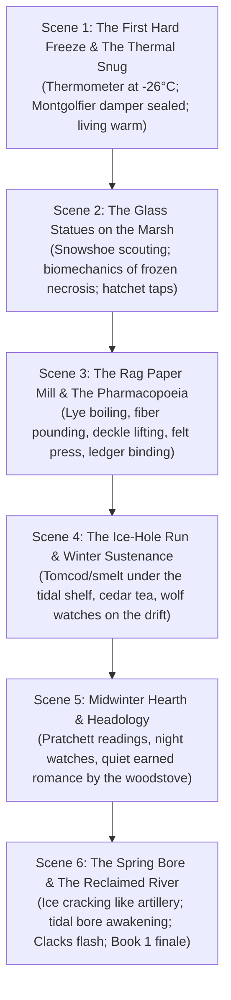

# Chapter 10 Blueprint: The Great Freeze
**Book:** *The Reclaimed River* (Book 1 Finale)  
**Timeline:** November (Day 96) – April (Day 250), Year 1  
**Protagonist:** Kwitn "Gwidn" Simon ("Mac")  
**Household:** Kwitn ("Mac"), Maya Lin, Nipn (The Wolf)  
**Word Count Target:** 10,000+ words of granular, novel-grade prose  

---

## Narrative & Thematic Objectives

1. **The Thermal Triumph of the Stone Light:**
   - Show the hard engineering and thermal physics of the retrofitted granite lighthouse functioning flawlessly in $-25^\circ\text{C}$ to $-30^\circ\text{C}$ Fundy gales.
   - Wool-cedar insulated snug, Montgolfier crown damper, counter-weighted insulated floor hatches, radiant cast-iron stove with soapstone thermal mass.
2. **The "Statues of Glass" (Cold Weather Zombie Physics):**
   - The infected are uninsulated, non-homeothermic mammalian tissue. At $-20^\circ\text{C}$, interstitial fluids and cellular water freeze solid into sharp ice crystals.
   - Wanderers freeze mid-stride, brittle and immobilized across the marsh flats and rail ballast.
   - Mac and Maya dispatch them safely on snowshoes with effortless, light taps of a carpentry hatchet to the frozen occiput—shattering like brittle rock crystal with zero splatter, fluid aerosol, or danger.
3. **The Craft of Archival Rag Paper:**
   - Fulfilling Maya's ambition from Chapter 9: boiling worn linen/cotton rags in clean hardwood ash lye, rinsing in the creek flume, pounding the fibers into smooth slurry in an ash mortar, lifting on wire mold and deckle, pressing in the book press between wool felt sheets, sizing with bone-and-cartilage gelatin.
   - Producing crisp, cream-colored, permanent 100% rag paper for Maya's clinical pharmacopoeia ledger and Mac's structural architectural blueprints.
4. **Winter Subsistence & Ice-Channel Fishing:**
   - Ice fishing for *punamu* (tomcod / frostfish) and winter smelt along tidal slush channels; harvesting stored Three Sisters corn, dried squash, salted shad, and smoked bass.
   - Nipn's wolf instincts on the snow: silent bounding, pinpoint rodent and perimeter scenting under four feet of drift.
5. **Intimacy, Domesticity & Headology:**
   - Mac and Maya's earned closeness: shared night watches, quiet reading of Terry Pratchett (*Guards! Guards!*, *Reaper Man*), laughing over old-world absurdities, mending wool socks, trading tea and cedar shavings.
   - The mutual warmth, banter, and deep romantic undertone that needs no rushed melodrama—it is steady, grounded, and permanent.
6. **The Great Thaw & Book 1 Resolution:**
   - March/April: the booming cannon-fire cracks of the Petitcodiac ice breaking under the spring tidal bore.
   - The river cleanses the mudflats. The first green fiddleheads, coltsfoot, and gaspereau runs appear.
   - The Clacks signal flashes bright from Fort Folly: *ALL WELL. RIVER CLEAR. SEND SEED COUNT.*
   - Mac, Maya, and Nipn looking out from the lighthouse catwalk over a reclaimed, living world.

---

## Granular Scene Breakdown

---

## Key Mechanical Details & Dialogues

* **Thermal Balance:** 8 cords of seasoned birch and sugar maple burning at steady primary/secondary combustion; internal temp $+21^\circ\text{C}$ against $-28^\circ\text{C}$ gale outside.
* **Papermaking Recipe:** 100% cotton/linen scrap + clean sugar maple ash lye (pH $\sim 10.5$) $\rightarrow$ water bath rinse $\rightarrow$ hardwood mallet maceration $\rightarrow$ wire screen deckle dip $\rightarrow$ maple screw press $\rightarrow$ animal gelatin dip for ink resistance.
* **Frozen Zombie Physiology:** Vitrification of extracellular water; crystalline rupture of muscle sarcomeres; brittleness of frozen cranial bone.
* **Fish Species:** Tomcod (*Microgadus tomcod*, *punamu* / frostfish), rainbow smelt, and stored salted shad.
