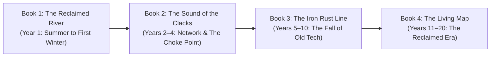

# Series Master Plan: The Petkotkweyak Chronicles
**Author Focus:** A Grounded, Smart Mi'kmaw Survival Epic Across Two Decades  
**Core Lead:** Kwitn "Gwidn" Simon (The Reader & Maker of Siknikt)  
**Literary DNA:** Terry Pratchett's pragmatic wit & Headology + Authentic L'nu Ecological Craft (*Netukulimk*) + Realistic Systemic Collapse  

---

## Series Vision & Overarching Arc

The series follows the 20-year transformation of the region from a collapsing colonial municipality into a self-sustaining, decolonized river-and-waterway society. 

---

## Book 1: *The Reclaimed River* (Year 1 — Summer to First Winter)
**Setting the Board: The Collapse, The Camp, and The Deep Freeze**

* **Timeline:** Early June (Day 0) to April (End of Year 1 Winter).
* **Core Theme:** *Pragmatism vs. Panic.* Rejecting prepper delusions in favor of quiet, durable woodcraft and tidal physics.

### Major Plot Milestones
1. **Act I: The Severance & The Gathering (June — Month 1)**
   * Day 0: The radio cuts out; the grid dies. The MC crafts the 6-foot ash bear-spear and dispatches his first stumble on the trail.
   * Day 3 to 7: The household gathers before town is fully locked down—Cousin Chris arrives with hand tools and scrap metal; Auntie Elizabeth brings the heirloom seed stash and medicines; Nipn the sled-dog cross is on silent point.
   * Meeting Maya: Fleeing town along the river trail, Maya (an adaptable, handy generalist with a medical kit and broad life skills) links up with the crew at the creek mouth.
2. **Act II: The Great Rot & The Salisbury Salvage (July–August)**
   * Avoidance of the town supermarkets as they liquefy into blowfly-infested methane biohazards.
   * Tending the 3 shallow pit weirs (live flounder/bass) and setting up Maya's fermentation crocks and seaweed drying racks.
   * Scouting the rural trail network to Salisbury: discovering the abandoned hot air balloon in a pasture trailer; salvaging ripstop nylon, cables, and the wicker gondola.
3. **Act III: Retrofitting the Stone Light (September–October)**
   * Moving up to the nearby 19th-century cut-granite lighthouse on the bluff.
   * Applying Montgolfier/balloon aerodynamics: installing heavy floor hatches, breathable wool-cedar living "snug," and a ceiling crown damper to eliminate the "big chimney" updraft without creating an airtight suffocation trap.
   * Splitting and stacking the remaining 5 cords of winter firewood (reaching the mandatory 8-cord quota).
4. **Act IV: The First Great Freeze (November–April)**
   * Temperatures plunge to $-20^\circ\text{C}$. Outdoor infected freeze solid into brittle ice statues.
   * Surviving comfortably by the woodstove reading *Guards! Guards!*, harvesting ice-channel fish, and safely clearing frozen corpses with single axe blows.
   * Spring Thaw: First visual Clacks flash spotted on the distant horizon across Shepody Bay.

---

## Book 2: *The Sound of the Clacks* (Years 2 – 4)
**Connecting the Outposts & Holding the Isthmus**

* **Timeline:** Spring of Year 2 to Winter of Year 4.
* **Core Theme:** *Community, Communication, and Geography as a Shield.*

### Major Plot Milestones
1. **Building the Optical Telegraph (The Clacks):**
   * Constructing the 6-shutter manual louver box and heliograph mirrors in the stone lighthouse lantern room.
   * Establishing the first silent, two-way line-of-sight communication link with Amlamgog (Fort Folly) and high-ground ridge outposts.
2. **The Defense of the Isthmus (The Chignecto Choke Point):**
   * A massive horde, funneled out of southern cities along the Trans-Canada highway corridor, moves toward the narrow 24 km land bridge into Nova Scotia.
   * Using the Living Map: Luring the migration off the highway and into the Tantramar marsh mudflats and tidal channels, allowing the Fundy bore and bottomless silt to swallow the threat.
3. **The First Community Council:**
   * Establishing shared protocols with neighboring L'nu and rural survivor groups: seed exchanges, communal weir maintenance, and trail-only scouting discipline.

---

## 3. Book 3: *The Iron Rust Line* (Years 5 – 10)
**The Death of Modern Junk & The Rebound of the Land**

* **Timeline:** Year 5 to Year 10.
* **Core Theme:** *The True Decolonization of Time and Space.*

### Major Plot Milestones
1. **The Great Material Breakdown:**
   * Modern plastics crumble from UV exposure; remaining old-world canned goods become botulism hazards; scavenged ammunition primers misfire at 50%+.
   * Survival transitions 100% to handcrafted traditional tech: ash bows, bone needles, hand-forged charcoal steel, and birchbark containers.
2. **The Rebounding River:**
   * The unmaintained colonial dikes along the Petitcodiac finally breach; the river reclaims its natural floodplains and ancient curves.
   * Fish runs (salmon, shad, striped bass) and wild fowl populations rebound tenfold.
3. **The Disappearing Dead:**
   * Multiple freeze-thaw cycles and scavengers reduce 95% of outdoor infected to mossy bone. The infected become isolated, seasonal hazards rather than active armies.

---

## 4. Book 4: *The Living Map* (Years 11 – 20)
**The Reclaimed Epoch & Passing the Knowledge**

* **Timeline:** Year 11 to Year 20.
* **Core Theme:** *Storytelling, Knowledge Preservation, and the Next Generation.*

### Major Plot Milestones
1. **A New Generation Born in the Wild:**
   * Young people who have never seen a smartphone, a running automobile, or an electric lightbulb.
   * Teaching them the Living Map: how to read water currents, track bird signals, weave weirs, and shape crooked knife handles.
2. **The Living Archive of Petkotkweyak:**
   * The physical book collection in the stone lighthouse (Terry Pratchett, ecology, history, engineering) becomes the foundational academy/schoolhouse for the region.
   * The colonial name "Moncton" is completely forgotten; **Petkotkweyak** is the permanent, living reality.
3. **The Series Climax / Legacy:**
   * A complete overland journey along the ancient portage routes connecting the Bay of Fundy to the Northumberland Strait, proving that human life and the land are once again in sustainable, unshakeable balance (*Netukulimk*).

---

## Series Structural Guidelines & Rules

1. **Tone:** Grounded, unhurried, witty, observant, and deeply respectful of the land. Never gratuitously gory or edgy; focused on the beauty of making, building, and thinking.
2. **Protagonist Integrity:** Stays the practical, smart craftsman throughout. Never becomes a generic action superhero; solves every crisis with physics, anatomy, terrain, and psychology (*Headology*).
3. **Pacing:** Each book covers a distinct physical and psychological season of the 20-year transition.
