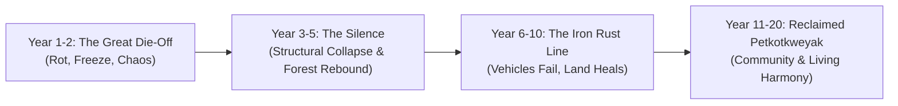

# Field Journal & Living Chronicle: The Two-Decade Almanac
**Author:** An L'nu Reader & Maker  
**Location:** Above the River Bends, Petkotkweyak (*Siknikt District, Mi'kma'ki*)  
**Chronicle Span:** Year 1 (Early Summer / Outbreak) to Year 20  
**Core Philosophy:** *"The land remembers everything; the grid was just a temporary distraction. Work with the water, read the patterns, let winter do the heavy lifting."*

---

## 1. The Immediate Collapse (Year 1: Summer to First Winter)

```
[Day 0: Early June]        [Week 2: Mid June]        [Month 2: Late July]       [Month 5: November]
Grid Failure & Panic ───▶ The Great Rot (Stores) ──▶ Gas Spoils / Rust ───▶ The First Great Freeze
```

### Phase A: Summer (The Outbreak & Decay Peak)
* **Day 0 to 7 (Early June — The Severance):**
  * *Grid & Water:* Power grid trips within 72 hours; municipal water towers drain completely by Day 5.
  * *Traffic Deathtraps:* Trans-Canada Highway and bridge choke points (Gunningsville, Causeway) become impassable parking lots.
  * *Protocol:* Seal off the perimeter; do not enter town; harvest initial fiddleheads, early greens, and set tidal weirs.
* **Weeks 2 to 4 (Late June to Early July — The Great Rot):**
  * *Commercial Biohazard:* Grocery stores (Sobeys, Superstore, Walmart) become methane-filled biohazards as tons of frozen poultry and pork liquefy. Cloud-swarms of blowflies make downtown unbreathable.
  * *Zed Discovery #1 (Heat Bloat):* Fresh summer zombies bloat rapidly from internal gas, slowing their movement down and making them clumsy on uneven terrain.
  * *Water Warning:* City water sources now cause deadly dysentery/E. coli. Strict boiling and charcoal-sand filtration enforced.
* **Months 2 to 3 (Late July to August — Stale Fuel & The Scurvy Wave):**
  * *Fuel Breakdown:* Untreated modern pump gasoline oxidizes into dark lacquer. Car engines and generators seize up.
  * *Survivor Drift:* City pantries run out of boxed crackers; desperate survivors start radiating outward along the river banks.
  * *Harvest Focus:* Peak tidal weir catches (flounder, striped bass). Sun-drying fish on cedar racks; gathering blueberries, raspberries, and sweetgrass.

---

### Phase B: Autumn (The Great Stockpile & The Chill)
* **Months 4 to 5 (September to October):**
  * *Zombie Discovery #2 (Insect Stripping):* After 90 days of summer, maggot and carrion bird activity has stripped significant tendon and muscle mass off the first-generation dead. Mobility drops by 40%.
  * *Harvest & Cellar:* Dug-out root cellar lined with cedar shavings. Packing in wild leeks, cattail flour, dried squash, smoked fish, and acorn mash.
  * *Firewood Metric:* Minimum 6 cords of seasoned maple and ash split, stacked bark-side up under birchbark covers.

---

### Phase C: The First Winter (November to April — The Great Reset)
* **The "Zed Popsicle" Effect ($-15^\circ\text{C}$ to $-25^\circ\text{C}$):**
  * Dead muscle contains water. Without metabolic heat or shelter-seeking instincts, the dead freeze solid into brittle statues by mid-December.
  * Any zombie trying to step over icy stones shatters its own frozen tibia/fibula.
* **The Human Filter:**
  * Survivors without chimney safety or seasoned wood perish from hypothermia or carbon monoxide.
* **Winter Food Line:**
  * Ice-weir fishing in deep river channels; hunting snowshoe hare with snares; burning slow hardwood.

---

## 2. The Annual Seasonal Calendar (The Sustainable Loop)

| Season | Land & Food Tasks | Zed Behavior & Hazards | Tool & Maker Focus |
| :--- | :--- | :--- | :--- |
| **Spring (Siwk)** <br>*(May–June)* | • River thaw & fiddlehead harvest<br>• Reset tidal shallow-pit weirs<br>• Plant corn, beans, squash (Three Sisters) | • **The Thaw Roar:** Frozen corpses re-liquefy; massive tissue breakdown.<br>• Mudflats swallow wading dead. | • Inspect ash bows, re-oil strings<br>• Shape new spear shafts using crooked knife<br>• Waterproof boots with bear/fish grease |
| **Summer (Nipk)** <br>*(July–Aug)* | • Heavy weir harvesting (live retention)<br>• Berry gathering & sun-drying<br>• Salt extraction from tidal marsh pans | • Fast rot; blowflies strip skin.<br>• Smell carries on hot winds (acts as early warning). | • Weave birchbark storage containers (*wi'kwe'tl*)<br>• Forge scrap steel arrowheads<br>• Thatch and repair cabin roofs |
| **Autumn (Toqa'q)** <br>*(Sept–Nov)* | • Root crop harvest (cattail, groundnuts)<br>• Heavy smoking of meat/fish<br>• Gathering spruce pitch & birchbark | • Tendons brittle; joint articulation failing in older zeds.<br>• Wandering herds slow down in mud. | • Split 6–8 cords of firewood<br>• Pack root cellar with dry moss & shavings<br>• Clear chimney flues of creosote |
| **Winter (Kewik)** <br>*(Dec–April)* | • Ice-hole passive line fishing<br>• Rabbit & deer snaring on ridges<br>• Rations & cellar reliance | • **Frozen Solid:** Complete dormancy/immobility.<br>• Easy manual cleanup with single axe blows. | • Carving wooden spoons, tool handles, traps<br>• Leather tanning & stitching moccasins/mitts<br>• Reading through book library by woodstove |

---

## 3. The 20-Year Horizon: Infrastructure & World Evolution



### Years 2 to 5: "The Silence & Structural Decay"
* **The Fate of the Dead:**
  * By Year 3, 85% of the original first-wave zombies are reduced to scattered, moss-covered skeletons due to three cycles of freezing, thawing, blowflies, and scavengers (coyotes, eagles, crows).
  * Only "preserved" dead (sealed in cool basements, walk-in freezers, dry shipping containers) remain active hazards when opened.
* **Infrastructure Collapse:**
  * Modern asphalt roads crack open under frost heaves; saplings take root in Main Street.
  * Flat commercial roofs (malls, warehouses) collapse under unmanaged snow loads.
  * Domestic dogs either die out or re-pack into feral coyote hybrids.
* **Agriculture & Gathering:**
  * Heirloom seeds acclimated to maritime soil; seed-saving systems fully stabilized.
  * Shallow pit weirs expand into permanent stone-and-wattle complexes along tidal estuaries.

---

### Years 6 to 10: "The Iron Rust Line"
* **Material Breakdown:**
  * Modern plastics degrade from UV sunlight, becoming brittle and unusable.
  * Canned goods from the old world are now 95% swollen, punctured, or botulism risks.
  * Ammunition primers degrade in maritime humidity; misfires exceed 50%.
* **The Return of True Tools:**
  * Hand-forged steel, carbon blades, ash staves, bone needles, and rawhide cordage outlast all commercial prepper gear.
* **The Landscape:**
  * Nature reclaims the river basin. The dikes breach; the Tantramar and Petkotkweyak return to their natural floodplains, creating lush wetlands rich in wild fowl and fish.

---

### Years 11 to 20: "The Reclaimed Epoch"
* **The Vanishing Dead:**
  * Zombies are no longer a roaming apocalypse; they are an occasional environmental hazard—like a rogue bear or a hidden hornets' nest in a ruined cellar.
* **Society & Settlement:**
  * Small, self-reliant L'nu and allied survivor communities thrive along the waterways.
  * Trade routes reopen via birchbark canoes and sailing dories along the coast from the Bay of Fundy across the ancient portages to the Northumberland Strait.
* **The Living Map Realized:**
  * "Moncton" is completely gone from memory and map. The settlement is permanently **Petkotkweyak**.
  * The physical library of books (Pratchett, history, engineering, poetry) forms the core schoolhouse archive for the next generation born into the new world.

---

## 4. The Zed Survival Field Notes (Protagonist's Rules)

> [!IMPORTANT]
> **Rule #1: The Mouth is the Bullseye.**  
> Never strike the top of the skull; bone is curved and hard. A braced spear through the open mouth into the soft palate destroys the brain or severs the C1/C2 cervical spine with zero spent muscle.

> [!TIP]
> **Rule #2: The Tide is Your Cleaner.**  
> Never fight a cluster on dry land when you have a 30-foot Fundy tide. Lure them onto the red mud flats at mid-ebb; the silt traps their ankles like quicksand, and the incoming bore drowns them with zero effort.

> [!WARNING]
> **Rule #3: Never Touch a Grocery Store After Week 2.**  
> The air in a sealed, unpowered supermarket is biological poison. Live weirs and root vegetables are clean; old-world canned garbage is a gamble.

> [!NOTE]
> **Rule #4: Trust Wool and Seasoned Ash.**  
> Tactical nylon melts by the hearth and snaps in the freeze. Good woven wool stays warm when damp, and an ash staff never runs out of ammunition.
