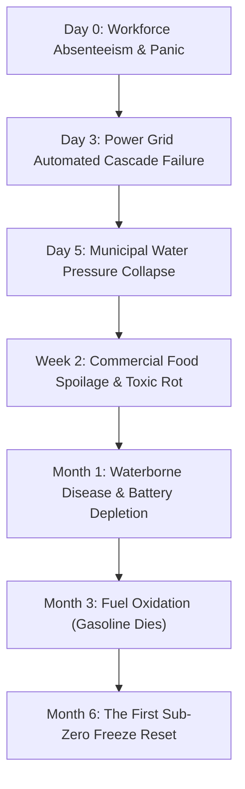

# Worldbuilding Dossier: The Collapse Timeline & Systemic Decay
**Setting:** Petkotkweyak & Siknikt District (*Moncton / Chignecto Isthmus, Mi'kma'ki*)  
**Scope:** Day 0 (Early Summer Outbreak) through Year 20  
**Focus:** Infrastructure Cascade, Human Societal Waves, Biological Decay of the Infected, & Environmental Reclamation  

---

## 1. Executive Summary: The Anatomy of Collapse

Civilization does not end in a single fiery instant; it unravels through a **domino effect of interdependent systems**. Modern human society depends on the continuous delivery of three things: **electricity, pressurized treated water, and diesel/gasoline logistics**. 

When infected outbreaks disrupt human workforce presence at critical junctions (substations, refineries, water treatment plants), the modern grid fails on a predictable mechanical and biological schedule.



---

## 2. Granular Chronological Timeline

### Phase I: The Acute Shock (Days 0 – 14)

#### **Days 0 – 3: The Severance & The Roadway Choke**
* **Communications & Grid:** Cell towers overload within hours, burning through battery reserves before backup diesel generators fail by Day 3.
* **The Pavement Trap:** Highway corridors (Trans-Canada Highway, Wheeler Blvd, Route 15) become impenetrable vehicular graveyards as panicked drivers run out of fuel, crash, or abandon cars.
* **The Bridge Bottlenecks:** The Petitcodiac river crossings (Causeway, Gunningsville Bridge) become primary ambush and infection choke points.
* **Protagonist Action:** Complete avoidance of roads and urban centers. Immediate retreat into wooded high ground using ancient trail networks. Water caches filled.

#### **Days 4 – 7: The Blackout & The Dry Tap**
* **Power Grid:** Thermal and hydro plants trip offline due to automated safety cutoffs without human load balancing. Total regional blackout.
* **Municipal Water:** Gravity-fed water towers exhaust their reserves in 48 to 72 hours. Tap water ceases entirely; toilets no longer flush; municipal sewers begin backing up.
* **Infected Behavior (First Wave):** Fresh, fully hydrated, intact muscle tissue. High speed, aggressive tracking of noise, headlights, and shouting crowds.

#### **Days 8 – 14 (Week 2): "The Great Rot" (The Supermarket Biohazard)**
* **Commercial Food Spoilage:** With ambient early summer temperatures ($20^\circ\text{C}$ to $28^\circ\text{C}$), grocery stores (Sobeys, Atlantic Superstore, Costco) become unapproachable death traps. Hundreds of tons of meat and dairy liquefy, producing lethal methane pockets and bursting packaging.
* **Vector Explosion:** Blowfly and maggot populations explode. The stench of rotting supermarkets carries for kilometers, acting as a massive olfactory lure that draws wandering infected away from outer woods and into retail centers.
* **Domestic Fires:** Unattended candles, woodstoves lit in living rooms without chimney flues, and electrical shorts burn residential subdivisions until rainstorms or natural firebreaks halt the spread.

---

### Phase II: The Secondary Die-Off (Weeks 3 – 12 / Months 1 – 3)

#### **Weeks 3 – 6 (Month 1): The Waterborne Plague & Electronic Death**
* **The Dysentery Wave:** Unfiltered, unboiled water consumption (creeks, standing water, toilet tanks) causes rampant outbreaks of giardia, cryptosporidium, and cholera among urban holdouts. More survivors die from dehydration and dysentery than from bites.
* **Electronic Parasitic Drain:** Unused modern vehicles parked in driveways completely drain their 12V batteries due to internal computer standby drain. Push-to-start vehicles become inert metal bricks.
* **Pharmacies Stripped:** Medical facilities and pharmacies are thoroughly ransacked. Insulin, antibiotics, and surgical supplies are depleted or spoiled due to heat.

#### **Months 2 – 3: The Stale Fuel Cliff & Scavenger Radiance**
* **Gasoline Oxidation:** Untreated pump gas undergoes chemical oxidation, separating into gum and dark varnish. Fuel injectors clog; generators and chainsaws sputter out.
* **The Pantry Bottom:** Canned goods and dried staples in city homes run out. Starving survivors who did not establish agriculture or hunting radiate outward into the woods, following rivers and rail lines.
* **Infected State (Summer Bloat & Insect Stripping):** First-wave infected suffer severe soft-tissue loss from carrion insects. Tendons loosen; movement slows from erratic sprints to heavy, dragging limps.

---

### Phase III: The First Winter (Months 5 – 10 / Year 1)

#### **The Great Freeze (November – April)**
* **Sub-Zero Climate:** Temperatures in the Siknikt / Petkotkweyak valley plunge to $-15^\circ\text{C}$ to $-25^\circ\text{C}$ with heavy maritime snowfall, Nor'easters, and freezing rain.
* **The "Zed Popsicle" Mechanic:** Lacking internal metabolic heat generation and basic shelter instincts, zombies freeze solid into rock-hard ice statues. Attempting to step on frozen uneven terrain causes brittle, frozen leg bones (femur/tibia) to snap cleanly under their own weight.
* **The Exposure Filter:** Survivors who do not understand wood seasoning, drafting, creosote management, or winter insulation die from hypothermia or asphyxiation from unvented fires.
* **Protagonist Routine:** Winter woodpile reliance (6+ cords of split hardwood), passive ice-channel weirs, snaring snowshoe hares on ridges, safe manual clearing of immobilized frozen corpses.

---

## 3. Long-Term Multi-Decade World Evolution

| Time Horizon | Infrastructure & Materials State | Infected Population & Threat Level | Ecosystem & Land Reclamation |
| :--- | :--- | :--- | :--- |
| **Year 2 – 3** | • Asphalt heavily cracked by frost heaves<br>• Flat warehouse roofs collapse under snow<br>• Tap/well electronics completely dead | • 80%+ of original dead reduced to bones by freeze-thaw cycles and scavengers<br>• Remaining zeds mostly trapped in sealed rooms | • Saplings root in major highways<br>• Feral domestic dogs collapse or crossbreed into coyote packs<br>• Salt marshes expand |
| **Year 5** | • Modern batteries entirely dead<br>• Unmaintained timber houses rot from roof leaks<br>• Bridge decks begin structural spalling | • Roaming hordes effectively extinct<br>• Threat localized to "dry-preserved" indoor hazards (basements, vaults) | • Deer and moose populations rebound dramatically<br>• Dikes fail; rivers reclaim natural floodplains<br>• Fish runs increase tenfold |
| **Year 10** | • Modern plastics brittle and crumbling from UV<br>• 95% of old-world canned goods blown/toxic<br>• Gunpowder primers unreliable (>50% misfire) | • Outdoor dead nonexistent (skeletal duff)<br>• Infected treated as rare, isolated ecological hazards | • Ancient portage trails become primary regional highways<br>• River water reaches pre-industrial clarity |
| **Year 20** | • Iron and steel tools preserved via oiling; modern high-tech junk completely oxidized<br>• Handcrafted traditional tech dominates | • The infected are historical/legendary cautions, encounter rate near zero | • True decolonized landscape: "Moncton" erased, **Petkotkweyak** fully established as a living water-and-land network |

---

## 4. Regional Geography & Tactical Dynamics (Petkotkweyak / Siknikt)

```
                       [ North: Richibucto / Boreal Woods ]
                                        ▲
                                        │ (Ancient Trails)
 [ West: Saint John River Basin ] ◄───[ PETKOTKWEYAK ]───► [ East: Tantramar Marshes & Isthmus ]
                                        │ (Tidal Mudflats)
                                        ▼
                           [ South: Bay of Fundy Tides ]
```

### 1. The Tidal Mudflats of Petkotkweyak
* **The 30-Foot Fundy Tide:** Twice a day, the river reverses course with immense force.
* **The Mud Quicksand:** The red clay mudflats are impossible for mindless infected to navigate. Any corpse stumbling onto the flats sinks past its knees, gets anchored by silt, and is drowned/churned by the incoming tidal bore.

### 2. The Chignecto Choke Point (The Isthmus)
* The 24 km land bridge connecting Nova Scotia to the mainland. Holding high ground along the Tantramar marshes creates an impenetrable natural buffer between geographic zones.

### 3. Trails vs. Roads
* **Roads:** Straight, loud, exposed, funnels hordes, destroys boots, littered with glass and wire.
* **Trails:** Moss-cushioned (silent), shielded by spruce/fir canopy, concealed within natural drainage ravines, bypassing all urban bottlenecks.

---

## 5. Biological Rules of the Infected

1. **Energy Source & Decay:** The pathogen animates the central nervous system but does not bypass the laws of thermodynamics. Tissue decays, dries out, and is consumed by bacteria and maggots.
2. **Sensory Limitations:** Relies strictly on acute auditory tracking and direct line-of-sight. Zero lateral tactical awareness; easily misdirected by natural water sounds, wind in the trees, or bird calls.
3. **Anatomical Target:**
   * **Top of Cranium:** Rounded, thick bone; high deflection rate for blunt/piercing tools.
   * **Open Mouth / Soft Palate:** Direct path of least resistance into the brainstem and C1/C2 cervical spine. Braced spears allow the charging infected to destroy itself on its own momentum.
